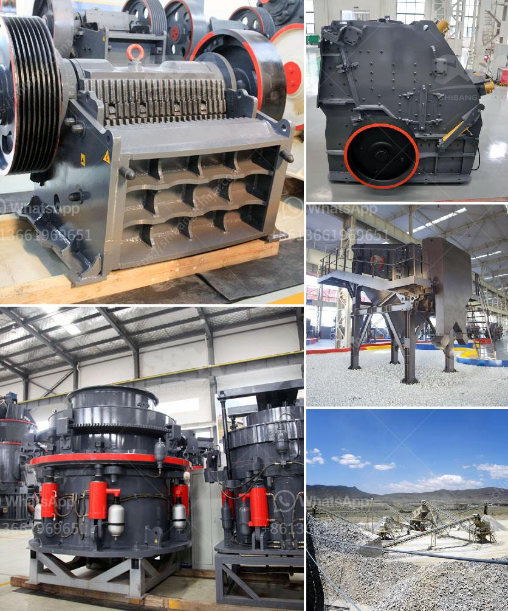

<h3>What is the optimal rotation speed for a ball mill?</h3>
A ball mill is a type of grinder used to grind materials into extremely fine powder for use in mineral dressing processes, paints, pyrotechnics, ceramics, and selective laser sintering. The key factors that influence the grinding process during ball milling include milling time, rotational speed, and ball-to-powder ratio. These parameters determine the efficiency and capacity of the mill.

Understanding the rotational speed influence on the milling process is crucial when aiming to tailor the mill to the specific requirements of the customer. In this article, we examine the effects of rotation speed on the grinding efficiency and performance of the ball mill.

Rotation speed variation inevitably brings about a change in the motion state and trajectory of the grinding medium in the barrel, resulting in sudden weight changes of the grinding medium. This disturbs the stability of the grinding process, leading to reduced efficiency and potentially damaging the equipment.

At lower rotation speeds, the grinding medium tends to slide along the inner wall of the barrel, causing poor grinding action and reduced grinding efficiency. Conversely, at higher rotation speeds, the grinding medium becomes centrifuged, leading to impact and abrasive grinding, resulting in high grinding efficiency.

However, it is important to note that there exists an optimal rotation speed at which the grinding process reaches its maximum efficiency. Beyond this point, increasing the rotation speed may cause excessive wear on the equipment, reduced grinding efficiency, and increased power consumption.

Determining the optimal rotation speed involves carefully balancing the need for efficient grinding, the potential for equipment damage, and the overall cost-effectiveness of the milling operation. Factors such as material properties, desired particle size, and desired final product quality must be taken into account when determining the optimal rotation speed.

To determine the optimal rotation speed, researchers have conducted experiments using various materials and different ball mill designs and sizes. These studies have shown that the particle size distribution, grinding efficiency, and overall performance of the ball mill depend on the rotation speed.

To summarize, the optimal rotation speed of a ball mill depends on the desired final particle size and the characteristics of the material being ground. Considering the use of the equipment, its efficiency, and the overall cost-effectiveness of the operation is key to determine the optimal rotation speed.

Research and testing play a crucial role in understanding the effects of rotation speed on the grinding process, allowing manufacturers to optimize their equipment and tailor it to specific customer needs. By finding the optimal rotation speed, industries can maximize the productivity and efficiency of their milling operations, leading to higher-quality products and improved profitability.
<h3>Contact us</h3><ul><li><strong>Whatsapp:&nbsp;<a href="https://wa.me/8613661969651">+8613661969651</a></strong></li><li><a href="https://swt.shibang-china.com/?git&amp;zhl&amp;What is the optimal rotation speed for a ball mill"><strong>Online Service(chat now)</strong></a></li></ul><h3>Related</h3><ul><li><a href='what are the equipments that are important for concrete production.md'>what are the equipments that are important for concrete production</a></li><li><a href='what equipment needed for mining iron ore.md'>what equipment needed for mining iron ore</a></li><li><a href='What are the wearing parts of grinding mill .md'>What are the wearing parts of grinding mill ?</a></li><li><a href='What equipment is used in the bauxite mining process in Jamaica.md'>What equipment is used in the bauxite mining process in Jamaica?</a></li><li><a href='What type of Raymond Mill exhaust fan is used at gypsum plant.md'>What type of Raymond Mill exhaust fan is used at gypsum plant?</a></li></ul>