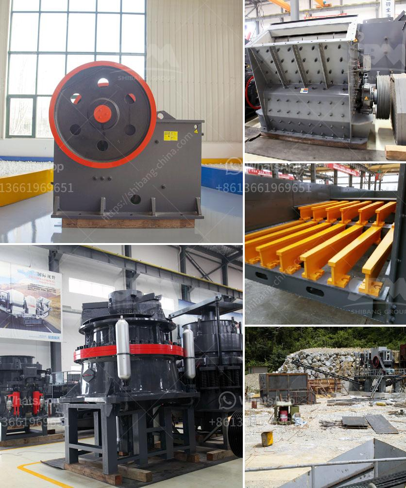

<h3>What is the optimum frequency for a vibrating screen?</h3>
Vibrating screens are widely used in various industries for several applications, such as separating, sizing, and dewatering materials. The performance of these screens usually depends on various factors, including the frequency of vibration. The frequency, also known as the speed or stroke, determines the efficiency and effectiveness of the screening process. Therefore, finding the optimum frequency is crucial to maximize the productivity and output of vibrating screens.

The frequency of a vibrating screen refers to the number of times it completes a full cycle of motion in a second. It is usually measured in Hertz (Hz). Different vibrating screens have different operating frequencies that can range from as low as 200 Hz to as high as 3000 Hz or even more. The optimal frequency depends on several factors, such as the material being screened, the desired particle size, and the capacity requirements.

When determining the optimum frequency for a vibrating screen, it is essential to consider the following factors:

1. Material Properties: Different materials have different vibration characteristics. Some materials may require higher frequencies to effectively sieve and separate particles, while others may require lower frequencies. For example, fine particles typically require higher frequencies to prevent blinding of the screen, whereas larger particles may perform better with lower frequencies.

2. Particle Size: The desired particle size of the screened material also influences the optimum frequency. Smaller particles can pass through the screen mesh more easily at higher frequencies, while larger particles may require lower frequencies for efficient separation. Therefore, the size distribution of the material should be taken into account when selecting the frequency.

3. Capacity Requirements: The throughput or capacity of the vibrating screen is another crucial factor to consider. Higher frequencies may allow for faster screening and greater throughput, but they can also result in reduced screen life and increased energy consumption. Balancing the desired capacity with the screen's longevity is essential when determining the optimum frequency.

4. Screen Design: The design of the vibrating screen, including the size and shape of the screen panels, the arrangement of the decks, and the amplitude (the distance the screen travels during each vibration cycle), can also impact the optimum frequency. Different screen designs may perform better at specific frequencies, and vice versa.

To find the optimum frequency, it is important to conduct tests and experiments on the specific materials being processed. This can be done by gradually adjusting the frequency while monitoring the screen's performance, such as the throughput, efficiency, and particle size distribution. Analyzing the results and comparing them against the desired outcomes can help determine the optimum frequency for a vibrating screen.

In conclusion, the optimum frequency for a vibrating screen depends on various factors, including the material properties, desired particle size, capacity requirements, and screen design. Finding the right frequency can improve the efficiency and productivity of the screening process, leading to higher quality output and reduced operating costs. Conducting thorough testing and experimentation is essential to identify the optimum frequency and maximize the performance of vibrating screens.
<h3>Contact us</h3><ul><li><strong>Whatsapp:&nbsp;<a href="https://wa.me/8613661969651">+8613661969651</a></strong></li><li><a href="https://swt.shibang-china.com/?git&amp;zhl&amp;What is the optimum frequency for a vibrating screen"><strong>Online Service(chat now)</strong></a></li></ul><h3>Related</h3><ul><li><a href='What beneficiation method is used for iron ore.md'>What beneficiation method is used for iron ore?</a></li><li><a href='What equipment is needed for perlite ore mines.md'>What equipment is needed for perlite ore mines?</a></li><li><a href='What could be the problems with your crusher plant.md'>What could be the problems with your crusher plant?</a></li><li><a href='What is cost of bauxite processing per ton.md'>What is cost of bauxite processing per ton?</a></li><li><a href='What is the machine used in hard rock gold mining.md'>What is the machine used in hard rock gold mining?</a></li></ul>