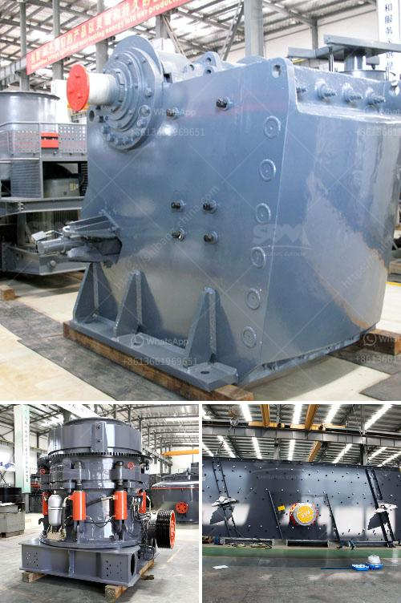

<h3>What is the percentage saved in labor costs for the operation of mobile mining crushers?</h3>
Mobile mining crushers have revolutionized the way materials are extracted from the earth, significantly reducing the need for manual labor and cutting costs. These mobile crushers offer exceptional flexibility, allowing operators to move the crushing equipment to the desired location. This mobility brings numerous advantages, including reduced labor costs which can save operations a substantial percentage.

Traditionally, mining operations involved manual labor to extract materials, a process that required a considerable workforce, increasing operational costs. With the advent of mobile mining crushers, labor costs have witnessed a remarkable reduction. These crushers are designed to efficiently crush various types of rocks, minerals, and ores, replacing the arduous task of breaking down materials manually.

The labor cost savings originate from two main factors: productivity and workforce requirements. Mobile crushers significantly increase productivity by automating the crushing process. These advanced machines can handle large volumes of materials in a short span of time, leading to more output per hour compared to manual labor. By maximizing the amount of crushed material per labor hour, operations can save a significant percentage of labor costs.

Furthermore, the reduced workforce requirement is another crucial aspect contributing to labor cost savings. Mobile crushers require minimal personnel to operate, as most of the crushing process is automated. A small team of skilled operators can efficiently manage the entire mobile crusher operation, monitoring and controlling the process remotely. This eliminates the need for a large workforce, ultimately decreasing labor costs.

The exact percentage of labor cost savings depends on various factors such as the scale of the mining operation, the efficiency of the mobile crusher, and the type of material being crushed. However, studies suggest that the cost savings can range anywhere between 20% to 40% compared to traditional manual labor.

Moreover, mobile mining crushers offer additional cost-saving benefits beyond labor expenses. These crushers are equipped with advanced technologies, such as remote monitoring and telematics systems. These features allow operators to track and optimize crusher performance, minimizing downtime and reducing maintenance costs. Additionally, mobile crushers can be easily transported from one site to another, eliminating the need for costly and time-consuming transportation of materials to a stationary crushing plant.

The labor cost savings achieved through mobile mining crushers can positively impact overall profitability and viability of mining operations. By reallocating the funds formerly spent on manual labor, companies can invest in other areas such as exploration, technology upgrades, or employee welfare, ultimately enhancing their competitiveness in the industry.

In conclusion, mobile mining crushers have revolutionized the mining industry by significantly reducing labor costs. These crushers automate the crushing process, increasing productivity and reducing the need for a large workforce. Depending on various factors, labor cost savings can range from 20% to 40%. The cost savings extend beyond labor expenses and encompass reduced maintenance costs and increased operational efficiency. Embracing mobile mining crushers can propel mining operations towards higher profitability and sustainability.
<h3>Contact us</h3><ul><li><strong>Whatsapp:&nbsp;<a href="https://wa.me/8613661969651">+8613661969651</a></strong></li><li><a href="https://swt.shibang-china.com/?git&amp;zhl&amp;What is the percentage saved in labor costs for the operation of mobile mining crushers"><strong>Online Service(chat now)</strong></a></li></ul><h3>Related</h3><ul><li><a href='what is the difference between river sand and crusher sand.md'>what is the difference between river sand and crusher sand</a></li><li><a href='What equipment is needed for boron ore mines.md'>What equipment is needed for boron ore mines?</a></li><li><a href='What equipment is needed for coal ore mines.md'>What equipment is needed for coal ore mines?</a></li><li><a href='What is the best concrete crusher to make gravel.md'>What is the best concrete crusher to make gravel?</a></li><li><a href='what type of crusher is best for concrete crushing.md'>what type of crusher is best for concrete crushing?</a></li></ul>