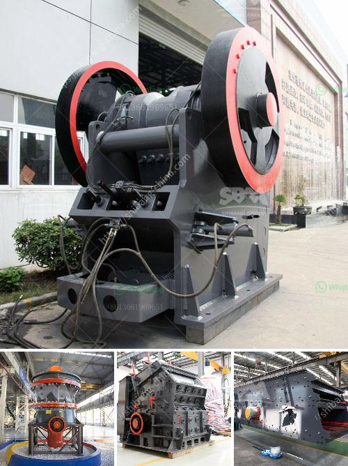

<h3>What is the price of the mobile crusher that has a capacity of 350 tons per hour?</h3>
Mobile crusher is a new type of crushing equipment, which plays an important role in the whole production process. The equipment integrates crushing and screening, which can crush materials nearby, thus avoiding the intermediate links caused by material transportation and re-crushing. It greatly reduces the transportation cost of materials. With the advancement of technology, mobile crushers with different crushing capacities are emerging in the market. What is the price of the mobile crusher that has a capacity of 350 tons per hour? This article will introduce our new mobile crushing station system with a capacity of 350 tons per hour.

There are two main types of mobile crushing stations: tire and crawler. These two types of equipment can be adjusted to different crushing production requirements according to the actual needs of users. Different models have different prices. Users can choose according to their own budget. Generally, speaking, the higher the capacity, the higher the price. A mobile crusher with a capacity of 350 tons per hour is aligned with the medium-sized crusher machine and meets the needs of users.

The market price of this type of equipment is relatively high. In order to choose a more reasonable price, users should make a comprehensive comparison. For example, our manufacturers, such as AIMIX GROUP, have mature technology and excellent performance. The quality and price of the equipment provided are also very competitive. When choosing equipment, users should not only focus on price, but also pay attention to the manufacturer's after-sales service and whether they can provide comprehensive technical support.

In addition to the mobile crusher mentioned above, other types of crushers such as jaw crushers, cone crushers, and impact crushers are also available. These different types of crushers have their own characteristics and applicable scenarios. Users can choose according to the different materials and requirements of the actual production. The price of each type of crusher is different. Our company has been focusing on the production of crushing equipment for more than 30 years, providing customers with high-quality and efficient crushing equipment.

In conclusion, the price of a mobile crusher with a capacity of 350 tons per hour is affected by many factors, such as equipment manufacturers, specifications, market supply and demand, etc. Users can consult our online customer service for detailed quotation information. AIMIX GROUP not only supports online quotation, but also provides on-site installation and after-sales service. We have a professional technical team to guarantee users' worries-free production. If you have any needs, please feel free to contact us, we will give you a satisfactory answer.
<h3>Contact us</h3><ul><li><strong>Whatsapp:&nbsp;<a href="https://wa.me/8613661969651">+8613661969651</a></strong></li><li><a href="https://swt.shibang-china.com/?git&amp;zhl&amp;What is the price of the mobile crusher that has a capacity of 350 tons per hour"><strong>Online Service(chat now)</strong></a></li></ul><h3>Related</h3><ul><li><a href='What is barite and how is it mined.md'>What is barite and how is it mined?</a></li><li><a href='What is the process and cost of quartz extraction.md'>What is the process and cost of quartz extraction?</a></li><li><a href='How to choose a cone crusher for rock crushing？.md'>How to choose a cone crusher for rock crushing？</a></li><li><a href='What equipment is needed for coal ore mines.md'>What equipment is needed for coal ore mines?</a></li><li><a href='What equipment is used in iron ore crusher.md'>What equipment is used in iron ore crusher?</a></li></ul>