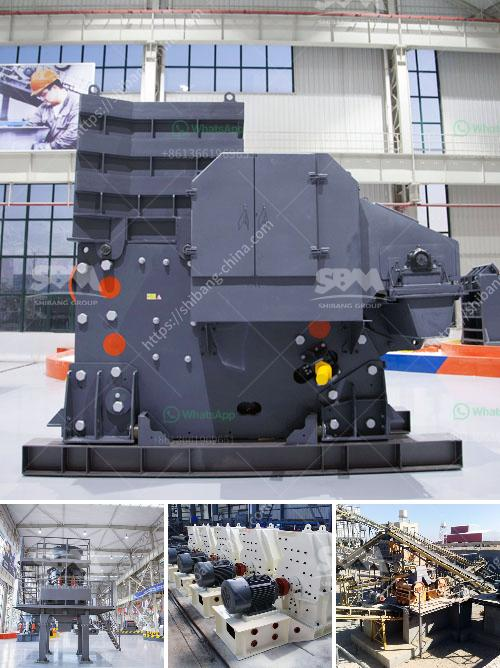

<h3>What is the process and cost of quartz extraction?</h3>
Quartz is a crystalline mineral found in abundance in the Earth's crust. It is one of the most common and widely distributed minerals on the planet. The extraction of quartz is a complex and time-consuming process. The process involves cutting, grinding, and polishing the quartz crystals to create a high-quality final product. However, before delving into the extraction process and cost of quartz, it is important to understand its uses and significance.

Quartz has a plethora of uses across various industries, making it a highly sought-after mineral. One of its primary uses is in the production of glass. Quartz is a key component in the manufacturing of glass due to its high silica content. It provides transparency, durability, and resistance to extreme temperatures, making it an ideal material for creating glass products.

Furthermore, quartz is also commonly used in the production of ceramics and porcelain. When mixed with clay and other minerals, it enhances the durability, strength, and heat resistance of these materials. Quartz is also utilized in the construction industry as an aggregate for concrete. It provides additional strength to the concrete mixture, ultimately resulting in a more durable and long-lasting structure.

Now let's explore the process of extracting quartz. The extraction process of quartz involves several steps. Initially, blasting or drilling is done to extract quartz from the mountain or quarry. The quartz is then crushed into smaller pieces using machinery like crushers and grinders. The pieces are further refined through a process called beneficiation, which involves removing impurities and separating the quartz from other minerals.

After the initial stage of extraction and refining, the quartz undergoes a final process called polishing. This involves grinding the quartz crystals to achieve a smooth and glossy surface. The process of polishing enhances the aesthetic appeal and market value of the quartz.

Now coming to the cost of quartz extraction, it can vary depending on several factors. The primary factor is the location of the quartz deposit. If the deposit is located in a remote area, the cost of transportation and logistics can significantly increase the overall extraction cost. Additionally, the extraction method used also affects the cost. Manual extraction can be more time-consuming and labor-intensive, increasing the overall cost. On the other hand, mechanized extraction methods may require substantial initial investments in machinery and equipment.

Moreover, the quality and purity of the quartz also impact its cost. High-quality quartz that is free from impurities is generally more expensive. It is also worth mentioning that environmental regulations and sustainability measures can add to the cost of extraction. Miners need to ensure that their extraction processes are environmentally friendly and comply with the regulations set by the relevant authorities.

In conclusion, the extraction of quartz is a complex and intricate process that involves cutting, grinding, and polishing the quartz crystals. The cost of extraction can vary depending on factors such as location, extraction method, quality, and environmental regulations. Quartz, with its numerous applications and versatility, continues to be a valuable mineral in various industries worldwide.
<h3>Contact us</h3><ul><li><strong>Whatsapp:&nbsp;<a href="https://wa.me/8613661969651">+8613661969651</a></strong></li><li><a href="https://swt.shibang-china.com/?git&amp;zhl&amp;What is the process and cost of quartz extraction"><strong>Online Service(chat now)</strong></a></li></ul><h3>Related</h3><ul><li><a href='What are the machines and equipment in mining.md'>What are the machines and equipment in mining?</a></li><li><a href='what are the equipments that are important for concrete production.md'>what are the equipments that are important for concrete production</a></li><li><a href='What type of equipment is used in the mining of lead ores.md'>What type of equipment is used in the mining of lead ores?</a></li><li><a href='What is a bentonite grinding unit.md'>What is a bentonite grinding unit?</a></li><li><a href='What is the wattage of the stone crusher.md'>What is the wattage of the stone crusher?</a></li></ul>