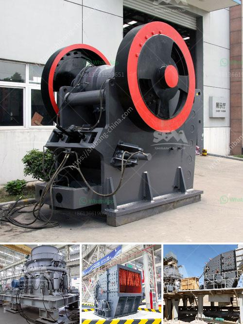

<h3>What is the process for mining line?</h3>
Limestone is a sedimentary rock composed primarily of calcium carbonate. It is commonly used in building materials, such as cement and mortar, as well as in various industrial applications. The mining of limestone involves several processes, including blasting, crushing, screening, and hauling. This article will explore each process in detail.

The first step in the mining process is the blasting of limestone. This involves drilling holes into the rock and filling them with explosives. Once the explosives are detonated, they break apart the limestone into smaller pieces. Blasting is necessary to loosen and remove the overlying materials and allow access to the limestone deposits.

After the blasting, the broken limestone pieces are loaded into trucks or onto conveyors and transported to the primary crushing stage. Here, the limestone is crushed into smaller sizes using jaw crushers, impact crushers, or cone crushers. The crushed limestone is then screened to separate the different sizes of particles and remove any undersized material.

The next step in the process is the secondary crushing stage. In this stage, the crushed limestone is further reduced in size using impact crushers or cone crushers. The aim is to create a product with a specific size distribution that meets the requirements of the end-use applications.

Once the limestone has been crushed to the desired size, it is ready for further processing. The crushed limestone is then screened again to remove any remaining oversized or undersized particles. The screened limestone is stored in silos or stockpiles for future use.

Hauling is the final step in the mining process. Large trucks or conveyors are used to transport the processed limestone from the mine to the end-users. These trucks can carry large loads, allowing for efficient transportation of the material.

Mining limestone requires careful planning and adherence to strict environmental regulations. A comprehensive environmental impact assessment is conducted prior to starting any mining operations. This assessment identifies potential impacts on water quality, air quality, and wildlife habitats. Measures are then implemented to minimize these impacts, such as using dust control systems, reclaiming disturbed areas, and monitoring water discharges.

Additionally, mine operators must comply with workplace safety regulations to protect the health and safety of their workers. This includes providing appropriate personal protective equipment, conducting regular safety training, and implementing safety protocols.

In conclusion, the process of mining limestone is a complex and multi-step process. It involves blasting, crushing, screening, and hauling the limestone to various end-use applications. Strict environmental and safety regulations must be followed to ensure responsible and sustainable mining practices.
<h3>Contact us</h3><ul><li><strong>Whatsapp:&nbsp;<a href="https://wa.me/8613661969651">+8613661969651</a></strong></li><li><a href="https://swt.shibang-china.com/?git&amp;zhl&amp;What is the process for mining line"><strong>Online Service(chat now)</strong></a></li></ul><h3>Related</h3><ul><li><a href='What is a suitable crusher for coal.md'>What is a suitable crusher for coal?</a></li><li><a href='What is the process of mining copper ore.md'>What is the process of mining copper ore?</a></li><li><a href='What equipment to extract iron ore.md'>What equipment to extract iron ore?</a></li><li><a href='What is the process of mining hematite ore.md'>What is the process of mining hematite ore?</a></li><li><a href='What equipment is used in the cement process.md'>What equipment is used in the cement process?</a></li></ul>