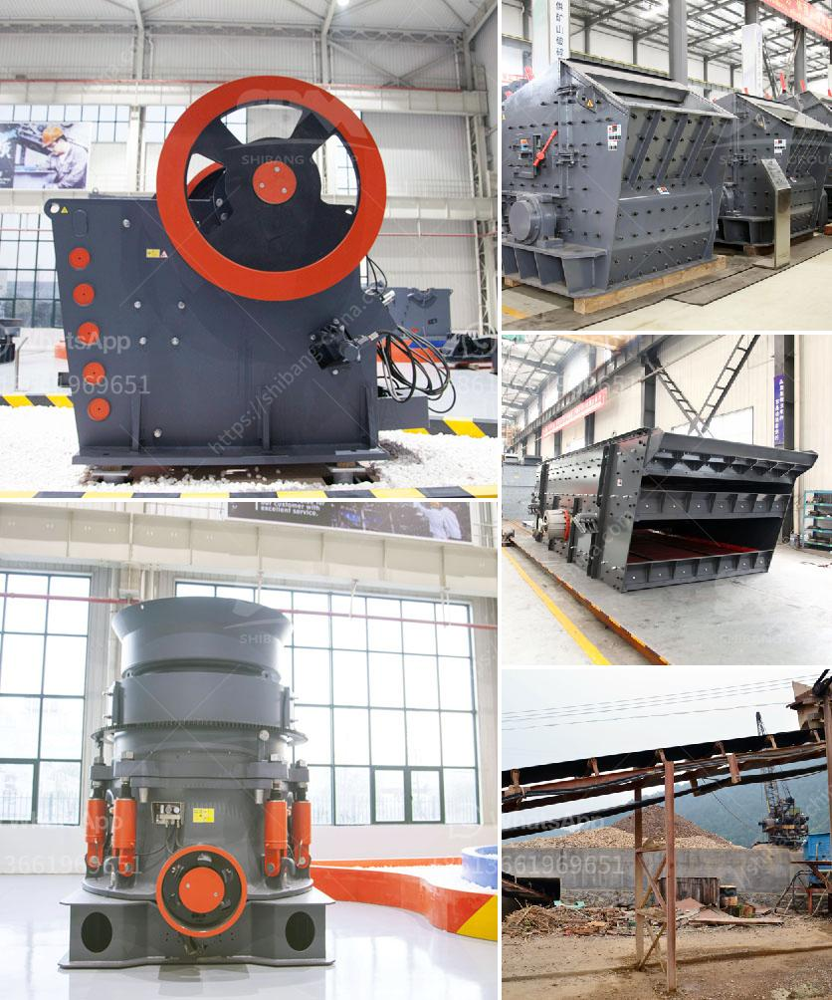

<h3>What is the process of mining and extraction of gold and molybdenum?</h3>
Mining is an intricate process that involves various stages and techniques to extract precious minerals from the depths of the earth. Gold and molybdenum are two highly sought-after minerals due to their widespread use in various industries. Here, we will explore the step-by-step process of mining and extracting gold and molybdenum.

The mining process begins with the search for gold and molybdenum deposits. Geologists employ various methods, including geological mapping, satellite imagery, and sampling, to identify potential locations for these minerals. Once a promising site is identified, the extraction process begins.

1. Exploration: The first step is to conduct exploratory drilling. Geologists drill into the earth's surface to obtain core samples. These samples are then analyzed to determine the presence of gold and molybdenum, as well as the quality and quantity of the deposits. This information is crucial in deciding the viability of the mining project.

2. Planning and Permitting: Once favorable deposits are identified, mining companies must obtain the necessary permits and licenses from regulatory bodies. This involves presenting comprehensive plans that outline the mining operation's environmental impact, safety protocols, and restoration plans.

3. Clearing and Preparation: Before mining can commence, the site must be cleared of vegetation and other obstacles. Roads and infrastructure are built to allow the movement of heavy machinery and facilitate the transportation of extracted minerals.

4. Extraction: There are several techniques employed to extract gold and molybdenum, depending on the geological characteristics of the deposit. Two common methods are open-pit mining and underground mining.

a. Open-pit Mining: This method is used when the gold or molybdenum deposit is close to the surface. Massive holes, called pits, are dug to extract the minerals. Bulldozers and other heavy equipment remove the topsoil, exposing the ore body. Large trucks transport the ore to the processing plant for further refinement.

b. Underground Mining: This method is employed when the deposits are deeper underground. Tunnels and shafts are excavated to access the minerals. Miners drill into the rock face and use explosives to break the ore loose. The fragmented ore is then transported to the surface for processing.

5. Processing and Refining: Once the ore is extracted, it undergoes a series of processes to separate the desired minerals from the waste materials. Various techniques, including crushing, grinding, and froth flotation, are employed to concentrate the minerals.

6. Smelting and Purification: The concentrated minerals, such as gold and molybdenum, are subjected to high heat and chemical reactions to further purify them. Smelting involves melting the minerals at high temperatures to separate impurities and obtain the pure metals.

7. Production: The final step involves shaping the refined metals into desired products and alloys. Gold and molybdenum find applications in numerous industries, including jewelry, electronics, construction, and manufacturing.

Mining and extraction of gold and molybdenum are complex processes that require careful planning, adherence to environmental regulations, and advanced technology. It is crucial for mining companies to ensure sustainable practices to minimize the impact on the environment and surrounding communities. By following these processes, these valuable minerals can be extracted and utilized to fulfill the ever-growing demands of various industries.
<h3>Contact us</h3><ul><li><strong>Whatsapp:&nbsp;<a href="https://wa.me/8613661969651">+8613661969651</a></strong></li><li><a href="https://swt.shibang-china.com/?git&amp;zhl&amp;What is the process of mining and extraction of gold and molybdenum"><strong>Online Service(chat now)</strong></a></li></ul><h3>Related</h3><ul><li><a href='What is a cone crusher and what stones are it mainly used to crush.md'>What is a cone crusher and what stones are it mainly used to crush?</a></li><li><a href='What is the process of mining hematite ore.md'>What is the process of mining hematite ore?</a></li><li><a href='What are machines used for mining iron ore.md'>What are machines used for mining iron ore?</a></li><li><a href='What equipment is used in the mining industry .md'>What equipment is used in the mining industry ?</a></li><li><a href='What is primary crushing and secondary crushing.md'>What is primary crushing and secondary crushing?</a></li></ul>