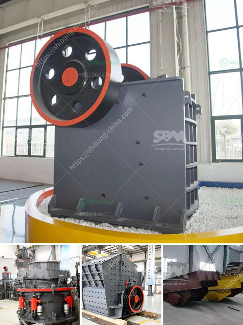

<h3>What is the process of mining copper ore?</h3>
Copper is one of the most widely used metals in the world, with applications ranging from electrical wiring to electronics and construction materials. The process of mining copper ore involves several steps, each with its own unique challenges. This article will explore the process of extracting copper ore from the ground and transforming it into a usable product.

Before mining operations can begin, extensive exploration is conducted to identify potential copper deposits. Geologists use various techniques, such as geochemical analysis and geophysical surveys, to analyze rock samples and locate ore bodies. Once a promising site is identified, further assessments are carried out to determine the viability of mining operations.

Following the discovery of a copper deposit, mining companies must obtain necessary permits from government agencies to begin extraction. This process involves a comprehensive environmental impact assessment to ensure responsible mining practices and mitigate any potential adverse effects on the surrounding ecosystem. Mining plans are developed, which outline extraction methods, waste management strategies, and safety protocols.

With the necessary permits and plans in place, mine development can commence. This stage involves clearing vegetation, constructing access roads, and establishing infrastructure to support mining operations. Facilities such as processing plants, storage areas, and worker accommodations are built to facilitate efficient production.

There are several methods used to extract copper ore from the ground, depending on the depth, size, and grade of the deposit. The most common method is open-pit mining, where large quantities of earth and rock are removed using explosives to expose the copper ore. This type of mining is cost-effective and suitable for low-grade deposits close to the surface. In contrast, underground mining is employed for high-grade deposits found at greater depths. In this method, tunnels and shafts are constructed to reach the ore, and specialized machinery is used to extract it.

Once the copper ore is extracted, it undergoes a series of physical and chemical processes to separate valuable copper minerals from other materials. The initial step is crushing and grinding the ore to a fine powder. This powder is then subjected to flotation, which uses chemicals to selectively separate copper minerals from the unwanted gangue (rock and other minerals).

The concentrated copper minerals obtained from the flotation process are then transformed into copper metal through smelting. Smelting involves heating the concentrate to high temperatures in the presence of a reducing agent, such as coke or charcoal, which reacts with the minerals to remove impurities and produce molten copper. The molten copper is then refined through processes such as electrolysis, which purify the metal and prepare it for commercial use.

Throughout the mining process, environmental considerations play a crucial role in minimizing the impact on land, water, and air quality. Measures such as dust suppression, water treatment, and reclamation of disturbed areas help mitigate the potential environmental consequences of mining. Reclamation involves restoring mined areas to their original or beneficial land use, ensuring the long-term sustainability of the ecosystem.

In conclusion, the process of mining copper ore involves multiple stages, from exploration and site selection to extraction, processing, and environmental considerations. Mining companies must adhere to stringent regulations and employ responsible practices to ensure the sustainability of copper production while minimizing the environmental impact. Copper remains a vital resource for various industries, making its responsible extraction and utilization essential for a sustainable future.
<h3>Contact us</h3><ul><li><strong>Whatsapp:&nbsp;<a href="https://wa.me/8613661969651">+8613661969651</a></strong></li><li><a href="https://swt.shibang-china.com/?git&amp;zhl&amp;What is the process of mining copper ore"><strong>Online Service(chat now)</strong></a></li></ul><h3>Related</h3><ul><li><a href='What is cost of bauxite processing per ton.md'>What is cost of bauxite processing per ton?</a></li><li><a href='what types of jaw crushers.md'>what types of jaw crushers</a></li><li><a href='what is universal grinding machine？.md'>what is universal grinding machine？</a></li><li><a href='What is the mining process of gypsum.md'>What is the mining process of gypsum?</a></li><li><a href='What type of mining is used for magnetite.md'>What type of mining is used for magnetite?</a></li></ul>