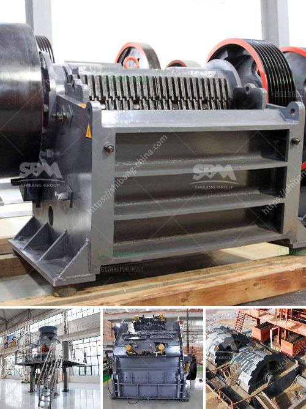

<h3>What is the process of mining hematite ore?</h3>
Hematite ore is a valuable mineral resource as it contains iron, one of the most abundant elements on Earth. The process of mining hematite involves blasting, crushing, and screening to obtain hematite ore. Hematite ore is extracted through mining and processed into pellets before being sent to a blast furnace to be refined into iron products.

Mining hematite ore begins at ground level. The first step involves the drilling of holes into the earth's surface. The hole patterns are drilled in a specific sequence to ensure a thorough and systematic exploration of the mine site. After the holes are drilled, explosives are inserted into the holes and detonated to break the rock and loosen the hematite ore.

Once the ore has been broken into smaller fragments through the blast, it is then transported by trucks or conveyor belts to a primary crusher. Primary crushers reduce the size of the blasted rock to a more manageable size. The rock is then further crushed and screened to specific sizes using various crushers and screening equipment.

After the initial crushing and screening, the hematite ore is further sorted and classified using different screens and sieves. The ore particles are separated based on size, with the smaller particles being sent for further processing while the larger particles are returned to the crushers for further reduction.

The next step in the process of mining hematite ore is beneficiation. The core purpose is to remove impurities from the iron ore, which includes crushing the ore to smaller sizes and chemical processing. This process is often referred to as comminution and involves crushing and grinding the ore to a fine size.

During the process of beneficiation, the hematite ore undergoes various mineral processing stages including crushing, grinding, gravity separation, magnetic separation, and froth flotation. After these stages, the hematite ore is further purified to remove impurities such as silica and alumina.

Once the ore has been processed and purified, it is transformed into hematite pellets. The pellets are created by agglomerating the finely ground ore with a binder and then rolling the mixture into small balls. These pellets are then fired at a high temperature in a furnace. The heat causes the binder to harden and the pellets to become solid.

The final step in the process of mining hematite ore involves loading the finished pellets into rail cars or trucks for transportation to a steel mill or processing plant. These pellets can then be used for various applications including steel production.

In summary, mining hematite ore involves blasting, crushing, and screening to obtain the hematite ore. The ore is further processed through beneficiation to remove impurities before being transformed into hematite pellets. This iron-rich product is then shipped for further processing or used directly in steel production. The process of mining hematite ore is a crucial and complex one that requires precision and expertise to ensure a high-quality product.
<h3>Contact us</h3><ul><li><strong>Whatsapp:&nbsp;<a href="https://wa.me/8613661969651">+8613661969651</a></strong></li><li><a href="https://swt.shibang-china.com/?git&amp;zhl&amp;What is the process of mining hematite ore"><strong>Online Service(chat now)</strong></a></li></ul><h3>Related</h3><ul><li><a href='What is the optimum frequency for a vibrating screen.md'>What is the optimum frequency for a vibrating screen?</a></li><li><a href='What type of bearings must be used for the taper of a jaw crusher.md'>What type of bearings must be used for the taper of a jaw crusher?</a></li><li><a href='What is a rare earth beneficiation plant.md'>What is a rare earth beneficiation plant?</a></li><li><a href='What are the parts of ball mill internal structure.md'>What are the parts of ball mill internal structure?</a></li><li><a href='What is the role of crushing in the beneficiation process.md'>What is the role of crushing in the beneficiation process?</a></li></ul>