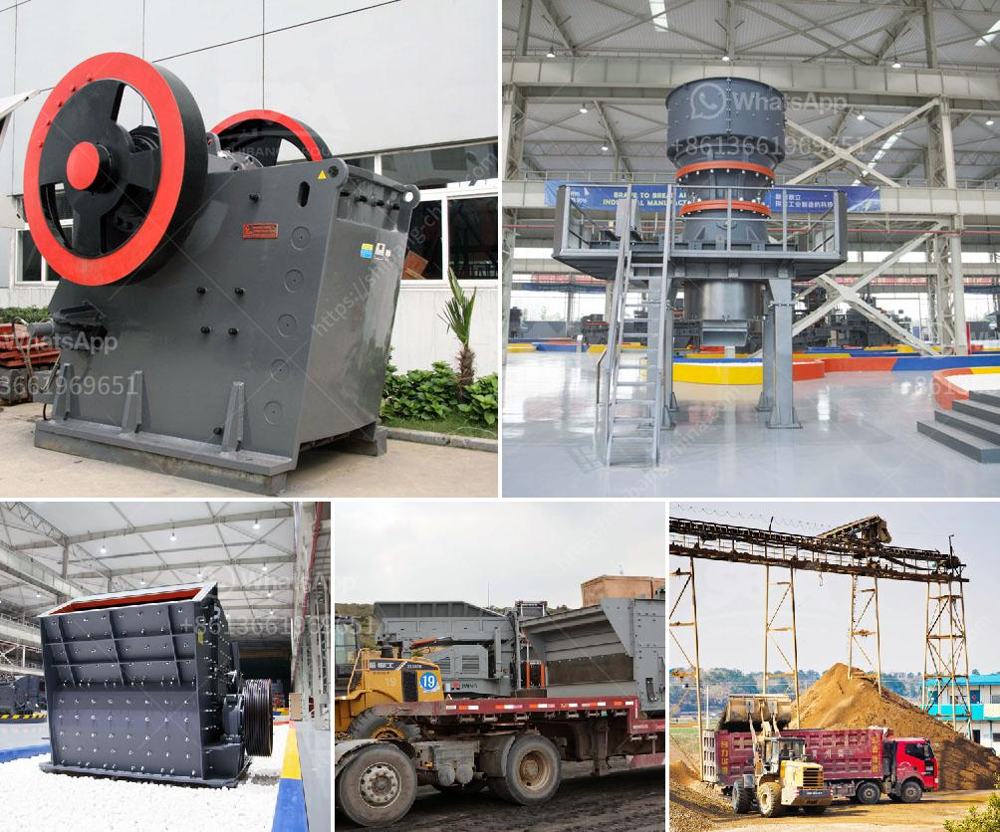

<h3>What is the process of mining iron ore?</h3>
Iron is one of the most abundant elements on earth. Iron ore is extracted from beneath the surface rock, crushed, and then transported to the surface for processing. The simplified process of mining iron ore is outlined below.

Iron ore deposits are typically found in layers or in the form of hematite and magnetite veins. To reach these deposits, several steps must be taken, including prospecting and exploration. Once a potential iron ore deposit is identified, the area is explored to determine the extent, quality, and vertical and horizontal ore distribution.

Geological studies are conducted using geological maps, satellite imagery, and geophysical surveys to identify the most promising areas for mining. Drill holes are then made to collect core samples that are analyzed for their iron content. These samples allow geologists to estimate the size and grade of the deposit, as well as its potential economic viability.

Once a suitable deposit is identified, detailed mine planning and development take place. This involves determining the best location for the mine, as well as designing the layout and infrastructure required for the operation.

Environmental and social considerations are also taken into account during the planning phase. Measures are put in place to minimize the impact on the environment, ensure worker safety, and address any potential social issues associated with mining.

Once the mine is developed and operational, the process of extracting iron ore begins. The ore is then extracted through blasting and hauling by large trucks. The iron ore is crushed into smaller particles that are ready for further processing.

The extracted iron ore is then transported to the surface, where it is processed and stored for later use. In many cases, the ore undergoes additional crushing and screening before it is stockpiled for shipping.

At the processing plant, the iron ore is subjected to several stages of crushing and grinding to reduce the size of the ore particles. Magnetic separators are then used to separate the iron ore from impurities such as silica and gangue minerals.

The iron ore is then formed into pellets or sintered to improve its physical properties and facilitate transportation. Pellets are small balls made from a mixture of iron ore concentrate and binder, whereas sinter is a clumpy material created by heating iron ore fines with coke and limestone.

Once processed, the iron ore is loaded onto transport vessels for shipping. Large ore carriers transport the iron ore across the oceans to reach various markets around the world. In some cases, it may be transported via rail or pipeline, depending on the proximity to the destination.

Mining iron ore involves a complex process that starts with prospecting and exploration, followed by mine planning and development. The ore is then extracted, transported to the surface, and processed to remove impurities. The final product is shipped to various markets globally, where it is used in the production of steel and other iron-based products. Proper planning, consideration of environmental and social factors, and adherence to safety protocols are crucial in ensuring sustainable iron ore mining practices.
<h3>Contact us</h3><ul><li><strong>Whatsapp:&nbsp;<a href="https://wa.me/8613661969651">+8613661969651</a></strong></li><li><a href="https://swt.shibang-china.com/?git&amp;zhl&amp;What is the process of mining iron ore"><strong>Online Service(chat now)</strong></a></li></ul><h3>Related</h3><ul><li><a href='What equipment is needed for magnesite ore mines.md'>What equipment is needed for magnesite ore mines?</a></li><li><a href='What is mechanism sand.md'>What is mechanism sand?</a></li><li><a href='What are the ore and vein minerals in coal mines .md'>What are the ore and vein minerals in coal mines ?</a></li><li><a href='what are some of the equipments used in mining industry.md'>what are some of the equipments used in mining industry?</a></li><li><a href='What is a magnetic iron separator.md'>What is a magnetic iron separator</a></li></ul>