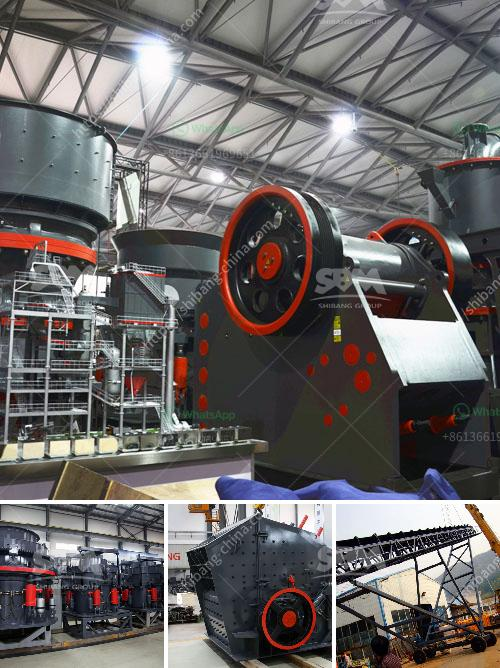

<h3>What is the process of sandstone mining？</h3>
Sandstone is a sedimentary rock composed mainly of sand-sized minerals or rock grains. Most sandstone is formed from quartz and feldspar because these are the most common minerals in the Earth's crust. Like sand, sandstone is made up of fine particles of minerals or rocks, which are tightly packed together.

The process of mining sandstone consists of three main stages: extraction, transportation, and processing. Each of these stages involves a variety of equipment and techniques, requiring professional knowledge and expertise.

The first stage in the process of sandstone mining is extraction. This involves removing the layers of sandstone from the earth’s crust by using heavy machinery. The process of extraction begins with the removal of the overburden (the soil and subsoil above the deposit). After the overburden is cleared, the extraction of the sandstone can begin.

Deposits of sandstone are usually flat-lying, making them easy to extract using open-pit mining methods. Once the sandstone is exposed, it is drilled, fragmented, and then excavated using heavy machinery. The extracted sandstone is then transported to the nearby processing plant for further classification and sorting.

Transporting the sandstone to the processing plant is the next step in the mining process. Typically, trucks or conveyors are used to move the sandstone from the quarry to the processing plant. Once at the processing plant, the sandstone is sorted and categorized based on size, shape, and quality.

The final step in the mining process is the processing of the sandstone. This is done by crushing the sandstone into smaller pieces and then heating it to remove moisture, iron, and other impurities. The purified sandstone is then screened and separated into different sizes and shapes. Once sorted, the sandstone is ready for use in construction, manufacturing, or other industries.

The mining process for sandstone differs from other materials, such as granite, in several ways. First, the extraction of sandstone is relatively straightforward because the deposits are usually close to the surface. Secondly, the process of sandstone extraction impacts the environment in ways that other materials do not. Sandstone mining can cause erosion of hillsides impacting groundwater and causing soil erosion. Additionally, the noise and dust generated by the mining process can be a nuisance to nearby residents.

In conclusion, the process of sandstone mining involves extraction, transportation, and processing. Each of these stages requires specific equipment and expertise to ensure a smooth and efficient mining operation. Sandstone has many applications in construction and other industries, making it a valuable resource. However, environmental considerations should always be taken into account to mitigate the impact of the mining process on the surrounding areas.
<h3>Contact us</h3><ul><li><strong>Whatsapp:&nbsp;<a href="https://wa.me/8613661969651">+8613661969651</a></strong></li><li><a href="https://swt.shibang-china.com/?git&amp;zhl&amp;What is the process of sandstone mining？"><strong>Online Service(chat now)</strong></a></li></ul><h3>Related</h3><ul><li><a href='What is the price of the mobile crusher that has a capacity of 350 tons per hour.md'>What is the price of the mobile crusher that has a capacity of 350 tons per hour?</a></li><li><a href='What is the raw ore crushing process.md'>What is the raw ore crushing process?</a></li><li><a href='What are the wearing parts of grinding mill .md'>What are the wearing parts of grinding mill ?</a></li><li><a href='What machinery and equipment is needed for a sand and gravel processing plant.md'>What machinery and equipment is needed for a sand and gravel processing plant</a></li><li><a href='What is limestone impact crusher？.md'>What is limestone impact crusher？</a></li></ul>