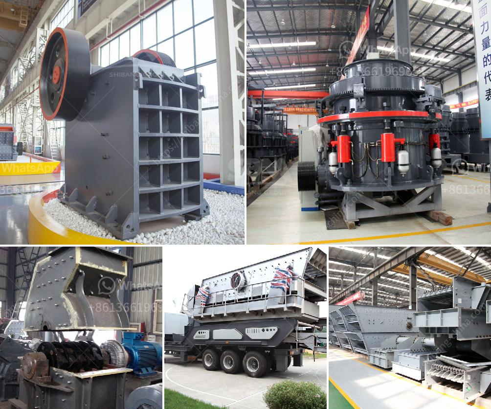

<h3>What is the raw ore crushing process?</h3>
The raw ore crushing process, also known as comminution, involves reducing large ore chunks into smaller particles suitable for further processing. This crucial step prepares the raw materials for various industrial applications, such as creating metals, ceramics, and construction materials. Let's explore the raw ore crushing process and its significance in more detail.

The first and foremost goal of the raw ore crushing process is to break down the large chunks of ore into smaller, manageable sizes. This primary crushing stage is essential for several reasons. Firstly, reducing the ore size allows for efficient transportation and storage. It minimizes the energy and costs associated with handling and processing large chunks. Moreover, it provides a consistent feed for downstream operations, ensuring uniformity in the subsequent processing steps.

There are various methods used for raw ore crushing, each suited to different ore types, sizes, and desired final particle sizes. One common technique is mechanical crushing, where ore rocks are subjected to compression forces using crushers. These crushers include jaw crushers, gyratory crushers, and cone crushers, among others.

Jaw crushers are commonly used in the primary crushing stage, where a large machine called a crusher receives the ore and gradually applies force until it breaks into smaller pieces. Gyratory crushers are also popular in primary crushing. They consist of a cone-shaped crushing head that gyrates in an eccentric motion, crushing the ore against the stationary concave surface.

Cone crushers are often utilized in secondary and tertiary crushing stages. Similar to gyratory crushers, they use a rotating cone-shaped head to crush the ore against a stationary concave surface. Cone crushers are known for their ability to produce finely crushed materials and are often employed in the production of aggregates for construction applications.

Besides mechanical methods, raw ore crushing can also be achieved through chemical processes. In some cases, ores are subjected to chemical reactions that weaken the ore structure, making it easier to crush. Various chemical agents, such as acids or alkalis, can be used to facilitate this process.

To optimize the raw ore crushing process, it is crucial to consider factors such as the hardness and abrasiveness of the ore, desired final particle size, energy efficiency, and cost-effectiveness. Different ore types require specific crushing equipment and techniques to ensure efficient and effective processing. The choice of crusher and the operating parameters, such as speed and crushing chamber design, impact the final product quality and production capacity.

In conclusion, the raw ore crushing process is a fundamental step in the production of metals, construction materials, and other industrial products. It involves breaking down large ore chunks into smaller particles to facilitate transportation, storage, and subsequent processing. Mechanical and chemical methods are employed to achieve this, with different crushers and techniques suited to specific ore types and desired final particle size. Efficient and effective raw ore crushing is essential for ensuring consistent and high-quality output in various industrial applications.
<h3>Contact us</h3><ul><li><strong>Whatsapp:&nbsp;<a href="https://wa.me/8613661969651">+8613661969651</a></strong></li><li><a href="https://swt.shibang-china.com/?git&amp;zhl&amp;What is the raw ore crushing process"><strong>Online Service(chat now)</strong></a></li></ul><h3>Related</h3><ul><li><a href='How to choose a cone crusher for rock crushing？.md'>How to choose a cone crusher for rock crushing？</a></li><li><a href='What is the mining process for fluorite.md'>What is the mining process for fluorite?</a></li><li><a href='What are the ponent of nigerian mining industry.md'>What are the ponent of nigerian mining industry?</a></li><li><a href='what are some of the equipments used in mining industry.md'>what are some of the equipments used in mining industry?</a></li><li><a href='What equipment is used in the mining industry .md'>What equipment is used in the mining industry ?</a></li></ul>