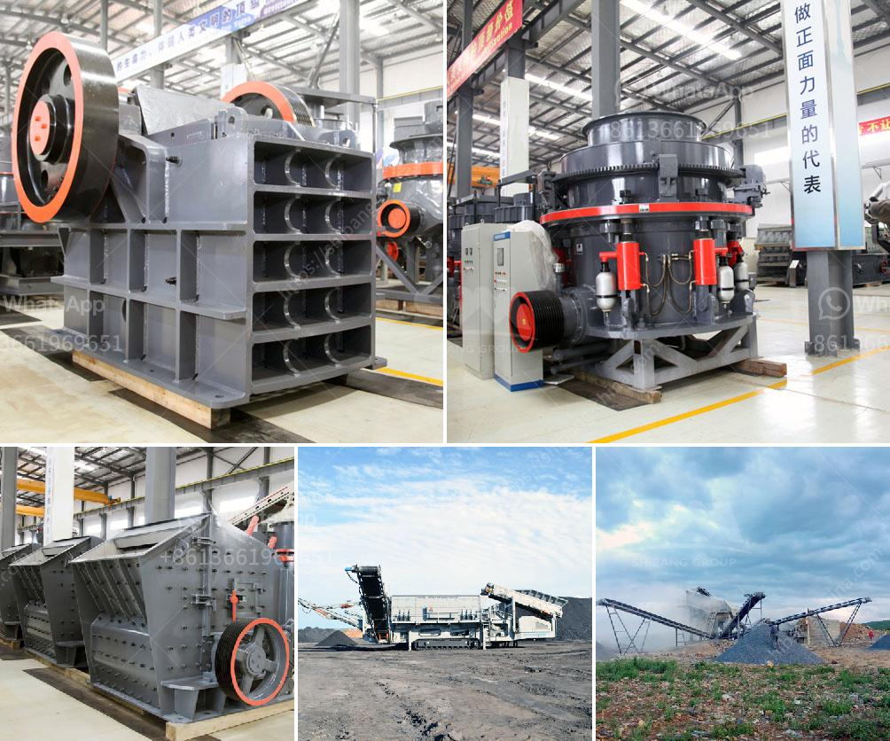

<h3>What is the role of crushing in the beneficiation process?</h3>
The beneficiation process is a crucial stage in the extraction of minerals, ores, and metals. It involves various techniques that aim to separate valuable materials from the waste, thereby enhancing the value of the final product. One of the essential steps within this process is crushing, which plays a fundamental role in breaking down mined ores into smaller fragments, enabling easier extraction and efficient processing. In this article, we delve into the significance of crushing in the beneficiation process.

Crushing serves as the initial step in the beneficiation process, which begins with mining operations. The raw materials extracted from the earth's crust are often large and unwieldy, requiring size reduction to facilitate further processing. Crushing helps to break the extracted ores into smaller, more manageable pieces, allowing for easier handling, transportation, and subsequent processing in the beneficiation plant.

Crushing also enhances the ore's surface area, exposing a greater portion of mineral particles to the subsequent beneficiation processes. A larger surface area results in improved contact with other reagents used in subsequent stages, such as flotation or leaching. This promotes efficient chemical reactions and facilitates the separation of valuable minerals from the gangue.

Once the materials are reduced in size, crushing enables the concentration of minerals and ores by separating the target elements from unwanted gangue minerals. The crushed material is often subjected to further processes like grinding, filtering, gravity separation, or froth flotation to concentrate the valuable minerals. This concentration step enhances the economic viability of mining operations by minimizing the amount of waste material to be processed.

Optimal crushing techniques contribute significantly to the liberation of valuable elements from the ore, ensuring efficient extraction. Different minerals have varying physical properties, such as brittleness, hardness, and grain size, which must be considered during the crushing process. By applying appropriate forces and selecting the right crushing equipment, ores are broken down with minimal energy input, freeing valuable elements for further beneficiation.

Crushing plays a vital role in ensuring the efficiency of downstream beneficiation processes. By breaking down the raw materials into smaller pieces, the subsequent operations become more energy-efficient, reducing costs and environmental impact. Additionally, an optimized crushing process also helps in reducing water and chemical consumption during subsequent beneficiation processes, promoting sustainability in mining operations.

Crushing occupies a crucial role in the beneficiation process by facilitating the initial size reduction of the mined material, exposing a larger surface area for efficient chemical reactions, and aiding in the liberation of valuable minerals. Its importance extends beyond primary mineral extraction, as it contributes to the efficiency, sustainability, and economic viability of the entire beneficiation process. By leveraging advanced crushing technologies and equipment, mining operations can enhance their overall productivity while minimizing environmental impact, ultimately extracting maximum value from the mined ores.
<h3>Contact us</h3><ul><li><strong>Whatsapp:&nbsp;<a href="https://wa.me/8613661969651">+8613661969651</a></strong></li><li><a href="https://swt.shibang-china.com/?git&amp;zhl&amp;What is the role of crushing in the beneficiation process"><strong>Online Service(chat now)</strong></a></li></ul><h3>Related</h3><ul><li><a href='what is the feed size for ball mill？.md'>what is the feed size for ball mill？</a></li><li><a href='What is concrete crusher.md'>What is concrete crusher?</a></li><li><a href='What kind of crushing machinery is used to mine marble ore.md'>What kind of crushing machinery is used to mine marble ore</a></li><li><a href='What is dry screening iron ore.md'>What is dry screening iron ore?</a></li><li><a href='what is the best method for beneficiation of limonite.md'>what is the best method for beneficiation of limonite</a></li></ul>