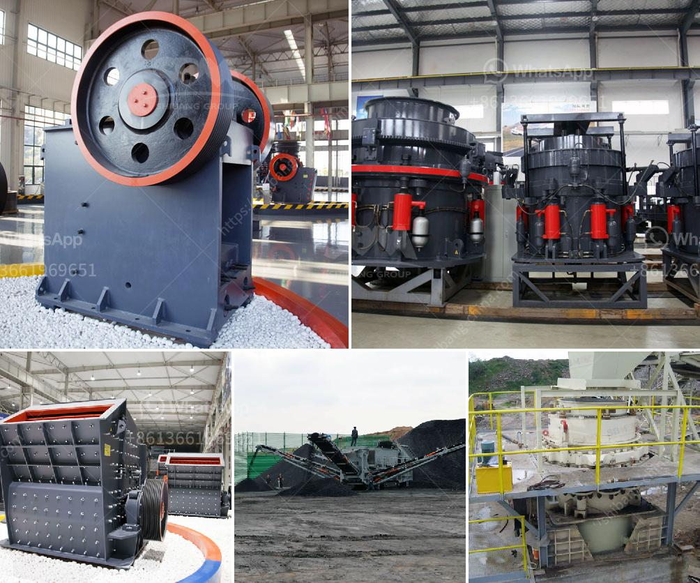

<h3>What is the size of the coal after it passes through the crusher?</h3>
Coal is a sedimentary rock formed by the decomposition of organic materials that have been subjected to heat and pressure over millions of years. The primary use of coal is as a fuel source for generating electricity, heating, and cooking. However, before it can be used, it needs to go through various processes to prepare it for its intended purpose. Reaching the desired size is an important step in coal processing, and the crusher is responsible for breaking down the large chunks of coal into smaller, more manageable pieces.

When coal is extracted from the earth, it can come in different sizes depending on where it is mined. Some coal mines produce larger-sized coal, while others produce smaller, finer particles. However, regardless of the initial size, the coal must undergo crushing and grinding processes to reduce it to a suitable size for further processing.

Coal crushing is the first stage in coal processing where the extracted coal is fed to the crusher to be reduced in size. It is a mechanical process that takes place between the bearings of the crusher and the apron or jaw plates. Crushing is done using mechanical crushers, which employ a combination of impact, shear, and compression forces to fracture the coal into smaller pieces.

The coal crusher works by using a rotating hammer or a combination of blowbars and hammers to repeatedly strike the coal, breaking it into smaller fragments. These fragments then pass through a mesh or screen that allows only the desired, smaller-sized coal particles to pass through.

The size of the coal after it passes through the crusher depends on a few factors including the type of crusher, the feed size, the desired product size, and the capacity of the crusher. Generally, the coal entering the crusher is considered as large-sized coal, and the desired product size is usually less than 1 inch.

Different types of crushers are available for coal crushing, including jaw crushers, gyratory crushers, cone crushers, and impact crushers. Each type of crusher has its own unique characteristics and operating principles, which affect the output size and quality of the crushed coal.

In addition to the type of crusher, the feed size of the coal also plays a significant role in determining the size of the coal after crushing. Larger feed sizes will result in larger output sizes, and vice versa.

The capacity of the crusher is another important factor to consider. A crusher with a higher capacity will generally produce larger-sized coal, while a crusher with a lower capacity will produce smaller-sized coal. The capacity of the crusher is typically measured by the mass or volume of material it can handle within a specified time period.

In conclusion, the size of the coal after it passes through the crusher depends on various factors, including the type of crusher, feed size, desired product size, and the capacity of the crusher. Properly sizing the coal is crucial for efficient and effective coal processing, as it ensures that the coal can be used in various applications such as electricity generation, heating, and cooking.
<h3>Contact us</h3><ul><li><strong>Whatsapp:&nbsp;<a href="https://wa.me/8613661969651">+8613661969651</a></strong></li><li><a href="https://swt.shibang-china.com/?git&amp;zhl&amp;What is the size of the coal after it passes through the crusher"><strong>Online Service(chat now)</strong></a></li></ul><h3>Related</h3><ul><li><a href='What is a magnetic iron separator.md'>What is a magnetic iron separator</a></li><li><a href='What is a grinding ball mill aid.md'>What is a grinding ball mill aid?</a></li><li><a href='What type of mining is used for magnetite.md'>What type of mining is used for magnetite?</a></li><li><a href='What beneficiation method is used for iron ore.md'>What beneficiation method is used for iron ore?</a></li><li><a href='what is the running cost for a jaw crusher.md'>what is the running cost for a jaw crusher?</a></li></ul>