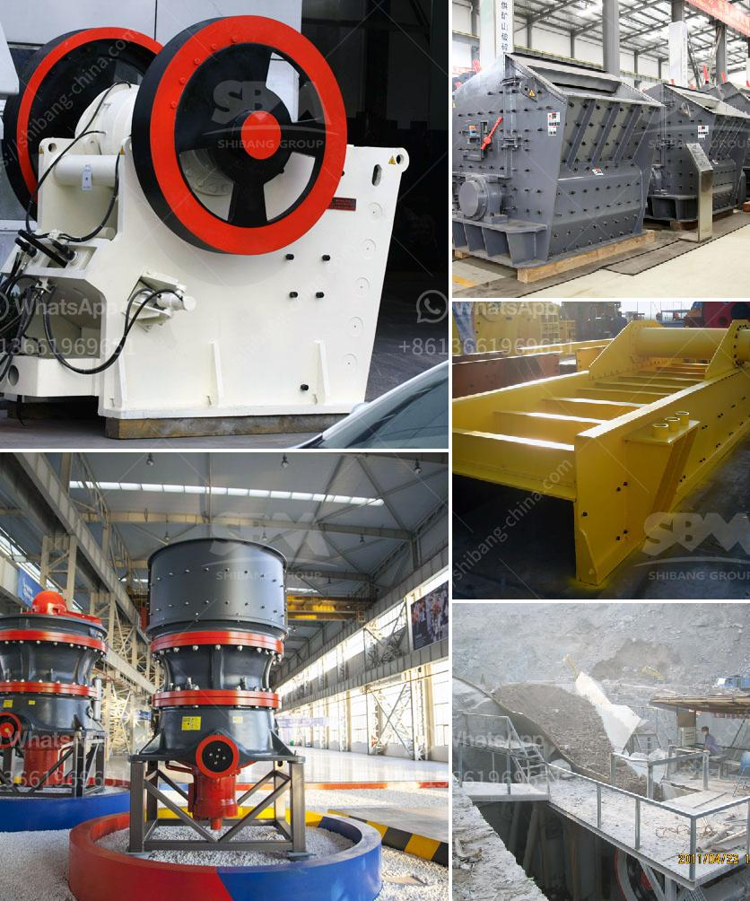

<h3>What is the specification of a jaw crusher?</h3>
A jaw crusher is a machine that reduces the size of materials used in many industrial applications such as construction, mineral extraction, and recycling. It is used to break or crush large rocks into smaller pieces. The specification of a jaw crusher includes different aspects of the machine such as power requirements, lubrication system, feed size, and capacity.

At the very basic level, jaw crushers use compression to break rock particles into smaller sizes. The movement of the jaws creates a force that generates pressure on the rock and forces it against the stationary plate. The width of the jaws directly impacts the throughput capacity, as it determines the maximum opening between the jaws.

The power requirements of a jaw crusher are dependent on the size of the machine and its operating speed. Rated power is the maximum power that a motor can deliver. Typically, a jaw crusher consists of a motor with a power rating of between 100 to 1500 horsepower.

The lubrication system ensures smooth operation of the machine by delivering lubricants to the moving parts of the crusher. It typically consists of an oil filter, oil tank, and oil pump. The oil is circulated through the machine and removes any dirt or contaminants that might cause damage or hinder the performance of the crusher.

The feed size of the jaw crusher determines the saw tooth opening of the jaws. Small-sized particles are crushed between the jaws and discharged at the bottom, while larger particles remain in the jaws for further crushing. The ideal feed size for a jaw crusher is often determined by the size of the opening between the jaws. For example, a 32 x 54 jaw crusher measures 32" from jaw die bottom to jaw die top opening, or gape opening, in inches.

The capacity of a jaw crusher is determined by the size of its feed opening and the horsepower of the motor. The maximum tonnage that can be produced by a jaw crusher depends on the size of its feed opening, the crushing chamber design, and the eccentric motion of the moveable jaw die. The larger the opening, the larger the crushing capacity.

Jaw crushers are available in various sizes and capacities ranging from 5 to 1500 tons per hour. They are commonly used in construction, mineral processing, and aggregate production industries. Some of the key features of a jaw crusher include high throughput rates, large feed openings, and aggressive crushing action.

In conclusion, a jaw crusher is a powerful machine that is used to reduce the size of materials used in various industrial applications. It has a wide range of specifications to ensure effective crushing performance, and its capacity and power requirements are directly proportional to the size of the machine. With its diverse applications and features, the jaw crusher continues to be an essential tool in many industries.
<h3>Contact us</h3><ul><li><strong>Whatsapp:&nbsp;<a href="https://wa.me/8613661969651">+8613661969651</a></strong></li><li><a href="https://swt.shibang-china.com/?git&amp;zhl&amp;What is the specification of a jaw crusher"><strong>Online Service(chat now)</strong></a></li></ul><h3>Related</h3><ul><li><a href='What guidelines are needed to set up a mobile stone crusher in Orissa.md'>What guidelines are needed to set up a mobile stone crusher in Orissa?</a></li><li><a href='what is the difference between river sand and crusher sand.md'>what is the difference between river sand and crusher sand</a></li><li><a href='What are the different steps of chromite ore beneficiation .md'>What are the different steps of chromite ore beneficiation ?</a></li><li><a href='What is the difference between impact crusher and hammer mill.md'>What is the difference between impact crusher and hammer mill?</a></li><li><a href='What type of bearings must be used for the taper of a jaw crusher.md'>What type of bearings must be used for the taper of a jaw crusher?</a></li></ul>