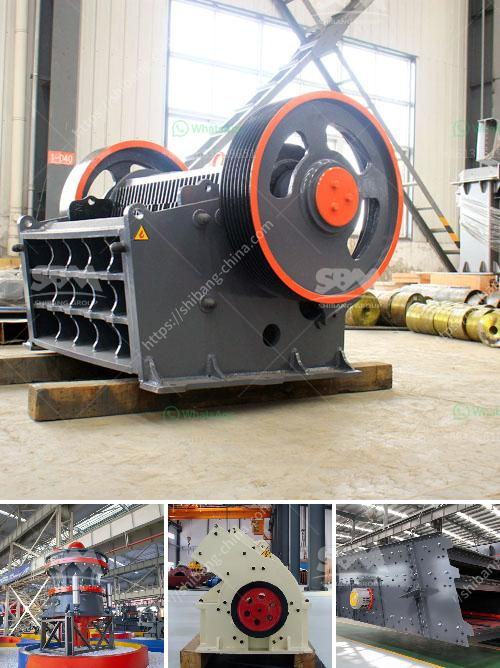

<h3>What is the use of crushing magnetite rock before milling?</h3>
Magnetite, also known as iron oxide, is a mineral that belongs to the spinel group of minerals. It has a chemical formula of Fe3O4 and is one of the most abundant minerals on Earth. Magnetite is sought after due to its magnetic properties, making it useful in a variety of applications including iron ore beneficiation, mineral processing, and as a dense-medium separation agent.

Before magnetite rock can be processed further, it needs to be crushed. Crushing magnetite rock before milling it is a crucial step as it ensures a consistent feed size that enhances the efficiency and effectiveness of the milling process. This article will delve into the importance of crushing magnetite rock and its subsequent benefits.

First and foremost, crushing magnetite rock improves the liberation of valuable minerals from the host rock. During the crushing process, the rock is reduced to smaller particles, exposing the valuable minerals locked within it. This liberation allows for easier separation of minerals during subsequent milling or beneficiation processes, improving the overall recovery of valuable minerals.

Furthermore, crushing magnetite rock also aids in achieving a consistent feed size for the milling process. Milling is a size reduction process that uses mechanical forces to break down particles into smaller sizes. By reducing the rock to a consistent feed size, milling efficiency is increased as the material is evenly processed, resulting in a more uniform product.

In addition, crushing magnetite rock before milling enhances the effectiveness of the milling process by reducing the energy consumption required. By ensuring a consistent feed size, the milling equipment can operate at optimal conditions without the need for excessive energy to break down oversized particles. This leads to energy savings and reduced operational costs.

Another important aspect of crushing magnetite rock is the prevention of equipment damage and wear. Magnetite rock often contains hard and abrasive components that can cause significant damage to milling equipment such as crushers and mills. By crushing the rock beforehand, large and abrasive particles can be reduced in size, minimizing the chance of equipment failure and prolonging the lifespan of the machinery.

Lastly, crushing magnetite rock before milling also facilitates the removal of impurities. As with any mineral, magnetite rock can contain impurities such as gangue minerals and contaminants. Crushing the rock helps to break down and separate these impurities, allowing for a cleaner and purer final product.

In conclusion, crushing magnetite rock before milling is a crucial step in the processing of magnetite ore. It improves the liberation of valuable minerals, ensures a consistent feed size for milling, enhances milling efficiency and reduces energy consumption, prevents equipment damage and wear, and facilitates the removal of impurities. By understanding the importance of this step, mining companies can optimize their operations and maximize the recovery of valuable mineral resources.
<h3>Contact us</h3><ul><li><strong>Whatsapp:&nbsp;<a href="https://wa.me/8613661969651">+8613661969651</a></strong></li><li><a href="https://swt.shibang-china.com/?git&amp;zhl&amp;What is the use of crushing magnetite rock before milling"><strong>Online Service(chat now)</strong></a></li></ul><h3>Related</h3><ul><li><a href='What machines are needed to crush river pebbles into small stones.md'>What machines are needed to crush river pebbles into small stones?</a></li><li><a href='What equipment is needed for coal ore mines.md'>What equipment is needed for coal ore mines?</a></li><li><a href='What are the parts of ball mill internal structure.md'>What are the parts of ball mill internal structure?</a></li><li><a href='What equipment and machinery are needed to mine marble.md'>What equipment and machinery are needed to mine marble?</a></li><li><a href='What is grindind machine.md'>What is grindind machine?</a></li></ul>