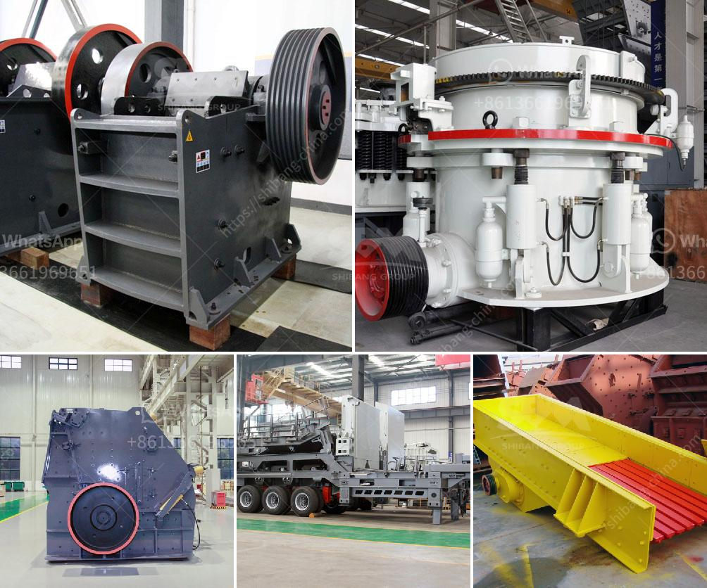

<h3>What is the wattage of the stone crusher?</h3>
Stone crushers are essential mining equipment for crushing, grinding, ore dressing, and recycling operations. These machines come in different wattage capacities and are commonly used in quarries, mines, and construction sites. Stone crushers are built to break massive stones into small and manageable sizes using a powerful mechanical force. They are generally powered by electricity or diesel engines, depending on the market's preferences and availability. The wattage of a stone crusher determines its power output and efficiency.

Wattage refers to the electrical power a device consumes or produces. For stone crushers, the power input can vary from 1000W up to a maximum of 11000W. On the other hand, the power output of these machines typically ranges from 50W up to a maximum of 1800W. This wide wattage range accounts for the various sizes and types of stone crushers available in the market.

The wattage of a stone crusher is selected by considering factors such as the required productivity, the type of stone to be crushed, the hardness, humidity, and density of the material, as well as the environmental conditions the machine will operate in. Higher wattage stone crushers are generally used for large-scale mining or heavy-duty applications, where larger stones need to be crushed with more force and at higher speeds.

In practical terms, the wattage of a stone crusher directly impacts its productivity. A higher wattage machine can handle larger quantities of material and produce more crushed stones per hour. This is especially crucial in mining operations where large volumes of ore need to be processed within a limited time frame.

Additionally, the wattage of a stone crusher affects its overall efficiency. Higher wattage machines usually provide a more powerful crushing force, allowing for more effective stone breakage. They can also maintain a consistent speed and throughput, ensuring smooth and continuous operation. Consequently, higher wattage stone crushers are generally more efficient at breaking down stones and require less energy to achieve the desired output.

When purchasing a stone crusher, it is vital to ensure that the wattage capacity matches your specific requirements. Over or underestimating the wattage can result in inefficiencies, reduced productivity, and increased energy costs. Consulting with experts or manufacturers will help you determine the appropriate wattage capacity based on your intended use and specific needs.

In conclusion, the wattage of a stone crusher plays a significant role in determining its power output, productivity, and efficiency. When selecting a stone crusher, it is crucial to match the wattage capacity with your specific requirements to ensure optimal performance. By doing so, you can maximize the machine's productivity, minimize energy consumption, and ultimately achieve your desired results.
<h3>Contact us</h3><ul><li><strong>Whatsapp:&nbsp;<a href="https://wa.me/8613661969651">+8613661969651</a></strong></li><li><a href="https://swt.shibang-china.com/?git&amp;zhl&amp;What is the wattage of the stone crusher"><strong>Online Service(chat now)</strong></a></li></ul><h3>Related</h3><ul><li><a href='what kind of crushing machinery is used for crushing rock？.md'>what kind of crushing machinery is used for crushing rock？</a></li><li><a href='what is the running cost for a jaw crusher.md'>what is the running cost for a jaw crusher?</a></li><li><a href='What beneficiation method is used for iron ore.md'>What beneficiation method is used for iron ore?</a></li><li><a href='what equipment needed for mining iron ore.md'>what equipment needed for mining iron ore</a></li><li><a href='What is a recycle feed hopper sand mine.md'>What is a recycle feed hopper sand mine?</a></li></ul>