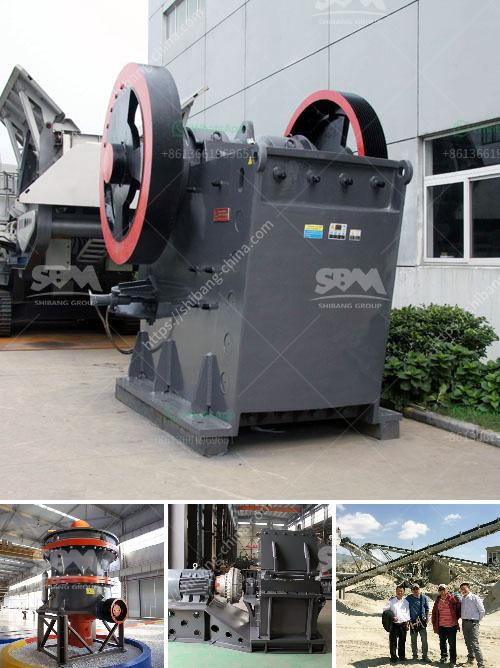

<h3>What is wet process cement?</h3>
Cement is the most widely used material in construction, and it is made through a chemical process known as hydration. There are two main methods of manufacturing cement: the dry process and the wet process. In this article, we will explore the wet process of cement manufacturing.

The wet process of cement manufacturing involves adding water to finely crushed raw material, such as limestone, clay or iron ore, in a proportion of 35% to 50 percent water to 50 to 65 percent raw material to make a slurry or slushy mixture. This slurry is then fed into a rotary kiln, which is a long, cylindrical, steel tube, together with a small amount of gypsum. The water in the slurry evaporates as the mixture passes through the kiln, and the chemical reactions take place which convert the mixture into clinker.

The main advantage of the wet process is that it is more energy-efficient compared to the dry process. This is because the raw materials are mixed with water, which reduces the energy required to remove the moisture from the materials. Additionally, it allows for better homogenization of the raw materials, resulting in a more consistent and higher-quality product.

Another advantage of the wet process is that it allows for more precise control of the chemical composition of the cement. By adding water to the raw materials, it becomes easier to ensure that the proportions of different compounds, such as calcium, silica, and iron, are accurately measured. This is crucial for achieving the desired properties and strength of the final cement product.

However, the wet process also has some drawbacks. One major disadvantage is that it requires a larger capital investment and higher operating costs due to the need for more complex machinery and equipment, such as the rotary kiln. Additionally, the wet process tends to produce a larger quantity of waste by-products, including dust, sludge, and emissions, which need to be properly managed and disposed of to prevent environmental pollution.

Over the years, the wet process of manufacturing cement has become less popular compared to the dry process. This is primarily due to advancements in technology and the development of more efficient dry process kilns. The dry process involves using raw materials in a powdered form, which is fed into the kiln directly, eliminating the need for water and the associated energy required for drying.

In conclusion, the wet process of cement manufacturing involves the addition of water to finely crushed raw materials, resulting in a slurry that is fed into a rotary kiln to produce the final product called clinker. While the wet process offers advantages such as energy efficiency and precise control of chemical composition, it also has drawbacks, including higher costs and environmental concerns. Ultimately, the choice between the wet and dry process depends on various factors, including the availability of resources, investment costs, and environmental considerations.
<h3>Contact us</h3><ul><li><strong>Whatsapp:&nbsp;<a href="https://wa.me/8613661969651">+8613661969651</a></strong></li><li><a href="https://swt.shibang-china.com/?git&amp;zhl&amp;What is wet process cement"><strong>Online Service(chat now)</strong></a></li></ul><h3>Related</h3><ul><li><a href='What is the role of crushing in the beneficiation process.md'>What is the role of crushing in the beneficiation process?</a></li><li><a href='What equipment is needed for boron ore mines.md'>What equipment is needed for boron ore mines?</a></li><li><a href='What are grinding and crushing in small scale miners.md'>What are grinding and crushing in small scale miners?</a></li><li><a href='What machinery and equipment is needed for a sand and gravel processing plant.md'>What machinery and equipment is needed for a sand and gravel processing plant</a></li><li><a href='What is an ore vibrating screen What is it for.md'>What is an ore vibrating screen? What is it for?</a></li></ul>