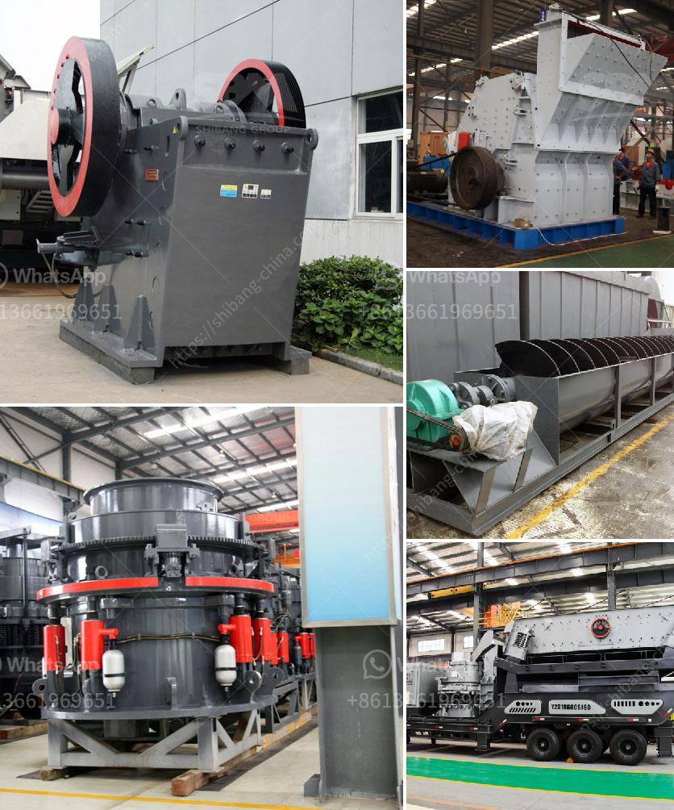

<h3>What kind of crusher crushes basalt best?</h3>
Basalt, a common volcanic rock, is one of the most abundant natural resources on earth. Its multiple uses and durability make it a popular material in many industries such as construction, manufacturing, and landscaping. To process and utilize basalt efficiently, it is essential to crush it into the desired size and shape. However, selecting the right crusher to accomplish this task can be challenging. With various crushers available on the market, determining the best one to crush basalt depends on several factors, including the desired outcome, production capacity, and cost-effectiveness.

One of the primary considerations when choosing a crusher for basalt is the desired product size. Different crushers excel at producing different sizes of crushed materials. Jaw crushers are commonly used for primary crushing, and they can provide a product size ranging from several centimeters to tens of centimeters. For finer sizes, cone crushers or impact crushers are preferred. Cone crushers can produce cubical-shaped particles and are well-suited for secondary or tertiary crushing, while impact crushers can provide excellent shape characteristics in both primary and secondary crushing stages.

Another factor to consider is the production capacity required for the specific application. Basalt has a high compressive strength and is a hard material to crush. Therefore, the crusher used should have a large crushing chamber and sturdy construction to withstand the intense pressure. Cone crushers and gyratory crushers are often the best choices due to their high capacity and robust design.

Furthermore, the cost-effectiveness of a crusher plays a significant role in the selection process. Initial investment, maintenance, and operational costs must be considered to ensure the crusher's long-term viability. Typically, jaw crushers have lower initial costs compared to other types of crushers, making them a popular choice for basalt crushing. However, their higher maintenance and operational costs, as well as their limited capacity, may offset the initial savings. Therefore, a thorough cost analysis is crucial to determine the crusher that offers the best balance between initial investment and long-term usage costs.

In recent years, technological advancements have brought about newer crusher designs that exhibit enhanced performance for crushing basalt. For instance, vertical shaft impact (VSI) crushers have gained popularity due to their ability to produce a high percentage of fine aggregate particles and excellent shape characteristics. These crushers utilize a high-speed rotor and anvils to create rock-on-rock impacts, offering efficient and precise crushing action.

In conclusion, the selection of the best crusher for crushing basalt depends on a variety of factors, including product size requirements, production capacity, and cost-effectiveness. Jaw crushers, cone crushers, and impact crushers are all suitable choices, depending on the desired outcome and specific application. Additionally, advancements in crusher technology have introduced new options like VSI crushers that offer improved performance and precise crushing capabilities. Ultimately, a comprehensive analysis of these factors will ensure the best crusher is selected to efficiently crush basalt and meet the needs of the industry.
<h3>Contact us</h3><ul><li><strong>Whatsapp:&nbsp;<a href="https://wa.me/8613661969651">+8613661969651</a></strong></li><li><a href="https://swt.shibang-china.com/?git&amp;zhl&amp;What kind of crusher crushes basalt best"><strong>Online Service(chat now)</strong></a></li></ul><h3>Related</h3><ul><li><a href='What is the process of sandstone mining？.md'>What is the process of sandstone mining？</a></li><li><a href='What are the most common expenses in crushing plant project.md'>What are the most common expenses in crushing plant project?</a></li><li><a href='what aspects influence stone crusher efficiency.md'>what aspects influence stone crusher efficiency</a></li><li><a href='What is iron ore screening process.md'>What is iron ore screening process?</a></li><li><a href='What equipment is needed for kaolin ore mines.md'>What equipment is needed for kaolin ore mines?</a></li></ul>