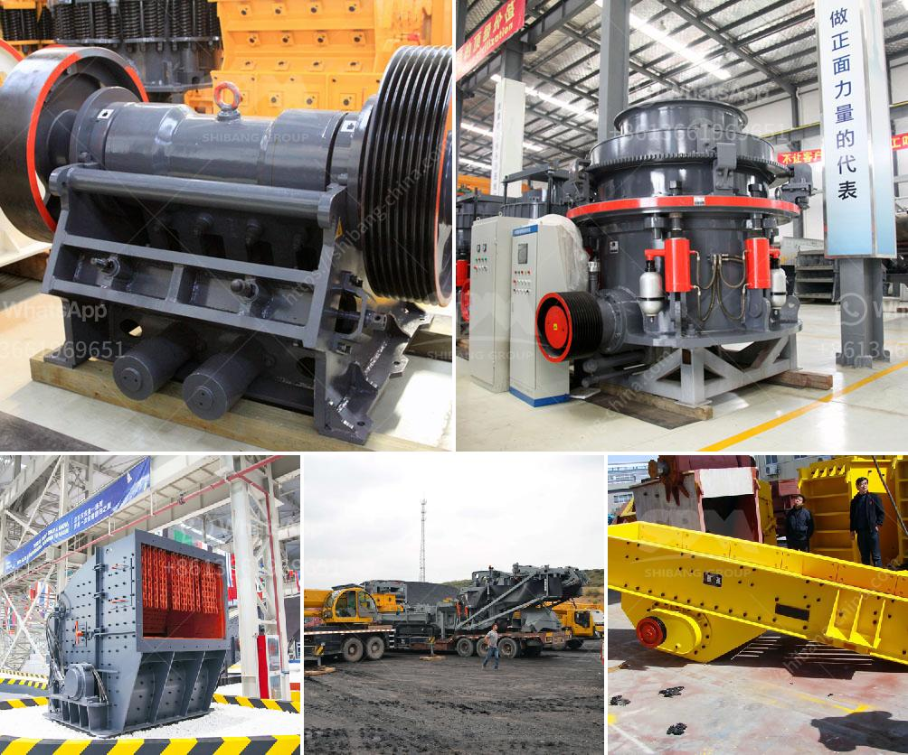

<h3>What kind of crushing equipment is needed to produce cement</h3>
When it comes to producing cement, one of the key equipment required is crushing equipment. Cement manufacturing involves several stages, with each stage requiring different crushing equipment. Here, we will discuss the various types of crushing equipment needed to produce cement.

Firstly, quarrying is the initial stage of cement manufacturing. In this stage, various raw materials like limestone, clay, shale, and sandstone are extracted from quarries. To crush these raw materials into smaller sizes suitable for further processing, primary crushers are used. Typically, a jaw crusher or impact crusher is utilized as primary crushing equipment.

After the raw materials have been crushed, they are then transported to the cement plant for further processing. The next step in cement manufacturing is the grinding of the finely crushed raw materials. To accomplish this, several types of crushing equipment can be used.

One commonly used crushing equipment is a roller crusher. This equipment works by compressing the material between two rollers to reduce the particle size. Roller crushers are ideal for producing uniform-sized raw meal for the kiln, as well as for pre-grinding clinker to reduce energy consumption in the grinding process.

Another type of crushing equipment used in the cement industry is a hammer crusher. This equipment utilizes hammers to crush the material instead of rollers. Hammer crushers are commonly used for crushing coal and limestone in cement plants, as well as for secondary crushing operations. They are also frequently used for pre-crushing clinker before grinding.

Additionally, impact crushers are widely used in cement plants for the secondary crushing process. They provide high reduction ratios and can handle large-sized materials. Impact crushers are available in various configurations, such as horizontal shaft impactors or vertical shaft impactors. These crushers are suitable for both soft and hard materials and are commonly used in the cement industry to crush limestone, clay, and other materials.

Furthermore, cone crushers are sometimes used in the cement industry for the secondary and tertiary crushing stages. These crushers are capable of producing fine and even-sized particles. Cone crushers are commonly used to crush hard and abrasive materials, such as granite, basalt, and ores.

In conclusion, producing cement requires various stages, with crushing equipment being a crucial part of the process. Different types of crushing equipment are needed at different stages to achieve the desired particle size and consistency. Jaw crushers, impact crushers, roller crushers, hammer crushers, impact crushers, and cone crushers are widely used in the cement industry for various crushing operations. By utilizing suitable crushing equipment, cement manufacturers can optimize their production process and ensure high-quality cement.
<h3>Contact us</h3><ul><li><strong>Whatsapp:&nbsp;<a href="https://wa.me/8613661969651">+8613661969651</a></strong></li><li><a href="https://swt.shibang-china.com/?git&amp;zhl&amp;What kind of crushing equipment is needed to produce cement"><strong>Online Service(chat now)</strong></a></li></ul><h3>Related</h3><ul><li><a href='what is the running cost for a jaw crusher.md'>what is the running cost for a jaw crusher?</a></li><li><a href='What are the different steps of chromite ore beneficiation .md'>What are the different steps of chromite ore beneficiation ?</a></li><li><a href='What machinery and equipment is needed for a sand and gravel processing plant.md'>What machinery and equipment is needed for a sand and gravel processing plant</a></li><li><a href='What type of equipment is used in the mining of lead ores.md'>What type of equipment is used in the mining of lead ores?</a></li><li><a href='what type of pumps uesd in stone crusher？.md'>what type of pumps uesd in stone crusher？</a></li></ul>