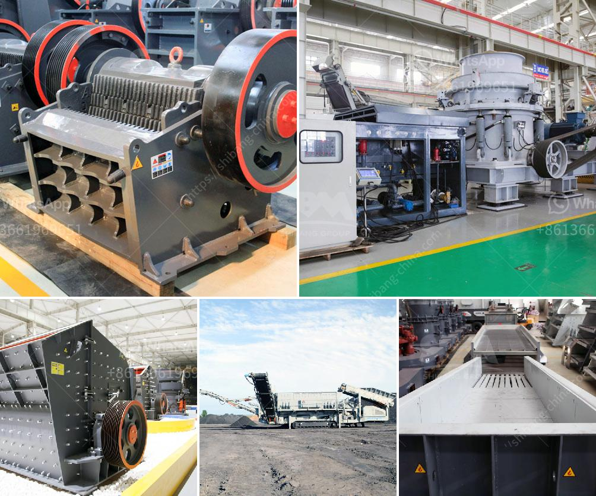

<h3>What kind of crushing machinery is needed for gypsum mine mining?</h3>
Gypsum, a mineral composed of calcium sulfate dihydrate, is commonly used in the construction industry. It is a versatile material that can be used as a binder for plaster, a component for cement, and as a soil amendment. Gypsum is obtained through the process of mining, where deposits of the mineral are extracted from the earth's crust. To extract gypsum efficiently, various crushing machinery is needed to break up the large rocks into smaller pieces suitable for further processing.

One of the primary machines used in gypsum mining is the jaw crusher. It is used to crush large rocks into smaller pieces of approximately 10-20cm, which are then sent to the grinding mill for further grinding. Jaw crushers have evolved over several decades to become a reliable and versatile crushing machine. They are known for their simple design, high efficiency, and low maintenance requirements. Additionally, jaw crushers have a wide range of adjustment options, allowing them to produce different sizes of crushed gypsum as required.

After the initial crushing stage, the secondary crusher is used to further reduce the size of the gypsum. The most commonly used secondary crusher is the impact crusher. It utilizes the principle of impact crushing to break the gypsum into smaller pieces. Impact crushers are known for their high reduction ratios and ability to produce a uniform product size. They are also capable of handling hard and abrasive materials, which are often found in gypsum mines.

In addition to jaw and impact crushers, cone crushers are also commonly used in gypsum mining. Cone crushers operate by compressing the material between an eccentrically rotating mantle and a concave bowl liner. This process duplicates the action of a mortar and pestle, reducing the gypsum to a finer size. Cone crushers are particularly useful in fine crushing applications, producing a high-quality product with a uniform particle size distribution.

In recent years, the development of mobile crushing plants has revolutionized the mining industry. These portable machines can be easily transported to the mining site, eliminating the need for expensive transportation of the extracted gypsum. Mobile crushers are equipped with powerful engines and advanced crushing technology, allowing them to process large quantities of gypsum quickly and efficiently.

In conclusion, a variety of crushing machinery is required for gypsum mine mining. Jaw crushers, impact crushers, cone crushers, and mobile crushers are all commonly used in gypsum mining operations. Each type of crusher has its own unique features and advantages, making them suitable for different stages of the crushing process. By utilizing these machines, gypsum can be processed into various sizes, meeting the diverse needs of the construction industry.
<h3>Contact us</h3><ul><li><strong>Whatsapp:&nbsp;<a href="https://wa.me/8613661969651">+8613661969651</a></strong></li><li><a href="https://swt.shibang-china.com/?git&amp;zhl&amp;What kind of crushing machinery is needed for gypsum mine mining"><strong>Online Service(chat now)</strong></a></li></ul><h3>Related</h3><ul><li><a href='What is the price of the mobile crusher that has a capacity of 350 tons per hour.md'>What is the price of the mobile crusher that has a capacity of 350 tons per hour?</a></li><li><a href='what crusher types are used in copper processing in zambia.md'>what crusher types are used in copper processing in zambia?</a></li><li><a href='What does 20 mm all in aggregate mean.md'>What does "20 mm all in aggregate" mean?</a></li><li><a href='What is a grinding ball mill aid.md'>What is a grinding ball mill aid?</a></li><li><a href='What is the size of the coal after it passes through the crusher.md'>What is the size of the coal after it passes through the crusher?</a></li></ul>