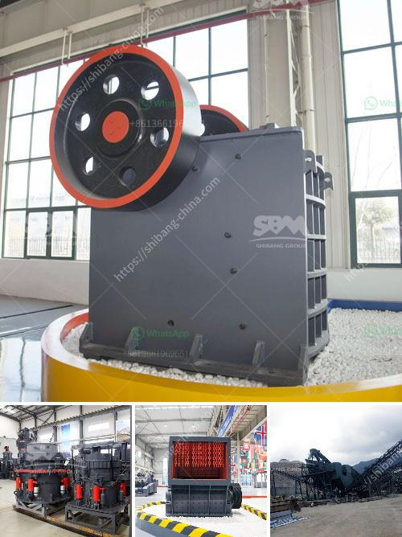

<h3>What kind of crushing machinery is used for sandstone processing ？</h3>
Sandstone is a popular natural stone material that is widely used in construction, landscaping, and other applications. It is known for its durability and unique aesthetic appeal. However, before it can be used in various projects, it needs to undergo a series of processing steps. One crucial step in the sandstone processing is the crushing stage, which is where the stone is broken down into smaller pieces that can be used for various purposes. In this article, we will explore the different kinds of crushing machinery used for sandstone processing.

One of the most common machines used in the crushing stage is a jaw crusher. As the name suggests, this machine works by utilizing a fixed jaw and a moving jaw to crush the sandstone. The rocks are fed into the crushing chamber through a vibrating feeder, and the eccentric motion of the jaws creates a compressive force, which breaks the stone into smaller sizes. Jaw crushers are known for their high reduction ratio and reliable performance, making them a popular choice for sandstone crushing.

Another type of crushing machinery used for sandstone processing is an impact crusher. This machine uses a rotor with hammers to strike the sandstone and further break it down. The material is fed into the machine from the top and is impacted by the hammers as it travels through the crushing chamber. Impact crushers are known for their high production capacity and ability to produce well-shaped and evenly graded aggregates.

Cone crushers are also commonly used in sandstone processing. This machine works by compressing the material between an eccentrically rotating mantle and a concave bowl liner. The sandstone is fed into the top of the crusher and is gradually crushed as it moves downward. Cone crushers are especially suitable for producing high-quality aggregates with a well-graded product shape. They are often used in the final stage of the crushing process to refine the particle size and shape.

In addition to the above-mentioned machines, there are also other specialized crushing machinery used for sandstone processing. For example, a hammer mill can be used to further pulverize the sandstone into finer particles. This is particularly useful for applications that require a very fine and consistent product, such as in the production of cement or asphalt.

Overall, the choice of crushing machinery for sandstone processing depends on various factors such as the desired product size, shape, and capacity requirements. It is essential to select a machine that can effectively break down the sandstone while maintaining the desired quality. Consulting with a professional in the field can help determine the most suitable crushing machinery for specific sandstone processing needs.

In conclusion, crushing machinery plays a crucial role in sandstone processing. Jaw crushers, impact crushers, cone crushers, and other specialized machines are used to break down the sandstone into smaller pieces. Each of these machines offers unique capabilities and features to meet different processing requirements. By selecting the right machinery, sandstone can be processed efficiently and effectively to meet the demands of various projects.
<h3>Contact us</h3><ul><li><strong>Whatsapp:&nbsp;<a href="https://wa.me/8613661969651">+8613661969651</a></strong></li><li><a href="https://swt.shibang-china.com/?git&amp;zhl&amp;What kind of crushing machinery is used for sandstone processing ？"><strong>Online Service(chat now)</strong></a></li></ul><h3>Related</h3><ul><li><a href='what are the gold ore crusher.md'>what are the gold ore crusher?</a></li><li><a href='What are the processes of iron ore beneficiation.md'>What are the processes of iron ore beneficiation?</a></li><li><a href='What is the cost of a quarry crusher for 500 tons.md'>What is the cost of a quarry crusher for 500 tons?</a></li><li><a href='What machinery and equipment is needed for a sand and gravel processing plant.md'>What machinery and equipment is needed for a sand and gravel processing plant</a></li><li><a href='What is a bentonite grinding unit.md'>What is a bentonite grinding unit?</a></li></ul>