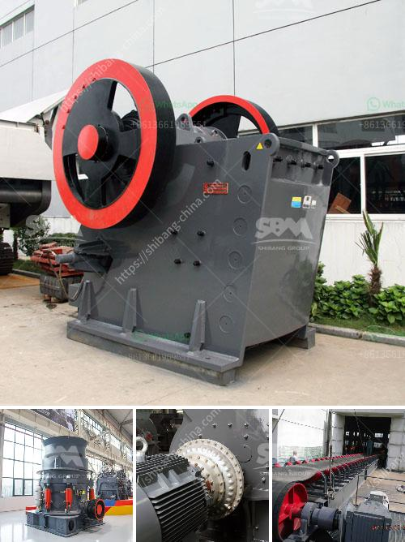

<h3>What kind of crushing machinery is used to mine marble ore</h3>
Marble is a stunning natural material that has been quarried and used in construction and decor for centuries. To extract marble from the earth, it is necessary to deploy a series of heavy-duty machinery. This article will explore the types of crushing machinery used in the marble mining process and highlight their specific functionalities.

A jaw crusher is commonly used as the primary crusher for marble crushing. It is a heavy-duty machine that has a movable jaw plate and a fixed jaw plate, both of which have wear plates on them. These plates help to crush the marble as it passes through the jaws. The crushed marble pieces are then filtered through a mesh screen known as a grizzly before being transported to the next stage of crushing.

An impact crusher, on the other hand, uses hammers to crush marble into smaller particles. This primary crushing equipment is suitable for mining, highways, power plants, etc., to crush various materials with a compressive strength lower than 250MPa. It can crush materials of all hardnesses, and its crushing ratio is large, ensuring the uniform particle size of the crushed material.

A cone crusher is used to break marble into smaller pieces. It has a large crushing ratio, suitable for the crushing of medium-hard materials. It is widely used in mining, smelting, building materials, highways, railways, water conservancy, and chemical industries. Cone crushers are composed of a frame, transmission device, hollow eccentric shaft, bowl-shaped bearing, crushing cone, hydraulic pressure adjusting device, and other parts.

A hammer crusher is another widely used machine for marble crushing. It has a rotating hammerhead that crushes the marble against the inner surface of the chamber. The hammer hits the marble, making it break into smaller pieces. These machines are commonly used in quarries, cement plants, coal mines, and other construction sites.

A vibrating feeder is often used in the early stages of marble crushing. It can evenly feed large marble ores into jaw crushers, impacting crushers, and other crushing equipment to facilitate subsequent crushing processes. It guarantees the quality of the finished marble product.

In conclusion, marble mining requires a range of crushing machinery in order to efficiently extract and process the marble. The above-mentioned machines are all essential in the marble ore mining process. With their powerful functionalities and durability, they are indispensable for workers to carry out high-quality marble mining operations.
<h3>Contact us</h3><ul><li><strong>Whatsapp:&nbsp;<a href="https://wa.me/8613661969651">+8613661969651</a></strong></li><li><a href="https://swt.shibang-china.com/?git&amp;zhl&amp;What kind of crushing machinery is used to mine marble ore"><strong>Online Service(chat now)</strong></a></li></ul><h3>Related</h3><ul><li><a href='What is the cost of a quarry crusher for 500 tons.md'>What is the cost of a quarry crusher for 500 tons?</a></li><li><a href='Which industries depend on coal.md'>Which industries depend on coal?</a></li><li><a href='What is a belt conveyor control system.md'>What is a belt conveyor control system?</a></li><li><a href='What is primary crushing and secondary crushing.md'>What is primary crushing and secondary crushing?</a></li><li><a href='what are some of the equipments used in mining industry.md'>what are some of the equipments used in mining industry?</a></li></ul>