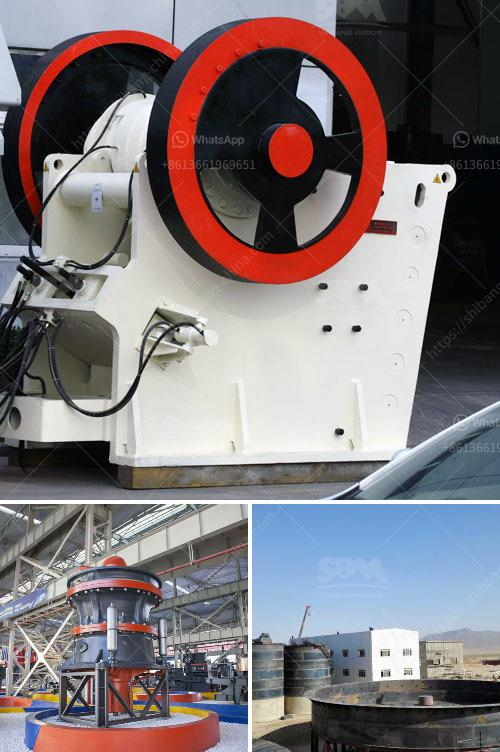

<h3>What machine can crush small stones into sand？</h3>
In various construction projects, crushed stone is used as a fundamental material. Being highly versatile, the crushed stone is utilized as a base material for roadways, driveways, and foundations. Stones are broken into smaller pieces, crushed into sand, and further processed to meet construction requirements. The crushing process is vital, and there are various machines that can do the job efficiently.

One prominent machine used in the crushing process is the jaw crusher. This machine is designed to break down large stones into smaller pieces. Additionally, this machine is able to crush rocks into sand or various sizes of gravel. It works by utilizing two jaw plates, one of which remains stationary while the other moves back and forth. As the materials are fed into the machine, the moving jaw compresses and crushes them against the stationary jaw. This continuous process breaks down the stones into smaller fragments, effectively turning them into sand.

Another machine commonly used in the crushing process is the cone crusher. This machine is similar to the jaw crusher, but it utilizes a different mechanism to crush rocks and turn them into sand. Cone crushers are widely used in mining, metallurgy, building materials, highways, railways, and water conservancy industries. These machines work by squeezing the materials between an eccentrically rotating cone and a concave hopper. The rocks are continuously broken until they are small enough to pass through the gap between the cone and hopper, resulting in finely crushed stone particles.

Impact crushers are another type of machine that can crush small stones into sand. These machines are typically used in quarries, mining, and recycling applications. Impact crushers apply a high-speed impact force to break rocks into smaller pieces. The material is fed into a chamber containing a spinning rotor, which impacts the stones, causing them to break apart. The crushed stones are then thrown against a curtain or a set of anvils, where they are further broken down into sand-sized particles.

In addition to these machines, there are other less common ones used for crushing small stones into sand. For example, the roller crusher is often used for crushing materials such as ores and rocks, with a compressive strength below 300 MPa. It consists of two parallel metal cylinders, which rotate in opposite directions. The rocks are fed into the gap between the cylinders and are crushed as they are pulled between the rotating cylinders.

To conclude, there are several machines available for crushing small stones into sand. The jaw crusher, cone crusher, impact crusher, and roller crusher are commonly used machines in this process. Additionally, there are other less common machines utilized in the crushing process. The choice of machine depends on the specific requirements of the project and the desired output size. With the efficient use of these machines, small stones can be easily transformed into sand, ready to be used in construction projects.
<h3>Contact us</h3><ul><li><strong>Whatsapp:&nbsp;<a href="https://wa.me/8613661969651">+8613661969651</a></strong></li><li><a href="https://swt.shibang-china.com/?git&amp;zhl&amp;What machine can crush small stones into sand？"><strong>Online Service(chat now)</strong></a></li></ul><h3>Related</h3><ul><li><a href='What is limestone impact crusher？.md'>What is limestone impact crusher？</a></li><li><a href='What kind of crushing equipment is needed to produce cement.md'>What kind of crushing equipment is needed to produce cement</a></li><li><a href='What are the parts of ball mill internal structure.md'>What are the parts of ball mill internal structure?</a></li><li><a href='What are factors that will affect the output of a cement mill.md'>What are factors that will affect the output of a cement mill?</a></li><li><a href='What mechanical equipment is used in limestone mining.md'>What mechanical equipment is used in limestone mining</a></li></ul>