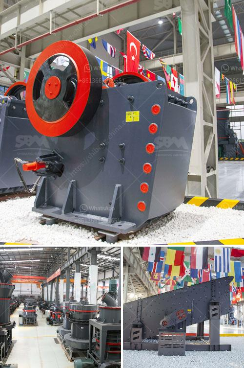

<h3>What machine is used to crush copper ore?</h3>
Copper is a versatile metal that has been used for various purposes for thousands of years. From electrical wiring to architecture, copper plays a vital role in many industries. One essential step in the process of extracting copper from its ore is the crushing stage. This entails the use of a machine referred to as a crusher. In this article, we will explore the various machines used to crush copper ore.

One of the most commonly used crushers is the jaw crusher. It is typically used for primary crushing where the rocks are first introduced into the crusher chamber. This machine consists of a fixed jaw and a movable jaw, which enables it to move back and forth to perform the crushing operation. The rocks are fed into the crusher through the top opening and are progressively crushed until they reach a size suitable for further processing.

Another type of crusher frequently used for copper ore crushing is the cone crusher. Compared to the jaw crusher, the cone crusher has a more efficient crushing chamber design that allows it to crush larger rocks into smaller pieces. It utilizes a rotating cone-shaped crushing head that gyrates in an eccentric motion to crush the material against the stationary walls of the crushing chamber. The crushed copper ore then exits through the discharge opening.

Impact crushers are also commonly used for crushing copper ore. They work by releasing a powerful impact force against the rocks, causing them to break apart. This force is achieved by either a horizontal shaft impactor or a vertical shaft impactor, depending on the desired end product size. The main advantage of impact crushers is their ability to create a cubical-shaped end product, which is highly desirable for certain applications.

In addition to the aforementioned crushers, other machines can also be used to crush copper ore. These include gyratory crushers, which are similar to jaw crushers but have a different crushing chamber design, and roll crushers, which use compression forces to break the rocks.

It is important to note that the choice of crusher depends on various factors such as the size and hardness of the copper ore, the desired end product size, and the capacity requirements. Each crusher has its advantages and limitations, and it is crucial to select the appropriate machine based on the specific needs of the operation.

In conclusion, the crushing stage in the copper ore extraction process plays a crucial role in efficiently extracting the metal. Various machines are used to crush copper ore, including jaw crushers, cone crushers, impact crushers, gyratory crushers, and roll crushers. The selection of the crusher depends on factors such as the size and hardness of the ore and the desired end product size. Understanding the characteristics of each type of crusher will ensure the efficient and effective extraction of copper ore.
<h3>Contact us</h3><ul><li><strong>Whatsapp:&nbsp;<a href="https://wa.me/8613661969651">+8613661969651</a></strong></li><li><a href="https://swt.shibang-china.com/?git&amp;zhl&amp;What machine is used to crush copper ore"><strong>Online Service(chat now)</strong></a></li></ul><h3>Related</h3><ul><li><a href='What equipment to extract iron ore.md'>What equipment to extract iron ore?</a></li><li><a href='What are the mining processes of copper.md'>What are the mining processes of copper?</a></li><li><a href='What mineral types are good for a jaw crusher.md'>What mineral types are good for a jaw crusher?</a></li><li><a href='Whats the difference between a mine and quarry.md'>Whats the difference between a mine and quarry?</a></li><li><a href='what aspects influence stone crusher efficiency.md'>what aspects influence stone crusher efficiency</a></li></ul>