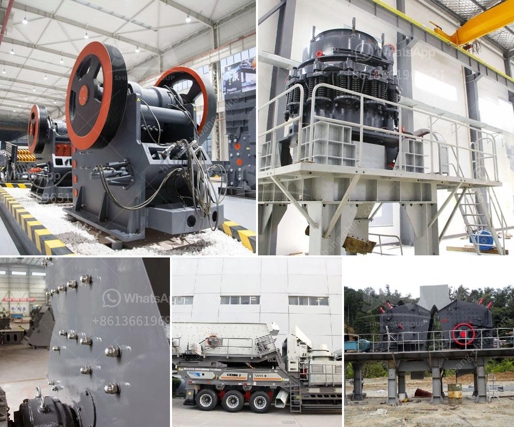

<h3>What machine need to be used for rock mining industry?</h3>
The rock mining industry plays a crucial role in supplying various raw materials necessary for construction, manufacturing, and other essential sectors. To extract and process rocks efficiently, the industry heavily relies on a range of machines specially designed for this purpose. In this article, we'll explore some of the key machines required for the rock mining industry.

Drill rigs are essential machines used for rock exploration and extraction. These machines utilize drilling techniques to create holes for blasting or excavation. Different types of drill rigs are available, such as rotary drill rigs, down-the-hole (DTH) drill rigs, and top hammer drill rigs. The choice of drill rig depends on the rock type, drilling depth, and efficiency needs of the mining operation.

Crushers and pulverizers are used to break down large rocks into smaller, more manageable pieces. They are crucial for rock processing, as smaller fragments can be transported and processed further. Jaw crushers, cone crushers, and impact crushers are popular choices for primary or secondary crushing, depending on the required end product.

Screens and scalpers are used to separate and sort rocks based on size. These machines efficiently classify materials according to their dimensions, ensuring that the right-sized rocks are sent for further processing while any oversize rocks are rejected. Vibrating screens, trommel screens, and grizzly screens are commonly employed in the rock mining industry for this purpose.

Excavators are versatile and powerful machines used for large-scale rock mining operations. Equipped with buckets or attachments like breakers or rippers, they can dig, load, and transport massive amounts of rocks and materials. Excavators are invaluable in removing overburden, extracting minerals, and shaping terrains for mining.

Haul trucks are heavy-duty vehicles specially designed for transporting rocks, minerals, and other materials over long distances within mining sites. These trucks are engineered to withstand rugged terrains, ensuring smooth and efficient transportation. Articulated dump trucks and rigid-frame dump trucks are commonly used in the rock mining industry.

For controlled rock fragmentation, blasting is often employed. Specialized drills, such as rotary drills and longhole drills, are used to create blast holes, enabling the controlled explosion and fragmentation of rock formations. This process facilitates easier loading, hauling, and processing of rocks.

Bulldozers play a vital role in preparing mining sites, leveling terrain, and pushing large amounts of rocks. With their immense power and robust construction, bulldozers are used to clear vegetation, debris, and excessive soil cover. They assist in creating safe and efficient working environments for other mining machines.

In conclusion, the rock mining industry relies on a variety of machines to extract, process, and transport rocks for various purposes. Drill rigs, crushers, screens, excavators, haul trucks, blast drills, and bulldozers are among the many machines used in this sector. Each machine plays a unique role in ensuring productive and sustainable rock mining operations. By understanding the specific needs of the mining operation, industry professionals can choose the most suitable machines to maximize efficiency and productivity.
<h3>Contact us</h3><ul><li><strong>Whatsapp:&nbsp;<a href="https://wa.me/8613661969651">+8613661969651</a></strong></li><li><a href="https://swt.shibang-china.com/?git&amp;zhl&amp;What machine need to be used for rock mining industry"><strong>Online Service(chat now)</strong></a></li></ul><h3>Related</h3><ul><li><a href='What is cost of bauxite processing per ton.md'>What is cost of bauxite processing per ton?</a></li><li><a href='What is mechanism sand.md'>What is mechanism sand?</a></li><li><a href='What is the cost of a quarry crusher for 500 tons.md'>What is the cost of a quarry crusher for 500 tons?</a></li><li><a href='What equipment is needed for phosphorite ore mines.md'>What equipment is needed for phosphorite ore mines?</a></li><li><a href='What equipment is used in the cement process.md'>What equipment is used in the cement process?</a></li></ul>