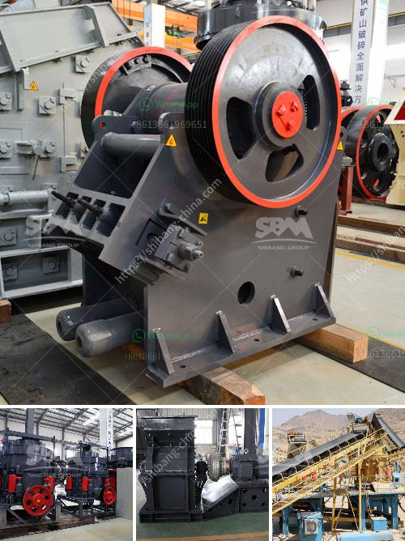

<h3>What machinery and equipment is needed for a sand and gravel processing plant</h3>
A sand and gravel processing plant is an essential part of any construction, landscaping, or infrastructure project. It creates gravel and sand for use in various construction activities. The plant includes several machinery and equipment necessary for the processing of sand and gravel.

1. Feeders: These machines are used to regulate the flow of materials into the processing plant. They ensure a consistent and uniform supply of material to the processing equipment.

2. Crushers: Crushers are used to break down larger-sized pieces of material into more manageable sizes. They can be jaw crushers, gyratory crushers, cone crushers, or impact crushers, depending on the desired product size and throughput rate.

3. Screens: Screens are used to separate different sizes of crushed materials. Vibrating screens and trommel screens are commonly used in sand and gravel processing plants to sort the different sizes of material and remove any unwanted debris.

4. Washing equipment: Washing equipment, such as sand screws, log washers, or cyclone plants, is used to remove impurities and achieve a clean and uniform product. It helps eliminate contaminants like clay, silt, or deleterious materials, improving the quality of the final product.

5. Sand classifiers: Sand classifiers are used to separate sand particles based on their size and density. They help achieve the desired specifications for different applications like concrete, mortar, asphalt, or landscaping.

6. Conveyors: Conveyors play a crucial role in transporting the processed material from one stage to another within the plant. They are used to transfer material between different processing equipment, stockpile the final product, or load trucks for delivery.

7. Dewatering equipment: Dewatering equipment, such as thickeners or filter presses, is used to remove excess water from the washed sand and gravel. It helps achieve the desired moisture content for specific applications like concrete production.

8. Storage and handling equipment: To store and handle the processed sand and gravel, the plant requires storage bins, stockpiles, or silos. These structures are used to hold and load the final product for transportation.

9. Water recycling system: Water is an essential resource in sand and gravel processing plants. A water recycling system helps reduce water consumption by reclaiming and reusing water from the processing operations. It also helps in controlling dust emissions and maintaining a sustainable operation.

10. Dust control systems: Dust control systems are crucial to create a safe and healthy working environment. These systems include dust collectors, baghouses, or misting systems to capture and control dust generated during the processing operations.

In conclusion, setting up a sand and gravel processing plant requires an array of machinery and equipment. Each piece has a specific role in the processing operation, ensuring the production of high-quality sand and gravel products. Investing in reliable and efficient equipment is vital for the success of any sand and gravel processing plant.
<h3>Contact us</h3><ul><li><strong>Whatsapp:&nbsp;<a href="https://wa.me/8613661969651">+8613661969651</a></strong></li><li><a href="https://swt.shibang-china.com/?git&amp;zhl&amp;What machinery and equipment is needed for a sand and gravel processing plant"><strong>Online Service(chat now)</strong></a></li></ul><h3>Related</h3><ul><li><a href='What is the mining process for fluorite.md'>What is the mining process for fluorite?</a></li><li><a href='What equipment is used when sand mining.md'>What equipment is used when sand mining?</a></li><li><a href='What are machines used for mining iron ore.md'>What are machines used for mining iron ore?</a></li><li><a href='What equipment is needed for alumstone mines.md'>What equipment is needed for alumstone mines?</a></li><li><a href='What equipment is needed for silicon ore mines.md'>What equipment is needed for silicon ore mines?</a></li></ul>