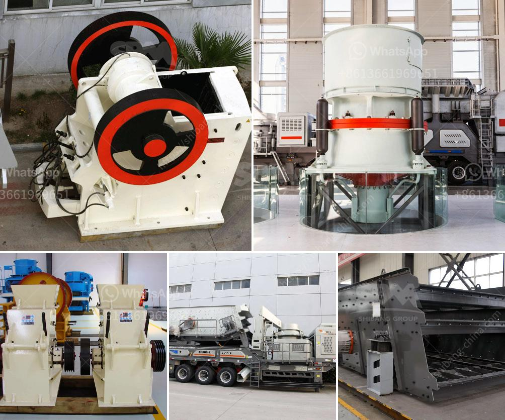

<h3>What machinery is used in copper mining ?</h3>
Copper mining has been a vital economic activity for centuries. From the Industrial Revolution to the present day, copper continues to be in high demand due to its various uses in a wide range of industries. As such, extracting this valuable metal requires the use of specialized machinery to ensure efficient and effective mining operations.

One of the key pieces of equipment used in copper mining is the heavy-duty mining truck. These trucks are used in various stages of the mining process, including transportation of the ore, removal of waste materials, and transportation of the extracted copper. With their large capacity and durability, these trucks play a vital role in optimizing mining operations.

Another essential machinery used in copper mining is the drilling equipment. This equipment is used to drill holes in the rocks or the earth's surface to extract copper. Drilling is an expensive process and requires the use of technologically advanced machinery that can withstand harsh conditions. Some common types of drilling equipment used in copper mining include blasthole drills and rotary drills.

Once the copper ore is extracted from the mines, it undergoes several processing stages before it can be transformed into usable copper products. One crucial piece of machinery used in this process is the crushers. These crushers are used to break down large rocks into smaller pieces, which can then be further processed. Cone crushers and jaw crushers are commonly used in the copper mining industry.

After the ore has been crushed, it is then ground down into a fine powder in the mill. Grinding equipment, such as ball mills and rod mills, are commonly used to achieve this desired size reduction. These grinding machines are designed to break down the copper ore into smaller particles, allowing for the separation of valuable copper minerals from the waste materials.

The next stage in the copper mining process is the flotation process. In this process, chemicals are used to separate the valuable copper minerals from the waste materials. Flotation machines play a crucial role in this process, as they help separate the desired copper minerals from the rest of the ore.

Once the copper minerals have been separated, they are transported for further processing and refining. Conveyor belts are widely used in copper mining to transport the extracted ore over long distances. These belts are designed to handle heavy loads and ensure the efficient movement of raw materials, contributing to overall productivity.

Overall, the machinery used in copper mining plays a critical role in ensuring the efficient extraction and processing of copper ore. From heavy-duty mining trucks to crushers, grinding equipment, flotation machines, and conveyor belts, each piece of machinery plays a crucial role in optimizing mining operations. Moreover, with technology advancements, these machines continue to evolve, becoming more efficient and environmentally friendly.

As the demand for copper continues to grow, the mining industry will continue to rely on cutting-edge machinery to meet this demand. By utilizing advanced equipment and machinery, copper mining operations can become more sustainable and efficient, benefiting both the industry and the environment.
<h3>Contact us</h3><ul><li><strong>Whatsapp:&nbsp;<a href="https://wa.me/8613661969651">+8613661969651</a></strong></li><li><a href="https://swt.shibang-china.com/?git&amp;zhl&amp;What machinery is used in copper mining "><strong>Online Service(chat now)</strong></a></li></ul><h3>Related</h3><ul><li><a href='What are the processes of iron ore beneficiation.md'>What are the processes of iron ore beneficiation?</a></li><li><a href='what is the feed size for ball mill？.md'>what is the feed size for ball mill？</a></li><li><a href='What causes the jaw crusher toggle plate to break.md'>What causes the jaw crusher toggle plate to break?</a></li><li><a href='What is the process of mining and extraction of gold and molybdenum.md'>What is the process of mining and extraction of gold and molybdenum?</a></li><li><a href='What is the process of mining copper ore.md'>What is the process of mining copper ore?</a></li></ul>