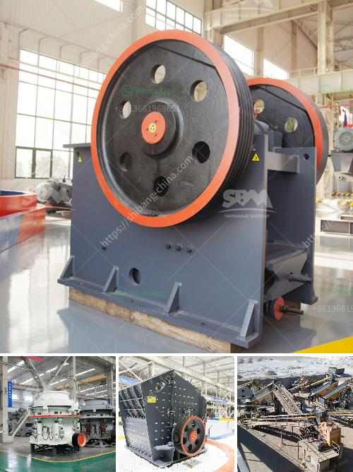

<h3>What machines are needed to crush river pebbles into small stones?</h3>
River pebbles are a natural stone, which have been worn and shaped by the action of water over time. They are widely used as building materials and ornamental stones due to their unique colors, textures, and smoothness. However, before these river pebbles can be put to various uses, they need to be crushed into smaller sizes.

Crushing river pebbles into small stones requires a set of equipment. As a professional stone crushing equipment manufacturer, Fote Machinery recommends the following machines for you.

Firstly, jaw crusher. Due to the large crushing ratio, high efficiency and uniform product granularity, it is widely used in primary crushing of various materials with higher hardness. In the crushing process, it forms a crushing chamber composed of a fixed jaw plate and a movable jaw plate. The raw river pebbles are crushed by the squeezing, rubbing and grinding of the movable and fixed jaw plates. The crushed river pebbles are discharged from the lower discharge port.

Secondly, cone crusher. As a widely used and popular secondary crushing equipment, cone crusher has the advantages of high crushing efficiency, large crushing ratio, low power consumption, uniform product size, and suitable for crushing hard and medium hardness ore and rock. It adopts the principle of laminated crushing, which improves the crushing efficiency and product quality. Cone crusher is often used to process river pebbles with high hardness and high wear resistance.

Thirdly, impact crusher. Impact crusher is mainly used for medium and fine crushing operations. It can not only process river pebbles but also various ores, rocks (granite, basalt, limestone, etc.), and has the advantages of large processing capacity, cubic shape of finished products, and uniform particle size. Its unique structure design makes the hammer and counterattack plate have good wear resistance, which greatly extends the service life of the machine.

Lastly, sand making machine. River pebbles have high hardness, strong pressure resistance, and corrosion resistance characteristics, which makes it very suitable for the production of building sand. The sand making machine uses the impact crushing principle to process the raw river pebble into sand of different particle sizes. It has the advantages of large processing capacity, high efficiency, low energy consumption, and uniform product size. The finished sand can be used in construction, road paving, and other industries.

In conclusion, to crush river pebbles into small stones, a set of crushing equipment is needed. Jaw crusher, cone crusher, impact crusher, and sand making machine are commonly used equipment in crushing river pebbles. Different types of crushing equipment have different crushing effects. Therefore, according to the actual production needs, users should choose suitable equipment to achieve the desired crushing effect and ensure the quality of the final product.
<h3>Contact us</h3><ul><li><strong>Whatsapp:&nbsp;<a href="https://wa.me/8613661969651">+8613661969651</a></strong></li><li><a href="https://swt.shibang-china.com/?git&amp;zhl&amp;What machines are needed to crush river pebbles into small stones"><strong>Online Service(chat now)</strong></a></li></ul><h3>Related</h3><ul><li><a href='What is the cost of limestone crushing process .md'>What is the cost of limestone crushing process ?</a></li><li><a href='What type of equipment is used in the mining of lead ores.md'>What type of equipment is used in the mining of lead ores?</a></li><li><a href='Whats better for a granite mobile crusher or fixed crusher.md'>Whats better for a granite mobile crusher or fixed crusher?</a></li><li><a href='What temperature should the Raymond roller mill operate at.md'>What temperature should the Raymond roller mill operate at?</a></li><li><a href='What are the methods of mining mica.md'>What are the methods of mining mica?</a></li></ul>