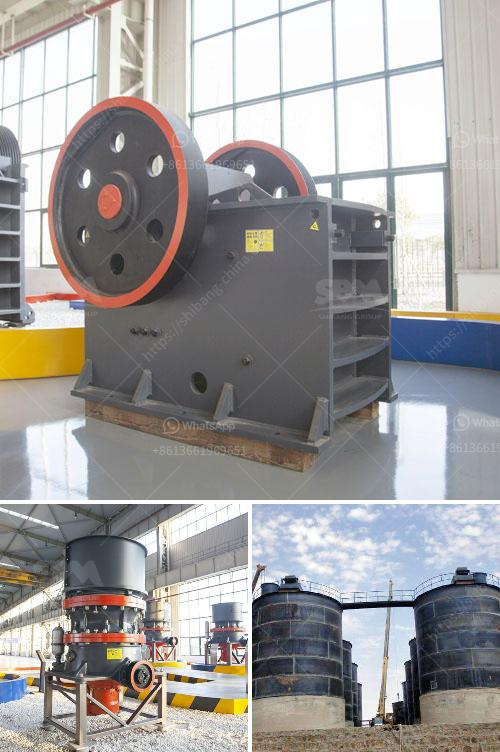

<h3>What mechanical equipment is used in limestone mining</h3>
Limestone is a sedimentary rock composed mainly of calcium carbonate (CaCO3). It is an abundant and widely distributed rock that occurs in various forms, such as chalk, limestone cliffs, and marble. Limestone mining is a complex process that involves various stages and uses different types of machinery.

The first step in the process of mining limestone is to find suitable deposits. This can be done by a variety of methods, including geological mapping, aerial photography, and satellite imagery. Once a deposit is found, drilling and blasting is used to extract the limestone from the ground.

Drilling is typically done using a rotary or percussion drill mounted on a truck or crawler. The drill holes are filled with explosives, which are then detonated to break up the limestone into manageable pieces. This method is known as blasting. The size of the blasted material can vary depending on the purpose of the mining operation, but typically ranges from small rocks to rubble.

After the limestone has been blasted, it is loaded onto trucks or conveyors and transported to a primary crusher. This is usually a jaw crusher, which breaks the material into smaller pieces. From there, it may be further reduced in size using secondary crushers, such as impact crushers, cone crushers, and gyratory crushers.

Once the limestone has been crushed, it is screened and sorted to remove any unwanted materials, such as clay or other impurities. This is done using vibrating screens or mechanical classifiers. The sorted material is then stored in stockpiles for further processing.

In some cases, the limestone may be processed further to produce lime or cement. This involves heating the crushed limestone to a high temperature in a process known as calcination. The resulting lime or cement can then be used in various construction projects.

Various types of machinery are used in the mining and processing of limestone. This includes heavy-duty equipment such as crushers, conveyors, stackers, reclaimers, vibrating screens, and mechanical classifiers. In addition, the extraction process often requires the use of large trucks and excavators. These machines are used to transport and load the limestone, as well as remove the overburden (the soil and rock that covers the deposit).

Overall, limestone mining is a highly mechanized process that can be carried out with minimal human intervention. The use of advanced machinery ensures that the extracted limestone is of high quality and meets the requirements of various industries. It also increases efficiency and reduces the environmental impact of mining operations.

In conclusion, limestone mining is a complex process that involves various stages and uses different types of machinery. This includes drilling equipment, blasting equipment, crushing equipment, screening equipment, sorting equipment, and heavy-duty trucks and excavators. The use of advanced machinery ensures the efficient extraction and processing of limestone, while minimizing environmental impact.
<h3>Contact us</h3><ul><li><strong>Whatsapp:&nbsp;<a href="https://wa.me/8613661969651">+8613661969651</a></strong></li><li><a href="https://swt.shibang-china.com/?git&amp;zhl&amp;What mechanical equipment is used in limestone mining"><strong>Online Service(chat now)</strong></a></li></ul><h3>Related</h3><ul><li><a href='What does the concrete batching plant contain.md'>What does the concrete batching plant contain?</a></li><li><a href='What is the best granite crusher machinery.md'>What is the best granite crusher machinery?</a></li><li><a href='What does 20 mm all in aggregate mean.md'>What does "20 mm all in aggregate" mean?</a></li><li><a href='What is an ore vibrating screen What is it for.md'>What is an ore vibrating screen? What is it for?</a></li><li><a href='What mineral types are good for a jaw crusher.md'>What mineral types are good for a jaw crusher?</a></li></ul>