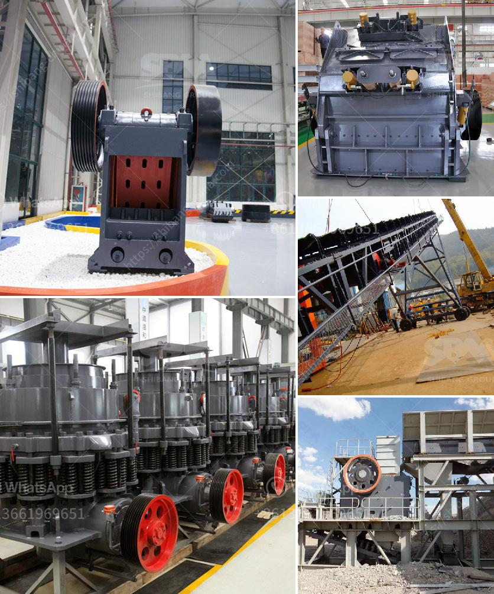

<h3>What mineral types are good for a jaw crusher?</h3>
Jaw crushers are essential equipment in the mining and mineral processing industries. Their ability to crush hard and abrasive materials, such as granite, ores, quartz, and rock, make them incredibly useful for secondary crushing applications. However, not all minerals are suitable for jaw crusher operations. In this article, we will explore the mineral types that are good for a jaw crusher.

1. Granite: Granite is a common and widely occurring type of intrusive, felsic, igneous rock. Its granular structure and high compressive strength make it an ideal material for a jaw crusher. Due to its hardness, granite requires a significant amount of pressure to break it down into smaller pieces. A jaw crusher's mechanical pressure can easily crush the granite into various sizes suitable for different applications.

2. Ores: Various types of ores, such as copper, iron, gold, and lead, can be processed effectively using a jaw crusher. Ores are typically hard minerals composed of crystalline solids. They require a crushing process to break them down into smaller sizes for further processing. A jaw crusher's strong and sturdy construction helps to apply the necessary force to crush ores into manageable pieces.

3. Quartz: Quartz is a mineral that can be found in various rocks and geological settings. Its high hardness and resistance to weathering make it suitable for a jaw crusher. Quartz typically occurs in clusters and is often associated with other minerals. Using a jaw crusher, quartz can be crushed into smaller particles, making it easier to extract and process for various applications.

4. Basalt: Basalt is a dark-colored, fine-grained igneous rock that is commonly encountered in volcanic regions. With its high compressive strength, basalt is an excellent material for jaw crushers. The combination of its durability and abrasive nature makes it suitable for breaking down into smaller particles. Jaw crushers excel at crushing basalt due to their strong crushing mechanism.

5. Limestone: Limestone is a sedimentary rock composed primarily of calcium carbonate. Although it is not as hard as granite, it is still a suitable material for jaw crushers. Limestone can vary in hardness and composition, but its relatively low hardness makes it easy to crush in a jaw crusher. Jaw crushers efficiently break down limestone into different sizes for various applications.

While the minerals mentioned above are suitable for a jaw crusher, there are some considerations to keep in mind. Jaw crushers perform best with hard and tough materials. Softer minerals that are less abrasive might not require the same level of crushing force as harder minerals. Additionally, the size and shape of the materials also play a significant role. Jaw crushers are more effective when the feed material is uniform in size and shape.

In conclusion, jaw crushers are versatile machines that are capable of crushing a wide range of minerals. However, not all minerals are suitable for their operation. Minerals such as granite, ores, quartz, basalt, and limestone are ideal for jaw crushers due to their hardness and strength. Understanding the mineral types that are good for jaw crushers is essential in optimizing their performance and achieving successful crushing operations.
<h3>Contact us</h3><ul><li><strong>Whatsapp:&nbsp;<a href="https://wa.me/8613661969651">+8613661969651</a></strong></li><li><a href="https://swt.shibang-china.com/?git&amp;zhl&amp;What mineral types are good for a jaw crusher"><strong>Online Service(chat now)</strong></a></li></ul><h3>Related</h3><ul><li><a href='what types of jaw crushers.md'>what types of jaw crushers</a></li><li><a href='What kind of crushing machinery is used for sandstone processing ？.md'>What kind of crushing machinery is used for sandstone processing ？</a></li><li><a href='What is a rare earth beneficiation plant.md'>What is a rare earth beneficiation plant?</a></li><li><a href='What is the cost of the cone crusher.md'>What is the cost of the cone crusher?</a></li><li><a href='what equipment is used when mining zinc ore.md'>what equipment is used when mining zinc ore?</a></li></ul>