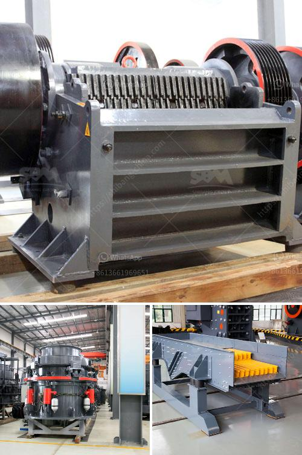

<h3>What size equpment is used in big rock crushing crews?</h3>
When it comes to the rock crushing industry, big crews are often required to efficiently break down large rocks into smaller, more manageable pieces. In order to accomplish this task, heavy-duty equipment is needed to support these crews and facilitate their work. This article will delve into the different sizes of equipment commonly used by big rock crushing crews, highlighting their purposes and benefits.

One of the key machines used in rock crushing crews is the primary crusher. This machine plays a vital role in breaking down large rocks into smaller pieces to be further processed. Generally, primary crushers are jaw crushers or gyratory crushers, capable of handling rocks of sizes up to 48 inches in diameter. These machines provide the initial crushing before the material is passed through screens for further processing.

To complement the work of the primary crusher, secondary and tertiary crushers are utilized. Secondary crushers are typically cone crushers, capable of handling the smaller-sized rocks produced by the primary crusher. They provide finer crushing, reducing the rock size to about 2 inches in diameter. Tertiary crushers, on the other hand, further reduce the rock size down to approximately ¼ inch.

Apart from crushers, rock crushing crews also rely on screens to sort and separate different rock sizes. Vibrating screens or shaker screens are commonly used for this purpose. They consist of multiple decks with varying opening sizes, allowing different-sized rocks to be separated for further processing.

Additionally, conveyors play a crucial role in moving the crushed rocks between different stages of the rock crushing process. These conveyors can be of different sizes, depending on the capacity and requirements of the crew. They transport the crushed rocks from one machine to another, ensuring a smooth flow of materials throughout the crushing process.

In certain cases, rock crushing crews may also employ heavy-duty equipment known as impact crushers. These crushers are designed for applications where the rock needs to be shattered rather than crushed. Impact crushers use a high-speed rotor and anvils to create an impact force on the rocks, breaking them into smaller pieces suitable for further processing.

Lastly, rock crushing crews typically require loaders to move the rocks from the crushing area to trucks for transportation. Loaders come in various sizes and capacities to accommodate different crew sizes and the volume of material being handled.

In summary, big rock crushing crews employ a range of equipment to efficiently break down large rocks into smaller pieces. Primary crushers handle the initial crushing, while secondary and tertiary crushers further refine the rock size. Screens, conveyors, impact crushers, and loaders all play important roles in the overall rock crushing process. By utilizing the proper size and capacity of equipment, rock crushing crews can enhance productivity and maximize the yield of smaller, more manageable rock pieces.
<h3>Contact us</h3><ul><li><strong>Whatsapp:&nbsp;<a href="https://wa.me/8613661969651">+8613661969651</a></strong></li><li><a href="https://swt.shibang-china.com/?git&amp;zhl&amp;What size equpment is used in big rock crushing crews"><strong>Online Service(chat now)</strong></a></li></ul><h3>Related</h3><ul><li><a href='What is grindind machine.md'>What is grindind machine?</a></li><li><a href='what is universal grinding machine？.md'>what is universal grinding machine？</a></li><li><a href='what is concentration of ores？.md'>what is concentration of ores？</a></li><li><a href='What are the processes of iron ore beneficiation.md'>What are the processes of iron ore beneficiation?</a></li><li><a href='What equipment is needed for magnesite ore mines.md'>What equipment is needed for magnesite ore mines?</a></li></ul>