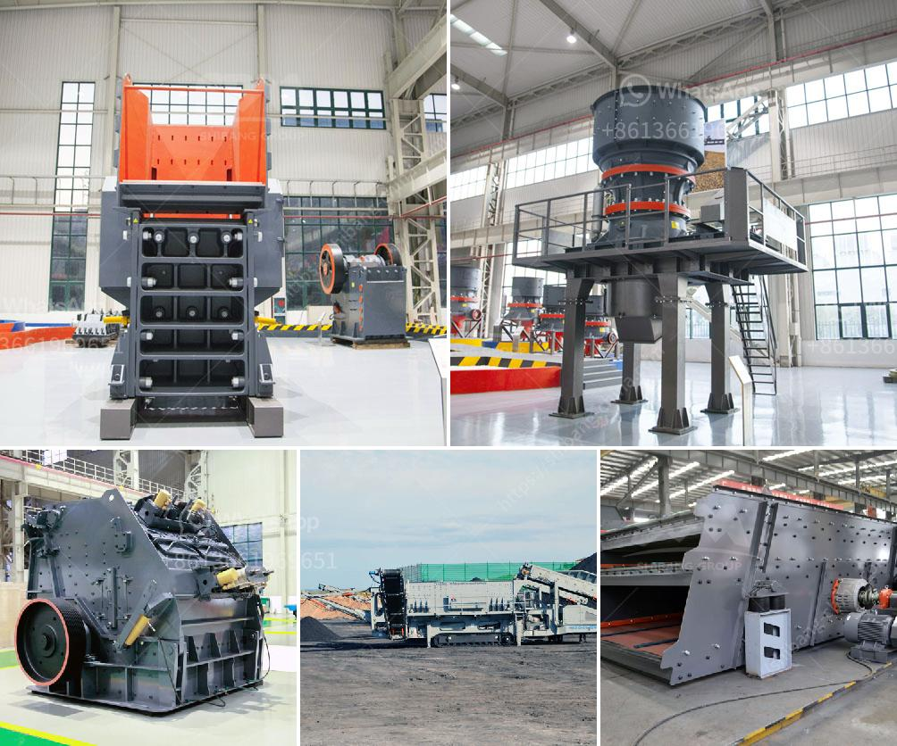

<h3>What temperature should the Raymond roller mill operate at?</h3>
The Raymond roller mill is a grinding machine that is widely used in the mining and metallurgical industries. It operates at a low temperature and therefore functions efficiently without the need for external heat sources. Since temperatures below 200°C are typically preferred for mineral processing operations, the Raymond roller mill operates between 90°C and 110°C. This low temperature ensures that the machine works efficiently while minimizing the risk of overheating and damage to its components.

Maintaining a consistent operating temperature is crucial for the Raymond roller mill to perform optimally. The grinding chamber, mill base, and mill roller must always be lubricated and cooled to prevent excessive heat accumulation, which can adversely affect the quality and texture of the final product. Therefore, it is essential to monitor and control the mill’s temperature throughout the grinding process.

One of the primary factors that govern the operating temperature of the Raymond roller mill is the airflow rate through the system. The mill's airflow controls the temperature of the internal grinding chamber and prevents it from surpassing the desired temperature range. An optimal airflow rate ensures that the material being processed does not become overheated, thereby retaining its desired properties.

Additionally, the cooling system of the Raymond roller mill plays a crucial role in maintaining the required temperature. The cooling system typically consists of a fan, which facilitates the circulation of cool air within the mill. This allows heat generated during the grinding process to dissipate efficiently. Adequate cooling prevents the temperature from rising beyond the desired range, ensuring the smooth operation of the mill and the quality of the final product.

Another aspect that influences the Raymond roller mill's operating temperature is the speed of the mill roller. Higher roller speeds generate more heat due to increased friction and impact between the grinding elements and the material being processed. Consequently, the mill roller speed needs to be carefully adjusted to maintain the desired operating temperature without compromising the grinding efficiency.

In conclusion, the Raymond roller mill operates between 90°C and 110°C to ensure efficient grinding while minimizing the risk of overheating. Maintaining a consistent operating temperature is crucial for preserving the quality and texture of the final product. Factors such as airflow rate, cooling system efficiency, and mill roller speed play key roles in determining the operating temperature. By carefully controlling these parameters, operators can optimize the performance of the Raymond roller mill and achieve the desired results.
<h3>Contact us</h3><ul><li><strong>Whatsapp:&nbsp;<a href="https://wa.me/8613661969651">+8613661969651</a></strong></li><li><a href="https://swt.shibang-china.com/?git&amp;zhl&amp;What temperature should the Raymond roller mill operate at"><strong>Online Service(chat now)</strong></a></li></ul><h3>Related</h3><ul><li><a href='Whats better for a granite mobile crusher or fixed crusher.md'>Whats better for a granite mobile crusher or fixed crusher?</a></li><li><a href='what type of crusher is best for concrete crushing.md'>what type of crusher is best for concrete crushing?</a></li><li><a href='what are the equipment for gypsum mining.md'>what are the equipment for gypsum mining?</a></li><li><a href='What are the processes of iron ore beneficiation.md'>What are the processes of iron ore beneficiation?</a></li><li><a href='What type of crusher is used to crush copper ore.md'>What type of crusher is used to crush copper ore?</a></li></ul>