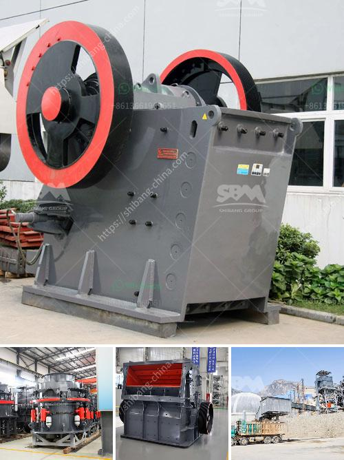

<h3>What type of Raymond Mill exhaust fan is used at gypsum plant?</h3>
Raymond Mill, a widely-used industrial milling machine, is typically utilized to grind various types of minerals. In the production process of gypsum powder, Raymond Mill often operates under high temperature and high pressure conditions. With the growth in usage and application of gypsum powder, the market demand for Raymond Mill has also increased significantly. One essential component of Raymond Mill is the exhaust fan, which plays a crucial role in collecting the fine powder materials and controlling the emission of the exhaust gas. 

The exhaust fan used in Raymond Mill operates under negative pressure. It creates a suction effect to draw in the discharged fine powder material and exhaust gas from the grinding chamber. The exhaust fan then transports these materials to the dust collector for further processing. The selection of a suitable exhaust fan for the gypsum plant is essential to ensure efficient and stable operation of the Raymond Mill.

In terms of the type of exhaust fan used at a gypsum plant, there are generally two categories: centrifugal exhaust fans and axial exhaust fans. The centrifugal exhaust fan consists of a rotating impeller that accelerates the airflow and discharges the materials at a tangent. This type of exhaust fan is highly efficient in transporting large volumes of gas and fine powder. It is particularly suitable for applications where high-pressure and high-flow gas transportation is required. The centrifugal exhaust fan is widely used in Raymond Mill systems with large output and high requirements for the fineness of the final product.

On the other hand, the axial exhaust fan features a propeller-like structure that generates an axial flow. This type of exhaust fan is known for its high airflow rate and low pressure characteristics. It is suitable for applications that require a large volume of airflow but with relatively low resistance, such as ventilation and cooling. In the gypsum plant, the axial exhaust fan is often used for general ventilation purposes to ensure the air circulation and maintain a comfortable working environment.

When selecting the appropriate exhaust fan for a gypsum plant, various factors need to be considered. These factors include the volume flow rate, pressure, power consumption, noise level, and reliability based on the specific requirements of the Raymond Mill system. It is essential to balance the trade-offs between energy efficiency, cost-effectiveness, and performance to achieve optimal results.

In conclusion, the type of exhaust fan used at a gypsum plant depends on the specific requirements of the Raymond Mill system. Both centrifugal and axial exhaust fans have their advantages and are suitable for different applications. The selection of an appropriate exhaust fan is crucial to ensure efficient and stable operation of the Raymond Mill, as well as proper control of emissions and dust collection. Therefore, careful consideration of the specific needs and characteristics of the gypsum plant is essential when choosing the ideal exhaust fan.
<h3>Contact us</h3><ul><li><strong>Whatsapp:&nbsp;<a href="https://wa.me/8613661969651">+8613661969651</a></strong></li><li><a href="https://swt.shibang-china.com/?git&amp;zhl&amp;What type of Raymond Mill exhaust fan is used at gypsum plant"><strong>Online Service(chat now)</strong></a></li></ul><h3>Related</h3><ul><li><a href='What are the parts of ball mill internal structure.md'>What are the parts of ball mill internal structure?</a></li><li><a href='What mechanical equipment is used in limestone mining.md'>What mechanical equipment is used in limestone mining</a></li><li><a href='What machine need to be used for rock mining industry.md'>What machine need to be used for rock mining industry?</a></li><li><a href='What is iron ore mining in Pakistan.md'>What is iron ore mining in Pakistan?</a></li><li><a href='What is aluminium ore benefication process.md'>What is aluminium ore benefication process?</a></li></ul>