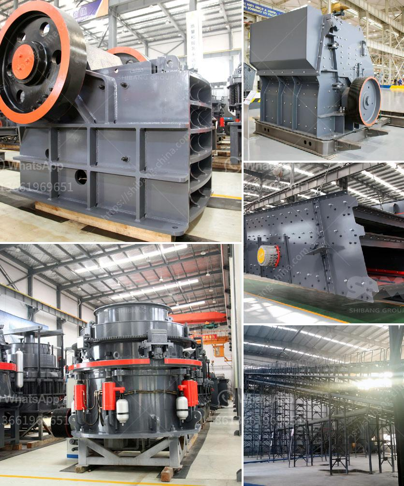

<h3>What type of bearings must be used for the taper of a jaw crusher?</h3>
Jaw crushers are commonly used in the mining, construction, and recycling industries to reduce the size of large rocks, concrete, or other materials into smaller, more manageable ones. These machines rely on a set of bearings to enable smooth operation and minimize frictional forces during the crushing process. One critical area where bearings play a crucial role is the taper of a jaw crusher. So, what type of bearings must be used for this specific part?

The taper of a jaw crusher refers to the part of the crusher that holds the movable and fixed jaw plates in place. These jaw plates help crush the material being fed into the machine, allowing it to pass through the crushing chamber and be processed accordingly. As a result, the taper is subject to significant loads, including compressive, bending, and impact forces.

To handle these demanding conditions, it is vital to select the right type of bearings. The primary considerations for the taper of a jaw crusher are load-bearing capacity, durability, and ease of maintenance. Two types of bearings commonly used in jaw crushers are spherical roller bearings and tapered roller bearings.

Spherical roller bearings are the most commonly employed bearings in heavy-duty jaw crushers. These bearings feature two rows of symmetrical rollers, which rotate freely along the inner ring with a common spherical raceway. This design allows the rollers to accommodate misalignment and axial loads, in addition to radial loads. Spherical roller bearings have high load-bearing capacity and can withstand shock and vibration, making them suitable for high-impact applications like jaw crushers.

On the other hand, tapered roller bearings are often used in applications where axial loads are predominant. These bearings have conical rollers and raceways, which are arranged in such a way that they can support both radial and axial forces. Tapered roller bearings can handle high radial and axial loads efficiently and are commonly found in gearboxes, wheel hubs, and other heavy machinery components. In a jaw crusher, tapered roller bearings are typically used to support the mainshaft, providing more durability and allowing for easy maintenance and replacement when needed.

When selecting the bearings for the taper of a jaw crusher, factors such as load capacity, speed, temperature, and lubrication must be taken into account. Additionally, regular inspection and maintenance are essential to ensure the bearings are functioning properly and to detect any potential issues before they escalate into costly failures.

In conclusion, the type of bearings used for the taper of a jaw crusher depends on factors such as load capacity, durability, and ease of maintenance. Spherical roller bearings and tapered roller bearings are two common options that can withstand the demanding conditions of a jaw crusher application. Proper selection, installation, and periodic maintenance of these bearings are crucial for optimal crusher performance and longevity.
<h3>Contact us</h3><ul><li><strong>Whatsapp:&nbsp;<a href="https://wa.me/8613661969651">+8613661969651</a></strong></li><li><a href="https://swt.shibang-china.com/?git&amp;zhl&amp;What type of bearings must be used for the taper of a jaw crusher"><strong>Online Service(chat now)</strong></a></li></ul><h3>Related</h3><ul><li><a href='What is the process for mining line.md'>What is the process for mining line?</a></li><li><a href='What is the process of sandstone mining？.md'>What is the process of sandstone mining？</a></li><li><a href='What is the cost of quarry stones in Kenya.md'>What is the cost of quarry stones in Kenya?</a></li><li><a href='What is the specification of a jaw crusher.md'>What is the specification of a jaw crusher?</a></li><li><a href='What equipment is used in the mining industry .md'>What equipment is used in the mining industry ?</a></li></ul>