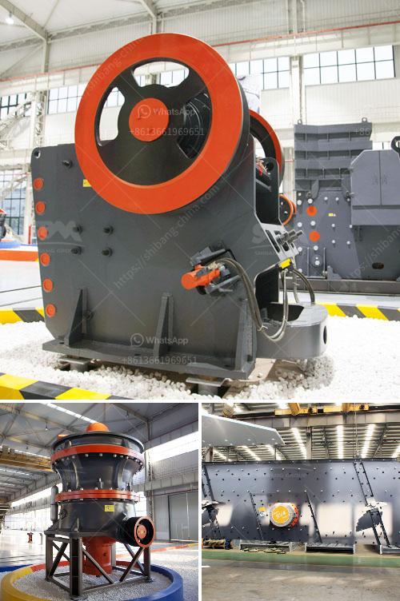

<h3>What type of crusher is used to crush copper ore?</h3>
Copper ore refers to natural minerals containing copper, sulfides, and oxides, which are generally used to produce copper metal. The extraction of copper from copper ores involves a series of processes such as crushing and grinding, followed by beneficiation using techniques such as flotation to obtain concentrates containing most of the copper metal.

In the crushing stage, the primary crusher used for copper ore crushing is jaw crusher. Jaw crusher is a widely used crushing equipment, which can crush various materials with a compressive strength not exceeding 320MPa. It is mainly used as the primary crushing equipment or the first step in the crushing process.

The jaw crusher is designed with a V-shaped cavity structure. This design helps to increase the feeding size and capacity, as well as improve the crushing efficiency. The deep cavity and large inclination angle of the jaw plate make the feed mouth size larger and the material blockage less likely to occur.

In the crushing process, the jaw crusher is equipped with a hydraulic system, which can adjust the size of the discharge port to control the particle size and output of the crushed material. The hydraulic system also plays a role in overload protection, ensuring the normal operation of the crusher and preventing damage to the crusher due to excessive load.

In addition to jaw crusher, other crushers can also be used to crush copper ore. Cone crusher is an advanced hydraulic crusher with high power, large crushing ratio, and high productivity. Generally, it is used as secondary crushing equipment during the crushing process of copper ore.

The cone crusher adopts the principle of laminated crushing, which forms a protective layer of materials, not only reducing wear and extending the service life of wearing parts but also increasing the proportion of cubes in the product. It is worth noting that the cone crusher is suitable for crushing harder ores, such as copper ores with a Mohs hardness greater than 5.

Impact crusher is another common crusher used in copper ore crushing. It is often used for the final crushing of copper ore after jaw crusher or cone crusher. It has high reduction ratio and crushing efficiency, and is favored by many copper mine investors. However, the impact crusher needs to be equipped with a vibrating screen to control the particle size of the finished product.

In conclusion, the type of crusher used to crush copper ore is determined by the properties of the ore and the required final product specifications. Jaw crusher and cone crusher are often used as primary and secondary crushers, while impact crusher is used for the final crushing in some cases. Choosing the right crusher can greatly improve the crushing efficiency and reduce the production cost of copper ore.
<h3>Contact us</h3><ul><li><strong>Whatsapp:&nbsp;<a href="https://wa.me/8613661969651">+8613661969651</a></strong></li><li><a href="https://swt.shibang-china.com/?git&amp;zhl&amp;What type of crusher is used to crush copper ore"><strong>Online Service(chat now)</strong></a></li></ul><h3>Related</h3><ul><li><a href='What is hematite magnetic limonite and rhodochrosite.md'>What is hematite, magnetic limonite and rhodochrosite?</a></li><li><a href='What is roller crusher.md'>What is roller crusher?</a></li><li><a href='What is the percentage saved in labor costs for the operation of mobile mining crushers.md'>What is the percentage saved in labor costs for the operation of mobile mining crushers?</a></li><li><a href='What is the machine used in hard rock gold mining.md'>What is the machine used in hard rock gold mining?</a></li><li><a href='What is primary crushing equipment .md'>What is primary crushing equipment ?</a></li></ul>