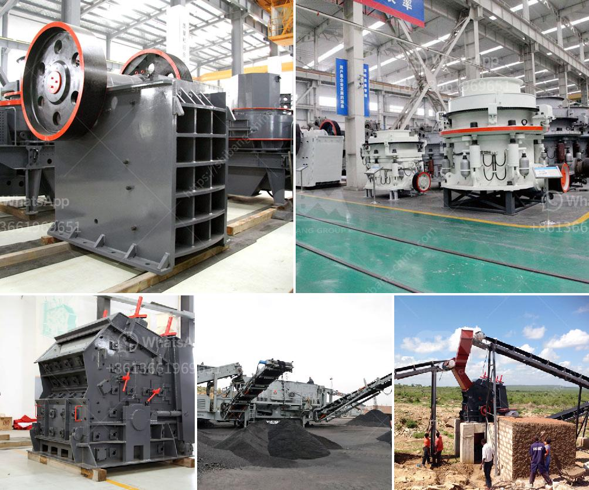

<h3>What type of crushing equipment should copper mine choose?</h3>
Copper mining is one of the economic pillars of many countries. However, the copper mining process is complex and involves many equipment choices. Among the numerous crushing equipment, the selection of suitable crushing machines plays a crucial role in the copper mines' production efficiency.

Firstly, they should consider the ore characteristics. The hardness and moisture content of the copper ore will affect the choice of crushing equipment. For example, an ore with high hardness requires a larger crushing ratio to meet the demand; soft ores, on the other hand, are more malleable and can be crushed with smaller crushing equipment.

Secondly, the copper mine should consider the desired product size. Different crushing equipment has different crushing levels, and the product size can be adjusted by adjusting the discharge opening of the crusher. If the copper mine requires a specific product size, it should choose a crushing machine that can achieve the desired size after crushing.

Thirdly, operational requirements should also be taken into account. The amount of ore to be processed per hour, the continuous operation time, and the maintenance and repair requirements are factors that affect the choice of crushing equipment. Copper mines need to select crushing machines that can meet their specific operational requirements to ensure smooth production.

In the selection process, there are several types of crushing equipment commonly used in copper mines:

1. Jaw Crusher: Jaw crushers are commonly used as primary crushers. They have a large crushing ratio, high production capacity, and can handle various materials with a compressive strength of up to 320 MPa. Jaw crushers are suitable for coarse and medium crushing of ores.

2. Cone Crusher: Cone crushers are widely used in secondary and tertiary crushing stages. They have the advantages of high crushing efficiency, low operating cost, and good particle shape of the final product. Cone crushers are suitable for crushing hard and medium-hard materials.

3. Impact Crusher: Impact crushers are suitable for crushing medium-hard and soft materials. They have a high crushing ratio and are easy to maintain. Impact crushers are often used in the final stage of crushing to produce high-quality copper ore concentrates.

4. Hammer Crusher: Hammer crushers are suitable for crushing brittle materials with a compressive strength of less than 150 MPa. They have the advantages of simple structure, high production efficiency, and low operating cost. Hammer crushers are often used in the early stage of copper ore processing.

5. Vertical Shaft Impact Crusher (VSI): VSI crushers are suitable for medium and fine crushing of copper ores. They have the advantages of high crushing efficiency, good particle shape, and low operating cost. VSI crushers are often used in the final stage of copper ore crushing.

In conclusion, the selection of crushing equipment in copper mines should consider factors such as ore characteristics, desired product size, and operational requirements. Different crushing machines have different advantages and are suitable for different stages of copper ore crushing. Copper mines should carefully analyze their needs and select the most suitable crushing equipment to maximize production efficiency.
<h3>Contact us</h3><ul><li><strong>Whatsapp:&nbsp;<a href="https://wa.me/8613661969651">+8613661969651</a></strong></li><li><a href="https://swt.shibang-china.com/?git&amp;zhl&amp;What type of crushing equipment should copper mine choose"><strong>Online Service(chat now)</strong></a></li></ul><h3>Related</h3><ul><li><a href='What is the use of crushing magnetite rock before milling.md'>What is the use of crushing magnetite rock before milling?</a></li><li><a href='What is the cost of quarry stones in Kenya.md'>What is the cost of quarry stones in Kenya?</a></li><li><a href='What is a cement grinding unit and what processes are involved .md'>What is a cement grinding unit and what processes are involved ?</a></li><li><a href='what is the feed size for ball mill？.md'>what is the feed size for ball mill？</a></li><li><a href='What is iron ore screening process.md'>What is iron ore screening process?</a></li></ul>