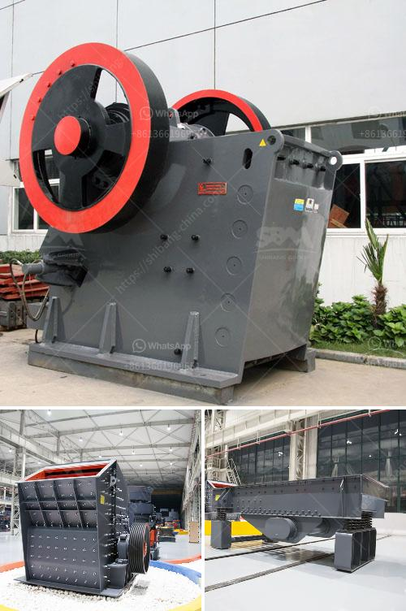

<h3>What type of equipment is used in the mining of lead ores?</h3>
Lead is a highly valuable metal that has been used throughout history for various purposes, such as construction, ammunition, and batteries. The mining of lead ores involves the extraction, processing, and refining of this valuable material. To accomplish these tasks efficiently and effectively, several types of mining equipment are used. This article will explore the equipment used in the mining of lead ores and shed light on their significance and function.

One of the primary pieces of equipment used in lead ore mining is the drill rig. These powerful machines are used to drill holes into the earth's surface, allowing miners to access the ore deposits. Drill rigs come in various sizes and types, with some capable of drilling holes several meters deep. The drills are equipped with diamond or tungsten-tipped bits that can penetrate through tough rock formations, enabling miners to reach the lead ore deposits deep underground.

Once the ore has been accessed, miners use loaders and excavators to extract the ore from the ground. Loaders are large, wheeled vehicles that are equipped with a bucket or shovel. They can scoop up large quantities of ore and transport it to processing areas. Excavators, on the other hand, are similar to loaders in terms of function but are generally larger and more powerful. They can dig deeper into the ground, making them ideal for accessing lead ore deposits that are located deeper underground.

After the lead ore has been extracted, conveyors are used to transport it to the processing plant. Conveyors are mechanical systems that consist of belts and pulleys or rollers. They are designed to move heavy loads, such as lead ore, from one location to another. Conveyors are highly efficient, as they can transport large quantities of ore over long distances, reducing the need for manual labor and optimizing the mining process.

Once the lead ore reaches the processing plant, crushers and mills are used to break it down into smaller pieces. Crushers are machines designed to reduce the size of large rocks and minerals, including lead ore. They use mechanical force, such as compression or impact, to break down the ore into smaller particles. Mills, on the other hand, are used to grind the lead ore into fine powder. This enables further processing, such as flotation or smelting, to extract the lead from the ore.

In addition to the equipment mentioned above, other tools and machines are used in lead ore mining. These include pumps to remove water from the mining area, ventilation systems to ensure a safe working environment, and safety equipment to protect miners from hazards. Miners also use explosives to break apart large rock formations, making it easier to access the ore deposits.

In conclusion, the mining of lead ores requires a combination of various types of equipment to extract, transport, and process the valuable material efficiently. Drill rigs, loaders, excavators, conveyors, crushers, and mills are some of the key pieces of machinery used in this process. The use of modern equipment and technology has made lead ore mining safer and more efficient, contributing to the supply of this vital metal to industries around the world.
<h3>Contact us</h3><ul><li><strong>Whatsapp:&nbsp;<a href="https://wa.me/8613661969651">+8613661969651</a></strong></li><li><a href="https://swt.shibang-china.com/?git&amp;zhl&amp;What type of equipment is used in the mining of lead ores"><strong>Online Service(chat now)</strong></a></li></ul><h3>Related</h3><ul><li><a href='What is a cement grinding unit and what processes are involved .md'>What is a cement grinding unit and what processes are involved ?</a></li><li><a href='What is chrome ore grades.md'>What is chrome ore grades?</a></li><li><a href='Which industries depend on coal.md'>Which industries depend on coal?</a></li><li><a href='What equipment is used in the cement process.md'>What equipment is used in the cement process?</a></li><li><a href='what is concentration of ores？.md'>what is concentration of ores？</a></li></ul>