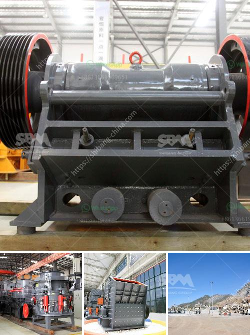

<h3>What type of mining is used for magnetite?</h3>
Magnetite is a mineral renowned for its magnetic properties, as its name suggests. It is a form of iron oxide with the chemical formula Fe3O4, commonly found in igneous and metamorphic rocks. Due to its high iron content, magnetite has become a valuable resource in the mining industry, especially for the production of iron and steel. But what type of mining is used to extract magnetite from the earth? In this article, we will explore the main methods employed for magnetite mining.

The most common mining method for magnetite is open-pit mining. Open-pit mining refers to extracting rock or minerals from an open pit or borrow, which is an excavation on the surface of the earth. This method is used when the resource is close to the surface and abundant. During open-pit mining, large equipment, such as excavators and trucks, are used to extract magnetite ore from the ground. The ore is then transported to a processing plant where the magnetite is separated from the waste rock, crushed into a manageable size, and further processed to produce iron concentrate.

Another method used for magnetite mining is underground mining. As the name suggests, underground mining involves digging tunnels and shafts to access the magnetite deposit below the surface. This method is used when the mineral resource is situated deeper underground and is less accessible through open-pit mining. Underground mining can be further categorized into two types: conventional and automated mining.

Conventional underground mining involves drilling, blasting, and manually extracting magnetite ore using underground mining equipment like loaders and haulage trucks. This method requires a skilled workforce and is often used when the magnetite deposit is of high value and worth the investment in labor-intensive mining techniques.

On the other hand, automated underground mining uses advanced technology and machinery to minimize human interaction and increase safety and efficiency. This method involves the use of remotely operated equipment, such as robotic mining vehicles, and sensors to navigate the underground environment and extract magnetite ore. Automated mining is particularly useful in hazardous or hard-to-reach deposits, where human miners' safety might be compromised.

Apart from open-pit and underground mining, there is also offshore mining for magnetite. Offshore mining refers to extracting minerals from the seabed or ocean floor. This method is used when the magnetite deposit is located in coastal areas or underwater. Offshore mining involves the use of dredges or suction devices to collect magnetite-containing sediments, which are then processed to extract the desired mineral.

In conclusion, magnetite mining utilizes various methods depending on the location, accessibility, and value of the deposit. Open-pit mining is commonly used for magnetite near the surface, while underground mining techniques, both conventional and automated, are employed for deeper and more challenging deposits. Additionally, offshore mining is employed in coastal areas or underwater locations where magnetite is found. These mining methods ensure the extraction of magnetite efficiently, helping to meet the global demand for iron and steel production.
<h3>Contact us</h3><ul><li><strong>Whatsapp:&nbsp;<a href="https://wa.me/8613661969651">+8613661969651</a></strong></li><li><a href="https://swt.shibang-china.com/?git&amp;zhl&amp;What type of mining is used for magnetite"><strong>Online Service(chat now)</strong></a></li></ul><h3>Related</h3><ul><li><a href='what crusher types are used in copper processing in zambia.md'>what crusher types are used in copper processing in zambia?</a></li><li><a href='What is the mining process for fluorite.md'>What is the mining process for fluorite?</a></li><li><a href='what kind of crushing machinery is used for crushing rock？.md'>what kind of crushing machinery is used for crushing rock？</a></li><li><a href='What equipment is needed for alumstone mines.md'>What equipment is needed for alumstone mines?</a></li><li><a href='what does a vibrating feeder do.md'>what does a vibrating feeder do?</a></li></ul>