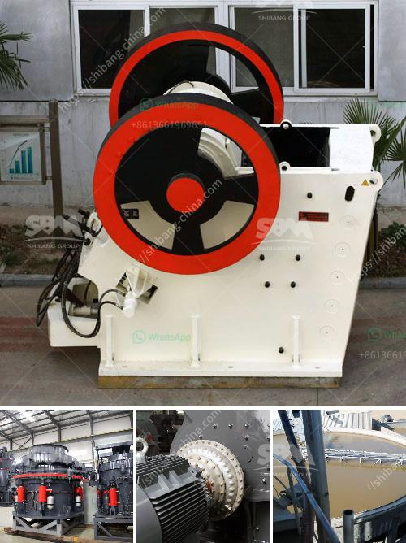

<h3>Whats better for a granite mobile crusher or fixed crusher?</h3>
When it comes to crushing granite, there are two major options available: a mobile crusher and a fixed crusher. Both have their pros and cons, so it's important to consider the specific needs of your project before making a decision.

Mobile crushers are versatile and convenient. They can be easily transported from one site to another, making them suitable for short-term projects or where the crushing site is constantly changing. With a mobile crusher, you can quickly and easily set up a crushing operation on-site, saving time and effort. This flexibility also allows you to reach remote areas that may otherwise be difficult to access with a fixed crusher.

In addition to mobility, mobile crushers offer a high degree of customization. They come in various sizes and configurations, allowing you to choose the right machine for your specific application. Some mobile crushers are equipped with advanced features like remote monitoring and control, allowing you to operate the machine from a safe distance. This can be particularly useful in hazardous environments or when working with volatile materials.

On the other hand, fixed crushers are stationary and cannot be easily moved. They are typically installed in a permanent location, such as a quarry or a mining site. Fixed crushers are often larger and more powerful than mobile crushers, making them suitable for high-capacity crushing operations. They also tend to be more efficient and produce a higher quality of crushed material.

Because fixed crushers are stationary, they require a dedicated infrastructure and require more planning and preparation before installation. This can include building foundations, setting up conveyor belts, and installing electrical systems. These additional requirements can increase the overall cost and time investment of a fixed crusher.

Another consideration when choosing between a mobile crusher and a fixed crusher is the nature of your project. If you have a short-term project that requires frequent relocation, a mobile crusher may be the better choice. However, if you have a long-term project with a stable location, a fixed crusher may offer a more cost-effective solution.

Ultimately, the choice between a mobile crusher and a fixed crusher depends on your specific needs and circumstances. Consider factors such as project duration, site conditions, and budget when making a decision. Additionally, consulting with industry professionals and examining case studies can provide valuable insights into the right choice for your project.

In conclusion, both mobile crushers and fixed crushers have their own advantages and disadvantages. Mobile crushers offer flexibility and convenience, allowing you to easily move and set up crushing operations on-site. Fixed crushers, on the other hand, offer higher capacity and efficiency. The decision between the two ultimately depends on your project requirements and circumstances.
<h3>Contact us</h3><ul><li><strong>Whatsapp:&nbsp;<a href="https://wa.me/8613661969651">+8613661969651</a></strong></li><li><a href="https://swt.shibang-china.com/?git&amp;zhl&amp;Whats better for a granite mobile crusher or fixed crusher"><strong>Online Service(chat now)</strong></a></li></ul><h3>Related</h3><ul><li><a href='What is quarrying in relation to cement production.md'>What is quarrying in relation to cement production?</a></li><li><a href='What is an ore vibrating screen What is it for.md'>What is an ore vibrating screen? What is it for?</a></li><li><a href='Whats the difference between a mine and quarry.md'>Whats the difference between a mine and quarry?</a></li><li><a href='What is the cost of the equipment used in mining lead ore.md'>What is the cost of the equipment used in mining lead ore?</a></li><li><a href='What equipment is used to mine gold in Australia？.md'>What equipment is used to mine gold in Australia？</a></li></ul>