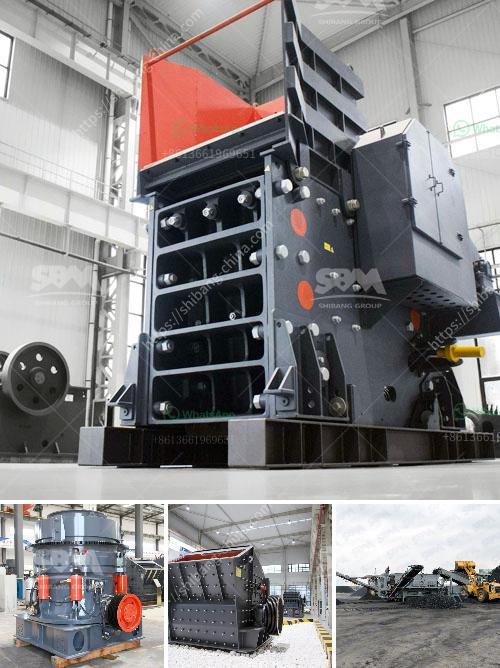

<h3>Whats the difference between a mine and quarry?</h3>
A mine and a quarry are two distinct entities in the field of extraction of minerals, rocks, and other naturally occurring substances. While they share some similarities, there are key differences between the two.

A mine is an underground excavation where minerals, ores, and valuable resources are extracted from the earth's crust. The process of mining involves drilling deep into the ground to access the desired materials. This can be done through various methods such as open-pit mining, shaft mining, or slope mining. Once the material is extracted, it goes through a series of processes such as crushing, grinding, and refining to obtain the desired mineral or metal. Mines are often associated with minerals like gold, silver, coal, copper, and iron.

On the other hand, a quarry is an open-pit mining process specifically for the extraction of rocks and aggregates, such as limestone, marble, granite, and sand. Quarries can be aboveground or underground and are typically used for the construction of buildings, roads, and other infrastructure projects. Unlike mines, which extract minerals and ores, quarries focus on the extraction of rocks, which are then crushed and processed before being used in various construction applications.

One of the key differences between mines and quarries is the type of materials they extract. Mines primarily focus on the extraction of valuable minerals, metals, and ores, which are often used in industries like manufacturing, electronics, and jewelry. On the other hand, quarries primarily extract rocks and aggregates, which have more direct applications in construction projects.

Another significant difference is the environmental impact. Mines, being underground excavations, can have a more detrimental impact on the surrounding ecosystems and local communities. The process of mining often involves the use of explosives, heavy machinery, and the release of hazardous substances into the environment. This can lead to soil erosion, water pollution, and destruction of habitats. In contrast, quarries, being open-pit operations, have a more visible impact on the landscape but are generally less environmentally destructive than mines.

Additionally, legal regulations and permits differ for mines and quarries. Due to the potential hazards associated with mining activities, mines are subject to stricter regulations and safety measures. These regulations aim to protect workers, ensure responsible extraction practices, and mitigate the environmental impact. Quarries also have regulations to comply with, but they are typically less stringent, mainly focusing on issues such as noise, dust control, and site rehabilitation.

In conclusion, although mines and quarries share some similarities in the extraction of materials from the earth, they have significant differences. Mines primarily focus on the extraction of minerals, metals, and ores, while quarries concentrate on rocks and aggregates used in construction. Mines often have a larger environmental impact and require more stringent regulations due to the nature of their operations. Understanding these distinctions is crucial to ensure responsible and sustainable extraction practices in both mining and quarrying industries.
<h3>Contact us</h3><ul><li><strong>Whatsapp:&nbsp;<a href="https://wa.me/8613661969651">+8613661969651</a></strong></li><li><a href="https://swt.shibang-china.com/?git&amp;zhl&amp;Whats the difference between a mine and quarry"><strong>Online Service(chat now)</strong></a></li></ul><h3>Related</h3><ul><li><a href='What is the separation process in a vertical raw mill.md'>What is the separation process in a vertical raw mill?</a></li><li><a href='What are the raw materials used in cement production.md'>What are the raw materials used in cement production?</a></li><li><a href='What is the fault and how do I repair a cone crusher.md'>What is the fault and how do I repair a cone crusher?</a></li><li><a href='What size equpment is used in big rock crushing crews.md'>What size equpment is used in big rock crushing crews?</a></li><li><a href='what are the applications of small portable crusher.md'>what are the applications of small portable crusher?</a></li></ul>