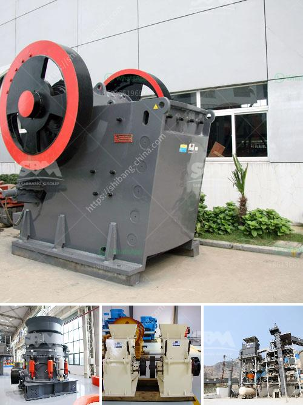

<h3>Which industries depend on coal?</h3>
Coal, a fossil fuel formed from the remains of plants that lived millions of years ago, has been a significant energy source for centuries. It has played a crucial role in powering various industries and has been instrumental in the growth and development of economies around the world. However, with growing concerns about its environmental impact and the need to transition to cleaner sources, the dependence on coal has declined. Nonetheless, several industries still rely heavily on coal for their operations.

1. Power Generation: One of the primary sectors that depend on coal is power generation. Coal-fired power plants produce electricity by burning coal to heat water, creating steam, which then drives turbines. This sector has historically been the largest consumer of coal globally, as it offers a reliable and affordable source of energy. However, the push for cleaner energy alternatives, such as natural gas, solar, and wind power, has resulted in a decline in the coal consumption for power generation.

2. Steel Production: Coal is a fundamental component in the production of steel. In the iron and steel industry, coal is used as a fuel in blast furnaces to produce the high temperatures required for smelting iron ore and extracting impurities. Additionally, coal is an essential ingredient in the coke-making process, where it is heated in the absence of oxygen to produce coke, a fuel used in blast furnaces. The steel industry heavily relies on coal as it is a cost-effective and efficient source of energy for these processes.

3. Cement Manufacturing: The cement industry is another sector that depends on coal. The production of cement requires significant amounts of energy, and coal is commonly used as a fuel for its high heat value. It is burned to generate heat, which ultimately leads to the production of clinker, the primary ingredient in cement. Although there have been efforts to reduce the carbon footprint of cement production through the use of alternative fuels and energy sources, coal remains a crucial energy source for this industry.

4. Chemicals and Pharmaceuticals: Coal is also used as a feedstock for various chemical processes. Many chemicals, including carbon black, methanol, and ammonia, are derived from coal. It is also an essential component in the production of synthetic materials such as plastics and fibers. While the chemical industry has been exploring cleaner and more sustainable alternatives, coal still plays a vital role in the production of certain chemicals and pharmaceuticals.

5. Paper and Pulp: Coal is utilized in some regions as an energy source in the production of paper and pulp. The processes involved in paper manufacturing require significant amounts of heat and steam, making coal a suitable choice due to its availability and affordability in certain areas.

While the industries mentioned above heavily depend on coal, it is essential to note that clean energy alternatives are progressively being adopted. The global shift toward renewable energy sources and the implementation of stricter environmental regulations have resulted in the decline of coal consumption over recent years. As the world moves towards a sustainable future, the dependence on coal is likely to decrease further, paving the way for cleaner and more environmentally friendly energy sources.
<h3>Contact us</h3><ul><li><strong>Whatsapp:&nbsp;<a href="https://wa.me/8613661969651">+8613661969651</a></strong></li><li><a href="https://swt.shibang-china.com/?git&amp;zhl&amp;Which industries depend on coal"><strong>Online Service(chat now)</strong></a></li></ul><h3>Related</h3><ul><li><a href='What can be used for basalt.md'>What can be used for basalt?</a></li><li><a href='what type of pumps uesd in stone crusher？.md'>what type of pumps uesd in stone crusher？</a></li><li><a href='what are rock crusher cone liners made out of.md'>what are rock crusher cone liners made out of</a></li><li><a href='What are the production and uses of crushed rock aggregates.md'>What are the production and uses of crushed rock aggregates?</a></li><li><a href='What equipment and machinery are needed to mine marble.md'>What equipment and machinery are needed to mine marble?</a></li></ul>