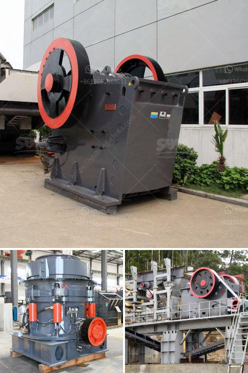

<h3>what are rock crusher cone liners made out of</h3>
Rock crusher cone liners are primarily used to protect the inner cone of the machine from wear caused by the constant and high-velocity rock abrasion. Unlike some traditional manganese steel wear liners, cone liners are made of a highly durable composite material which has a longer lifespan and can withstand higher crushing forces.

The materials used to create cone liners are carefully selected to meet the specific requirements of rock crushing applications. They are typically made from a combination of high-quality steel, rubber, and polyurethane, which offer excellent resistance to abrasive wear and impact. Let's take a closer look at these materials and their individual properties:

1. Steel: Steel is a fundamental component of rock crusher cone liners. It provides structural integrity and toughness required to withstand heavy loads and impact forces generated during the crushing process. High-grade steel alloys with a significant percentage of manganese are commonly used as they offer exceptional hardness, strength, and resistance to wear.

2. Rubber: Rubber is often added as a protective layer on the outer surface of cone liners. It acts as a shock absorber, reducing the impact forces exerted on the liner and optimizing its lifespan. Rubber also provides some flexibility, allowing the liner to better conform to the shape of the crushing chamber. This helps to prevent rock particles from getting trapped between the liner and the mantle, which could cause premature wear.

3. Polyurethane: Polyurethane is another important component of cone liners. It is known for its high abrasion resistance and superior performance in challenging environments. Polyurethane liners are often used in high-impact applications because they can withstand extreme conditions, including heavy impact and constant abrasion. Additionally, polyurethane liners are lightweight, which reduces the overall weight of the cone crusher and makes it easier to handle and move.

Overall, the combination of steel, rubber, and polyurethane creates a robust and durable cone liner that can withstand even the harshest rock crushing environments. These cone liners are carefully engineered to maximize the lifespan of the crushing equipment and minimize downtime for maintenance and replacement. They play a crucial role in ensuring the efficiency and productivity of rock crushers.

In conclusion, rock crusher cone liners are made from a combination of high-quality steel, rubber, and polyurethane. These materials provide exceptional resistance to wear, impact, and abrasion, making them ideal for rock crushing applications. By choosing the right cone liner material, crusher operators can significantly extend the lifespan of their machines and reduce maintenance costs.
<h3>Contact us</h3><ul><li><strong>Whatsapp:&nbsp;<a href="https://wa.me/8613661969651">+8613661969651</a></strong></li><li><a href="https://swt.shibang-china.com/?git&amp;zhl&amp;what are rock crusher cone liners made out of"><strong>Online Service(chat now)</strong></a></li></ul><h3>Related</h3><ul><li><a href='What are the production and uses of crushed rock aggregates.md'>What are the production and uses of crushed rock aggregates?</a></li><li><a href='What beneficiation method is used for iron ore.md'>What beneficiation method is used for iron ore?</a></li><li><a href='What machine need to be used for rock mining industry.md'>What machine need to be used for rock mining industry?</a></li><li><a href='What are the processes of iron ore beneficiation.md'>What are the processes of iron ore beneficiation?</a></li><li><a href='What guidelines are needed to set up a mobile stone crusher in Orissa.md'>What guidelines are needed to set up a mobile stone crusher in Orissa?</a></li></ul>