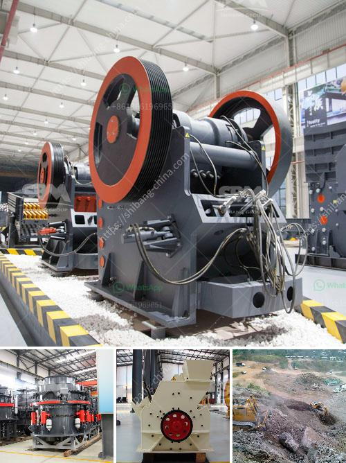

<h3>what are some of the equipments used in mining industry?</h3>
The mining industry is an essential sector of the global economy that has been instrumental in providing valuable resources such as minerals, metals, and coal. This industry relies heavily on various equipment and machinery to facilitate extraction, processing, and transportation of these resources. Here, we explore some of the key equipment used in the mining industry.

1. Excavators: Excavators are powerful machines equipped with a boom, bucket, and cab. They are used for digging and removing overburden, rocks, and soil in open-pit mining operations. With their immense size and capacity, excavators can efficiently extract large quantities of minerals while reducing manual labor.

2. Loaders: Loaders are versatile machines used to load mined materials onto haul trucks for transportation. They can be equipped with different attachments, such as buckets, forks, or grapples, depending on the specific needs of the mining operation. Loaders are essential for moving and loading heavy materials swiftly and efficiently.

3. Haul trucks: Haul trucks handle the transportation of excavated minerals and waste materials from the mine to the processing or storage areas. These massive trucks can carry substantial loads, typically ranging from 100 to 400 tons. Advanced models even come with autonomous capabilities, enhancing safety and productivity.

4. Drills: Drilling is a crucial step in both surface and underground mining. Blasthole drills are specifically designed to create holes in the earth's surface, enabling controlled fragmentation of rocks. These drills can reach depths of hundreds of meters and are equipped with advanced technology to improve accuracy and productivity.

5. Crushers: Crushers are employed to break down large rocks into smaller, more manageable sizes for further processing. They come in various forms, such as jaw crushers, impact crushers, and cone crushers, each designed to suit different mineral types and processing requirements.

6. Conveyors: Conveyors are used to transport materials, both horizontally and vertically, throughout the mining process. They eliminate the need for manual transportation, thus improving efficiency and reducing labor costs. Belt conveyors are the most common type and play a significant role in moving bulk materials in mining operations.

7. Separators: Separation is a vital stage in mining, where different valuable minerals are separated from the mined ore. Various types of separators, such as magnetic separators, gravity separators, and flotation machines, are used, depending on the type of minerals being extracted.

8. Ventilation systems: Underground mining operations require proper ventilation systems to ensure the health and safety of workers. These systems deliver fresh air while removing hazardous gases and dust generated during the mining process. Ventilation equipment includes fans, ducts, and ventilation controls.

9. Dewatering equipment: Water is a common challenge in mining operations, and dewatering equipment is used to remove excess water from mines, enabling work to continue safely and efficiently. Pumps, filters, and separators are commonly employed for dewatering applications.

10. Safety equipment: Mining is a hazardous industry, and comprehensive safety equipment is vital for protecting workers. Personal protective equipment (PPE) such as helmets, goggles, gloves, and safety vests, along with specialized equipment like gas detectors and monitoring systems, are essential to minimize risks and ensure worker well-being.

The mining industry heavily relies on these and many other equipment to facilitate the extraction, processing, and transportation of valuable resources. Continual advancements in technology and equipment design contribute to improved productivity, safety, and sustainability in mining operations, driving the industry forward.
<h3>Contact us</h3><ul><li><strong>Whatsapp:&nbsp;<a href="https://wa.me/8613661969651">+8613661969651</a></strong></li><li><a href="https://swt.shibang-china.com/?git&amp;zhl&amp;what are some of the equipments used in mining industry"><strong>Online Service(chat now)</strong></a></li></ul><h3>Related</h3><ul><li><a href='What are the raw materials used in cement production.md'>What are the raw materials used in cement production?</a></li><li><a href='What equipment is used when sand mining.md'>What equipment is used when sand mining?</a></li><li><a href='What is the mining process of gypsum.md'>What is the mining process of gypsum?</a></li><li><a href='What is iron ore mining in Pakistan.md'>What is iron ore mining in Pakistan?</a></li><li><a href='What mineral types are good for a jaw crusher.md'>What mineral types are good for a jaw crusher?</a></li></ul>