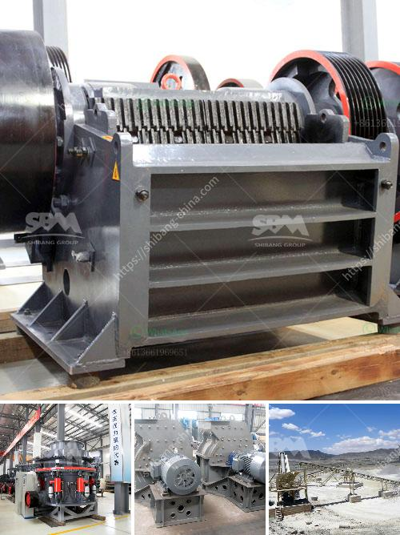

<h3>what are steps to wash iron sand？</h3>
Iron sand, also known as iron ore sand or magnetite sand, is a type of sand that is heavy and metallic in nature. It contains a high concentration of iron, making it a valuable resource for various industries such as steel production and manufacturing. However, before it can be used, iron sand needs to be thoroughly cleaned and processed. In this article, we will discuss the steps involved in washing iron sand.

The first step in the process of washing iron sand is to gather the raw material. Iron sand deposits are commonly found along coastlines and riverbeds. Once the desired location is identified, the iron sand is dug up and collected using heavy machinery or by hand. This process requires careful planning and consideration to ensure minimal damage to the environment.

Once the iron sand is collected, it needs to be pre-screened to remove any large debris or unwanted materials. This is usually done using mechanical screening equipment that separates the sand from rocks, shells, or other impurities. By removing these larger particles, the subsequent washing process becomes more efficient.

The washing process is the most crucial step in cleaning iron sand. There are several methods for washing iron sand, but the most commonly used technique is wet gravity separation. This involves using water and gravity to separate the sand from other impurities. The iron sand is mixed with water in a washing unit or a special tank that allows the heavy sand particles to settle at the bottom while the lighter impurities float to the top.

After the washing process, the iron sand is wet and needs to be dried before it can be further processed or packaged. Drying is typically done using industrial dryers or by exposing the sand to sunlight in large drying beds. The aim is to remove any excess moisture, ensuring that the sand is ready for the next stage of processing.

Once the iron sand is dry, it undergoes magnetic separation to remove any remaining impurities. This process utilizes powerful magnets to attract and separate iron particles from non-ferrous materials such as silica or quartz. The magnets are set to different magnetic strengths, depending on the desired purity level of the iron sand.

The final step in washing iron sand involves tumbling and sizing. Tumbling is a process whereby the iron sand is mixed and agitated in large barrels or tumblers. This helps to further remove any residual impurities and ensure a consistent quality. Sizing refers to the classification of the iron sand into different particle sizes, which can vary depending on the requirements of the end-user.

In conclusion, washing iron sand is a multi-step process that involves gathering, pre-screening, washing, drying, magnetic separation, and tumbling and sizing. Each step plays a critical role in ensuring the purity and quality of the iron sand, making it suitable for various industrial applications. By following these steps, iron sand can be cleaned and processed efficiently, maximizing its value and contributing to the production of high-quality iron products.
<h3>Contact us</h3><ul><li><strong>Whatsapp:&nbsp;<a href="https://wa.me/8613661969651">+8613661969651</a></strong></li><li><a href="https://swt.shibang-china.com/?git&amp;zhl&amp;what are steps to wash iron sand？"><strong>Online Service(chat now)</strong></a></li></ul><h3>Related</h3><ul><li><a href='what type of crusher is best for concrete crushing.md'>what type of crusher is best for concrete crushing?</a></li><li><a href='What is the cost of quarry stones in Kenya.md'>What is the cost of quarry stones in Kenya?</a></li><li><a href='What is the mining process for fluorite.md'>What is the mining process for fluorite?</a></li><li><a href='What is the optimal rotation speed for a ball mill.md'>What is the optimal rotation speed for a ball mill?</a></li><li><a href='What guidelines are needed to set up a mobile stone crusher in Orissa.md'>What guidelines are needed to set up a mobile stone crusher in Orissa?</a></li></ul>