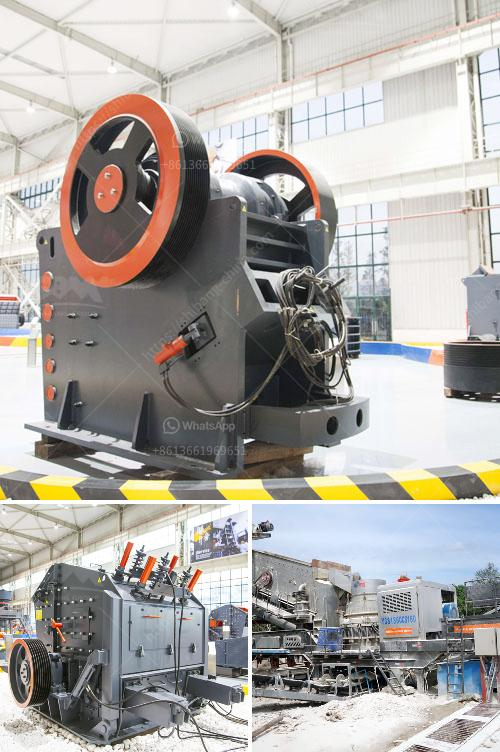

<h3>what are the applications of small portable crusher?</h3>
The small portable crusher is a versatile and convenient piece of equipment that offers multiple applications. This article will discuss some of the common applications of this versatile machine.

One of the primary uses of a small portable crusher is for construction waste recycling. This versatile machine can effectively crush and recycle construction waste, including concrete, bricks, asphalt, and other materials. By crushing and recycling these materials, construction companies can save on disposal costs and reduce the environmental impact of their projects. The crushed materials can be reused in construction projects or sold to other companies for further processing.

Another application of a small portable crusher is in the mining industry. Many mining operations require the use of crushers to process various materials, such as ores and minerals. The small portable crusher can be easily transported to the mining site and used for on-site crushing of materials. This not only reduces transportation costs but also improves the efficiency of mining operations by processing materials on-site, eliminating the need to transport them to a centralized crushing facility.

In addition to construction waste recycling and mining applications, small portable crushers are also widely used in the demolition industry. These machines can quickly and efficiently crush concrete structures, such as buildings, bridges, and roads, into smaller, more manageable pieces. This makes the demolition process easier and more efficient, as the crushed materials can be easily removed and transported for disposal or recycling.

The agricultural industry also benefits from the use of small portable crushers. Farmers and rural communities can use these machines to crush agricultural waste, such as crop residues, straw, and branches, into smaller pieces. These crushed materials can be used as organic fertilizer or animal bedding, saving on disposal costs and providing a sustainable solution for agricultural waste management.

Small portable crushers can also be used in landscaping and gardening applications. These machines can crush organic materials, such as tree branches, leaves, and grass clippings, into smaller sizes, which can then be used as compost or mulch. This helps to improve soil health and promote plant growth, while also reducing the volume of organic waste that needs to be disposed of.

In conclusion, the small portable crusher offers a wide range of applications across various industries. From construction waste recycling to mining, demolition, agriculture, and landscaping, this versatile machine provides a convenient and efficient solution for crushing and recycling various materials. Its portability, ease of use, and cost-effectiveness make it an essential tool for many businesses and industries.
<h3>Contact us</h3><ul><li><strong>Whatsapp:&nbsp;<a href="https://wa.me/8613661969651">+8613661969651</a></strong></li><li><a href="https://swt.shibang-china.com/?git&amp;zhl&amp;what are the applications of small portable crusher"><strong>Online Service(chat now)</strong></a></li></ul><h3>Related</h3><ul><li><a href='What is the difference between impact crusher and hammer mill.md'>What is the difference between impact crusher and hammer mill?</a></li><li><a href='What equipment is needed for iron ore mines .md'>What equipment is needed for iron ore mines ?</a></li><li><a href='What machinery and equipment is needed for a sand and gravel processing plant.md'>What machinery and equipment is needed for a sand and gravel processing plant</a></li><li><a href='What is the difference between a quarry and a mine.md'>What is the difference between a quarry and a mine?</a></li><li><a href='What is iron ore screening process.md'>What is iron ore screening process?</a></li></ul>