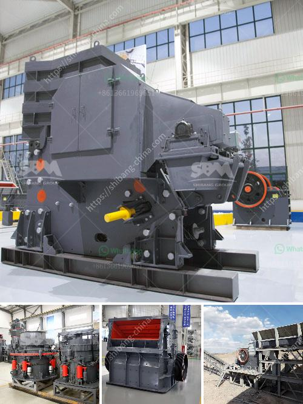

<h3>what are the equipment for gypsum mining?</h3>
Gypsum, a soft mineral composed of calcium sulfate dihydrate, is widely used in various industries, including construction, agriculture, and medicine. Before gypsum can be used commercially, it needs to be mined from the earth's surface. In this article, we will explore the equipment used for gypsum mining.

1. Excavators: Excavators are essential for any mining operation and are commonly used in gypsum mining. These heavy machines are used to dig and remove the gypsum ore from the earth's surface. Excavators come in various sizes and capacities, depending on the scale of the mining operation.

2. Haul Trucks: Once the gypsum ore has been extracted, it needs to be transported to the processing plant or storage facility. Haul trucks, also known as dump trucks, are employed for this purpose. These trucks can carry large quantities of gypsum over long distances efficiently, thanks to their robust design and high load capacity.

3. Crushing Equipment: After the gypsum ore is transported to the processing plant, it is crushed into smaller particles. Crushing equipment, such as jaw crushers, cone crushers, and impact crushers, are commonly used to achieve this task. Crushing the ore into smaller pieces ensures its uniformity, making it suitable for further processing.

4. Grinding Mills: To further process the crushed gypsum ore, it is often ground into a fine powder using grinding mills. These mills, which can include ball mills, Raymond mills, and vertical mills, utilize the crushing and grinding action to reduce the gypsum ore to a desired particle size.

5. Magnetic Separators: In some cases, gypsum ore may contain impurities or other unwanted materials that need to be separated. Magnetic separators are used to remove these impurities by utilizing magnetic forces. This equipment ensures that the final gypsum product is of high purity before it is used in various applications.

6. Drying Equipment: Once the gypsum ore is processed and ground into fine powder, it usually contains some moisture. Drying equipment, such as rotary dryers or fluidized bed dryers, is employed to remove this moisture and ensure a stable and consistent product. The dried gypsum can then be stored or used directly, depending on the intended application.

7. Bagging Equipment: Depending on the end-use of the gypsum, it may need to be bagged for ease of transportation and storage. Bagging equipment, such as automated bagging machines, is used to pack the final gypsum product into bags of various sizes. This equipment ensures efficient and precise bagging, minimizing human error and increasing productivity.

In conclusion, gypsum mining relies on a range of specialized equipment to extract, process, and distribute this valuable mineral. From excavators and haul trucks to crushers and grinding mills, each piece of equipment plays a crucial role in the mining process. Finally, magnetic separators, drying equipment, and bagging machines contribute to ensuring the quality and usability of the final gypsum product.
<h3>Contact us</h3><ul><li><strong>Whatsapp:&nbsp;<a href="https://wa.me/8613661969651">+8613661969651</a></strong></li><li><a href="https://swt.shibang-china.com/?git&amp;zhl&amp;what are the equipment for gypsum mining"><strong>Online Service(chat now)</strong></a></li></ul><h3>Related</h3><ul><li><a href='what is the feed size for ball mill？.md'>what is the feed size for ball mill？</a></li><li><a href='What are the raw materials used in cement production.md'>What are the raw materials used in cement production?</a></li><li><a href='What equipment is needed for alumstone mines.md'>What equipment is needed for alumstone mines?</a></li><li><a href='What are the ponent of nigerian mining industry.md'>What are the ponent of nigerian mining industry?</a></li><li><a href='what are the applications of small portable crusher.md'>what are the applications of small portable crusher?</a></li></ul>