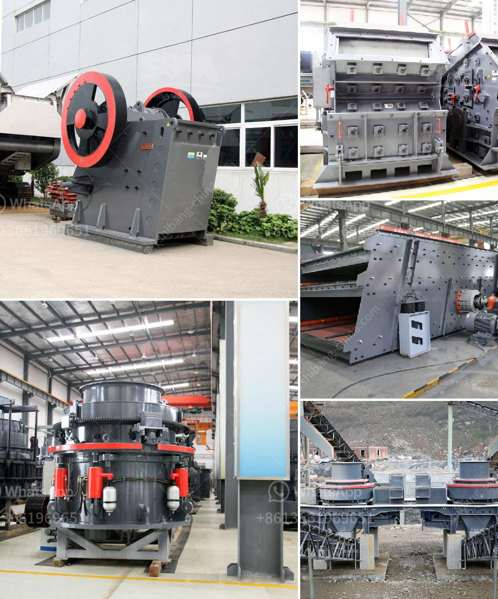

<h3>what are the equipments that are important for concrete production</h3>
Concrete production is a complex process that requires various equipment to ensure the quality and efficiency of the final product. From mixing to curing, these tools play a crucial role in every step of the production process. In this article, we will discuss the important equipment needed for concrete production.

1. Batch mixers: Batch mixers are essential equipment for concrete production. These machines are responsible for combining various ingredients, including cement, aggregates, water, and additives, in precise proportions. Batch mixers come in different sizes and designs, such as drum mixers and pan mixers, to cater to different production needs.

2. Transit mixers: Transit mixers are used to transport the freshly mixed concrete from the batch plant to the construction site. These trucks have a rotating drum that keeps the concrete in motion, preventing it from setting. Transit mixers ensure that the concrete remains homogeneous and workable during transportation, allowing for easy pouring and placement.

3. Concrete pumps: Concrete pumps are widely used in large-scale construction projects where the distance between the batch plant and the pouring location is long. These machines offer a more efficient and convenient way to transport concrete by pumping it through pipelines directly to the desired location. Concrete pumps can be either piston pumps or boom pumps, depending on the project requirements.

4. Concrete vibrators: Concrete vibrators are used to remove air bubbles and excess water from freshly poured concrete. These handheld or fully automated tools are essential for achieving proper consolidation and ensuring that the concrete is dense and durable. Vibrators come in different types, including internal vibrators, external vibrators, and surface vibrators, to cater to various applications.

5. Aggregate handling equipment: Aggregates, such as sand, gravel, and crushed stone, are essential components of concrete. Therefore, proper handling and storage of aggregates are crucial to maintaining the quality of the final product. Equipment like conveyors, hoppers, and storage bins are used to transport and store aggregates efficiently and prevent contamination.

6. Mixing plants: Mixing plants, also known as batch plants, are the central units where concrete is produced in large quantities. These plants consist of various components, such as storage silos, weighing systems, conveyors, and mixers, to automate the entire concrete production process. Mixing plants ensure consistent production of high-quality concrete and offer better control over the mix proportions.

7. Concrete testing equipment: Concrete testing equipment is essential for quality control and determining the properties of the hardened concrete. These tools include slump cones, compression testing machines, rebound hammers, and moisture meters, among others. Concrete testing equipment helps to assess the strength, durability, and workability of concrete, ensuring it meets the required standards.

In conclusion, concrete production requires a range of equipment to achieve the desired quality and efficiency. From batch mixers and transit mixers to concrete pumps and vibrators, each equipment plays a crucial role in different stages of the production process. Additionally, proper handling and testing equipment ensure that the final product meets the required standards. Investing in high-quality equipment and maintaining them properly can significantly impact the overall success of concrete production projects.
<h3>Contact us</h3><ul><li><strong>Whatsapp:&nbsp;<a href="https://wa.me/8613661969651">+8613661969651</a></strong></li><li><a href="https://swt.shibang-china.com/?git&amp;zhl&amp;what are the equipments that are important for concrete production"><strong>Online Service(chat now)</strong></a></li></ul><h3>Related</h3><ul><li><a href='What is the fault and how do I repair a cone crusher.md'>What is the fault and how do I repair a cone crusher?</a></li><li><a href='What machine is used to crush copper ore.md'>What machine is used to crush copper ore?</a></li><li><a href='What are the mining processes of copper.md'>What are the mining processes of copper?</a></li><li><a href='What are the most common expenses in crushing plant project.md'>What are the most common expenses in crushing plant project?</a></li><li><a href='What is the difference between a quarry and a mine.md'>What is the difference between a quarry and a mine?</a></li></ul>