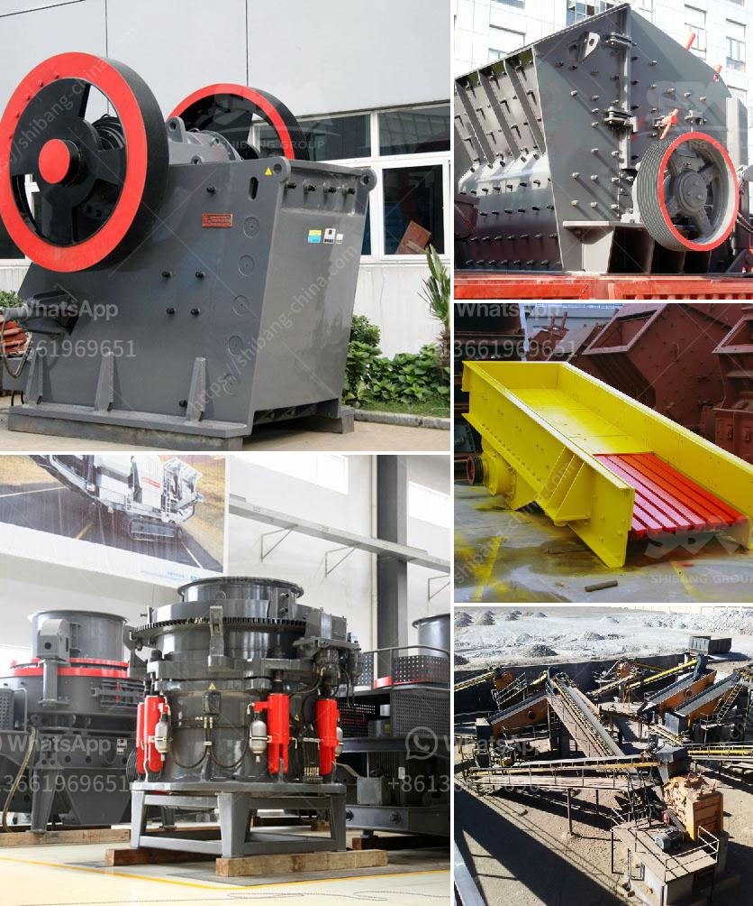

<h3>what are the gold ore crusher?</h3>
Gold ore refers to the abundant mineral resources in the earth's crust. Gold extraction is a technical and economic process that involves extracting gold from the earth's crust and converting it into pure gold. The primary methods used to extract gold from the ore include crushing, grinding, and extraction using cyanide.

The gold ore crushing process uses a jaw crusher for coarse crushing, and a cone crusher and impact crusher for secondary crushing. The crushed ores are then conveyed into vibrating screens for screening. The oversized materials are returned to the crusher for further crushing until they meet the required particle size. The undersized materials are sent to the grinding mills for further grinding.

The grinding process is essential for the efficient extraction of gold from the ore. The grinding mills used for the process include rod mills, ball mills, and autogenous mills. Rod mills break down the ore by grinding it in a rotating cylinder with steel rods. Ball mills use balls made of stainless steel or rubber to crush the ore into a fine powder. Autogenous mills, on the other hand, utilize the ore itself as the grinding media.

After grinding, the gold particles are mixed with water and chemicals such as cyanide. This mixture is then agitated in tanks, a process known as leaching, to extract the gold from the ore. The gold-bearing solution is then separated from the remaining solids and sent to a refining process to further purify the gold.

Gold ore crushers play a crucial role in the gold mining process. They provide the primary crushing solution for the ores, which are later sent to the grinding mill for further grinding. Crushing is the most energy-consuming operation in the whole mining process, requiring a lot of energy and high investment costs. Therefore, choosing the right type of crusher is critical for maximizing the production efficiency and reducing operational costs.

There are various types of gold ore crushers available in the market. The most common ones include jaw crushers, impact crushers, and cone crushers. Jaw crushers are used for coarse crushing and are mainly used for primary crushing of gold ores. They are durable and can handle large rocks with ease.

Impact crushers, on the other hand, are used for secondary crushing and are often used in conjunction with jaw crushers. They are designed to break down the ores into smaller sizes and produce a more uniform particle size distribution.

Cone crushers are also commonly used in gold ore crushing. They are suitable for medium and fine crushing of the ores and have the advantage of high efficiency and low operating costs.

In conclusion, gold ore crushers are essential equipment in the gold mining process. They are used for crushing the gold ores into smaller sizes and preparing them for further processing. Choosing the right type of crusher is crucial for maximizing production efficiency and reducing operational costs. With the advances in technology, there are various types of crushers available in the market to cater to different needs.
<h3>Contact us</h3><ul><li><strong>Whatsapp:&nbsp;<a href="https://wa.me/8613661969651">+8613661969651</a></strong></li><li><a href="https://swt.shibang-china.com/?git&amp;zhl&amp;what are the gold ore crusher"><strong>Online Service(chat now)</strong></a></li></ul><h3>Related</h3><ul><li><a href='what are the applications of small portable crusher.md'>what are the applications of small portable crusher?</a></li><li><a href='What is the wattage of the stone crusher.md'>What is the wattage of the stone crusher?</a></li><li><a href='What is a belt conveyor control system.md'>What is a belt conveyor control system?</a></li><li><a href='What is the optimal rotation speed for a ball mill.md'>What is the optimal rotation speed for a ball mill?</a></li><li><a href='What is quarrying in relation to cement production.md'>What is quarrying in relation to cement production?</a></li></ul>