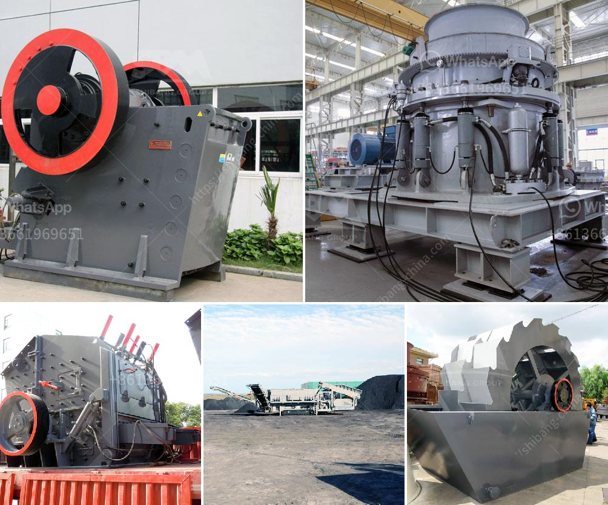

<h3>what aspects influence stone crusher efficiency</h3>
Stone crusher plays a very important role in modern mining industry and construction materials processing. Stone crusher efficiency refers to the ratio between the dimension of the input material and the output size of the crushed stone. As the primary crushing equipment, stone crusher depends on the squeezing and impacting action of the high-speed moving stone to crush the stones. So, what aspects can influence the stone crusher efficiency?

1. Types of stone crushers: Different types of stone crushers have different crushing capacity and efficiency, so the type of stone crusher equipment should be selected according to the crushing needs. Generally speaking, different types of crushers have different production capacities or output sizes.

2. Hardness of stones: It is more difficult to crush hard stones than soft stones. The hardness of the stone is the first factor to consider when selecting the stone crusher. If the hardness is high, it will cause excessive wear and tear to the crushing equipment, leading to a decrease in efficiency. Therefore, the stone crusher with a higher hardness should choose a wear-resistant equipment.

3. Moisture content of stones: Moisture content also affects stone crusher efficiency. If the moisture content is too high, the material will easily adhere to the inner wall of the crushing cavity during the crushing process. This will cause blockage and reduce the crushing efficiency. Therefore, the moisture content of the stone should be strictly controlled.

4. Size of the feeding material: The size of the feeding material also affects the stone crusher efficiency. If the size of the feeding material exceeds the specified range, it will increase the energy consumption of the crushing process and reduce the production efficiency. Therefore, the feeding size should meet the required specifications.

5. Crushing cavity design: The design of the crushing cavity directly affects the crushing efficiency and discharge granularity. Generally, the larger the cavity, the higher the crushing efficiency and the larger the output size. Therefore, the cavity should be selected according to the requirements of the final product size.

6. Operation and maintenance: Proper operation and regular maintenance are essential for improving stone crusher efficiency. Operators should follow the instructions and regular maintenance schedules to ensure the normal operation of the equipment. Regularly clean the equipment and lubricate the parts to reduce wear and tear and prolong the service life of the equipment.

In conclusion, stone crusher efficiency is influenced by various factors, including types of stone crushers, hardness of stones, moisture content, size of the feeding material, crushing cavity design, and operation and maintenance. It is important to choose a suitable stone crusher based on the specific requirements of crushing operation to improve efficiency and productivity.
<h3>Contact us</h3><ul><li><strong>Whatsapp:&nbsp;<a href="https://wa.me/8613661969651">+8613661969651</a></strong></li><li><a href="https://swt.shibang-china.com/?git&amp;zhl&amp;what aspects influence stone crusher efficiency"><strong>Online Service(chat now)</strong></a></li></ul><h3>Related</h3><ul><li><a href='What equipment is needed for kaolin ore mines.md'>What equipment is needed for kaolin ore mines?</a></li><li><a href='What is limestone impact crusher？.md'>What is limestone impact crusher？</a></li><li><a href='What is the process of mining copper ore.md'>What is the process of mining copper ore?</a></li><li><a href='what is the feed size for ball mill？.md'>what is the feed size for ball mill？</a></li><li><a href='What good pebble crushing equipment .md'>What good pebble crushing equipment ?</a></li></ul>